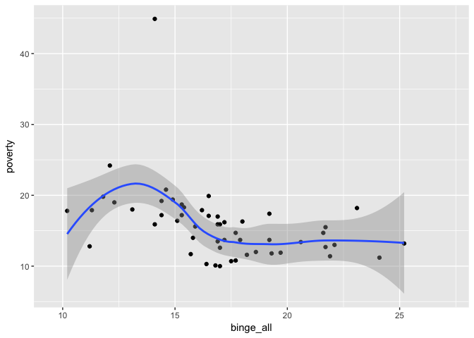

Selection of Data and Tidying
-----------------------------

``` r
library(readr)
library(tidyr)
library(dplyr)
```

    ## 
    ## Attaching package: 'dplyr'

    ## The following objects are masked from 'package:stats':
    ## 
    ##     filter, lag

    ## The following objects are masked from 'package:base':
    ## 
    ##     intersect, setdiff, setequal, union

``` r
library(ggplot2)
rawData <- read_csv('U.S._Chronic_Disease_Indicators__CDI_.csv', na='NA')
```

    ## Parsed with column specification:
    ## cols(
    ##   .default = col_character(),
    ##   YearStart = col_integer(),
    ##   YearEnd = col_integer(),
    ##   DataValue = col_double(),
    ##   DataValueAlt = col_double(),
    ##   LowConfidenceLimit = col_double(),
    ##   HighConfidenceLimit = col_double()
    ## )

    ## See spec(...) for full column specifications.

    ## Warning in rbind(names(probs), probs_f): number of columns of result is not
    ## a multiple of vector length (arg 1)

    ## Warning: 1087 parsing failures.
    ## row # A tibble: 5 x 5 col      row       col expected actual expected    <int>     <chr>    <chr>  <chr> actual 1 161451 DataValue a double     No file 2 161633 DataValue a double     No row 3 162019 DataValue a double     No col 4 162460 DataValue a double     No expected 5 162494 DataValue a double     No actual # ... with 1 more variables: file <chr>
    ## ... ................. ... .................................. ........ .................................. ...... .................................. .... .................................. ... .................................. ... .................................. ........ .................................. ...... .......................................
    ## See problems(...) for more details.

``` r
cleanData <- rawData %>% filter((Question == "Binge drinking prevalence among adults aged >= 18 years"| Question =='Poverty')& DataValueType == 'Crude Prevalence' & DataValueUnit == '%') 

a <- filter(cleanData, StratificationCategoryID1 == 'GENDER'|StratificationCategoryID1 == 'OVERALL')

b <- select(a, YearStart, YearEnd, LocationAbbr, LocationDesc, Question, DataValue, Stratification1)

C <- b %>% unite(new, Question, Stratification1)

d <- spread(C, key=new, value=DataValue)

binge_clean <- d %>% select(state= LocationDesc, stateabb=LocationAbbr, year=YearStart, binge_all='Binge drinking prevalence among adults aged >= 18 years_Overall', binge_male='Binge drinking prevalence among adults aged >= 18 years_Male', binge_female='Binge drinking prevalence among adults aged >= 18 years_Female' ,poverty= Poverty_Overall)
write.csv(binge_clean, "binge_clean.csv")
```

Data Transformation and Summary Results
---------------------------------------

``` r
e <- binge_clean %>% filter(year==2015) %>% select(year, state, binge_all, binge_female, binge_male) %>% arrange(desc(binge_all))
f <- e %>% filter(state == 'District of Columbia'|state == 'North Dakota'|state == 'Wisconsin'|state == 'Guam'|state == 'Alaska'|state == 'Illinois'|state == 'Iowa'|state == 'Montana'|state == 'Minnesota'|state == 'Nebraska')
tbl_df(f)
```

    ## # A tibble: 10 x 5
    ##     year                state binge_all binge_female binge_male
    ##    <int>                <chr>     <dbl>        <dbl>      <dbl>
    ##  1  2015 District of Columbia      27.2         21.9       33.1
    ##  2  2015         North Dakota      24.1         16.9       31.0
    ##  3  2015            Wisconsin      22.9         17.1       28.9
    ##  4  2015                 Guam      21.2         11.4       30.8
    ##  5  2015               Alaska      20.3         16.4       23.9
    ##  6  2015             Illinois      20.2         14.4       26.4
    ##  7  2015                 Iowa      19.8         13.3       26.6
    ##  8  2015              Montana      19.8         13.2       26.5
    ##  9  2015            Minnesota      19.5         14.0       25.2
    ## 10  2015             Nebraska      19.5         13.1       26.0

``` r
ggplot(binge_clean,aes(x=binge_all,y=poverty))+geom_point()+geom_smooth(method='loess')
```

    ## Warning: Removed 222 rows containing non-finite values (stat_smooth).

    ## Warning: Removed 222 rows containing missing values (geom_point).



Comment: when the the prevalence of binge drinking in the overall population is less than 12%, the overall poverty prevalence grows with overall poverty prevalence; when the the prevalence of binge drinking in the overall population is more than 12%, the overall poverty prevalence keeps almost the same.

``` r
dataByState <- binge_clean %>% 
  group_by(state) %>%
  summarise(avgGrowth = (last(binge_all) - first(binge_all)) / (n() * first(binge_all))) %>% 
  arrange(avgGrowth)

dataByState2 <- na.omit(dataByState)

dataByState2 %>% head(5)
```

    ## # A tibble: 5 x 2
    ##          state   avgGrowth
    ##          <chr>       <dbl>
    ## 1     Delaware -0.05320197
    ## 2       Nevada -0.04731183
    ## 3 South Dakota -0.04705882
    ## 4   New Mexico -0.04268293
    ## 5     Maryland -0.04222222

``` r
dataByState2 %>% tail(5)
```

    ## # A tibble: 5 x 2
    ##                  state  avgGrowth
    ##                  <chr>      <dbl>
    ## 1            Tennessee 0.00600000
    ## 2        West Virginia 0.00990099
    ## 3            Louisiana 0.01490683
    ## 4 District of Columbia 0.01760000
    ## 5                 Guam 0.03169399

``` r
AnnualGrowthTable<-data.frame(states_with_the_largest_increases= c('Guam','District of Columbia','Louisiana','West Virginia','Tennessee'), states_with_the_largest_decreases=c("Delaware","Nevada","South Dakota",'New Mexico','Maryland'))
AnnualGrowthTable
```

    ##   states_with_the_largest_increases states_with_the_largest_decreases
    ## 1                              Guam                          Delaware
    ## 2              District of Columbia                            Nevada
    ## 3                         Louisiana                      South Dakota
    ## 4                     West Virginia                        New Mexico
    ## 5                         Tennessee                          Maryland
