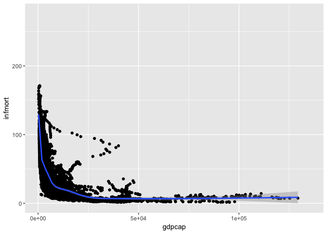
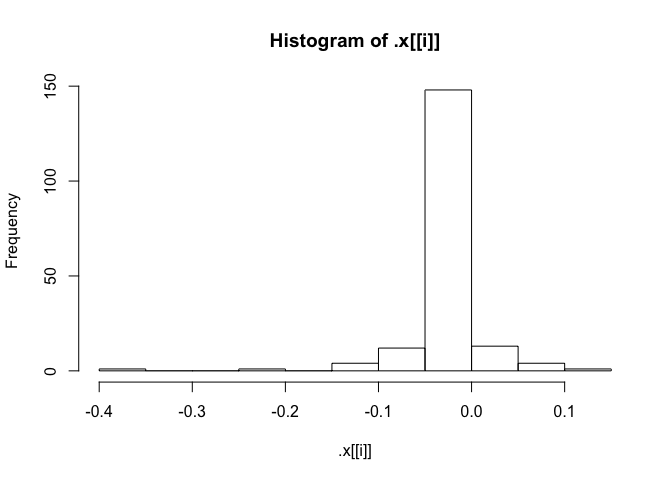

1. Functions in the R Base Package
----------------------------------

``` r
content <- mget(ls("package:base"), inherits = TRUE)
base_functions <- Filter(is.function, content)
library(purrr)
library(dplyr)
```

    ## 
    ## Attaching package: 'dplyr'

    ## The following objects are masked from 'package:stats':
    ## 
    ##     filter, lag

    ## The following objects are masked from 'package:base':
    ## 
    ##     intersect, setdiff, setequal, union

``` r
##a) Longest name
names <- map(names(base_functions), ~ .)  
length<- map(names,~nchar(.))%>% as.integer()
longest_name <- names[length==max(length)]
longest_name
```

    ## [[1]]
    ## [1] "getDLLRegisteredRoutines.character"

The funtion 'getDLLRegisteredRoutines.character' has the longest name.

``` r
##b) Number of arguments
narg <- map(base_functions,~formals(.)) %>% lengths
top10=narg[order(narg,decreasing=TRUE)[1:10]]
list=list(name=names(top10),length=top10)
tbl_df(list)
```

    ## # A tibble: 10 x 2
    ##                name length
    ##               <chr>  <int>
    ##  1             scan     22
    ##  2   format.default     16
    ##  3           source     16
    ##  4          formatC     14
    ##  5 merge.data.frame     12
    ##  6        prettyNum     12
    ##  7             save     10
    ##  8          system2     10
    ##  9          library      9
    ## 10    print.default      9

``` r
##c) No arguments
map(base_functions,~formals(.))[narg==0] %>% names %>% length
```

    ## [1] 226

226 base functions have no arguments. They are primitive functions. The advantage of primitive functions is the potential efficiency of argument passing.

2. Infant Mortality and GPD per Capita
--------------------------------------

``` r
##a) Highest and lowest infant mortality rates in 2015
library(WDI)
```

    ## Loading required package: RJSONIO

``` r
data <- WDI(indicator=c("NY.GDP.PCAP.PP.KD","SP.DYN.IMRT.IN"), start=1960, end=2016, extra=TRUE) %>% rename(gdpcap= NY.GDP.PCAP.PP.KD, infmort=SP.DYN.IMRT.IN) %>% filter(!region=='Aggregates') ##keep only entries for countries


list <- filter(data, year =='2015')
list <- list[with(list,order(-infmort)),] %>% filter(!is.na(infmort))

selected_countries <- rbind(head(list,5),tail(list,5))
selected_countries <- selected_countries[,c(2,4,5)]
selected_countries
```

    ##                      country     gdpcap infmort
    ## 1                     Angola  6231.0680    96.0
    ## 2   Central African Republic   626.4109    91.5
    ## 3               Sierra Leone  1316.0601    87.1
    ## 4                    Somalia         NA    85.0
    ## 5                       Chad  2047.6372    85.0
    ## 186                    Japan 37818.0908     2.0
    ## 187                   Norway 63669.5253     2.0
    ## 188                  Finland 38993.6707     1.9
    ## 189                  Iceland 42674.4240     1.6
    ## 190               Luxembourg 95311.1140     1.5

``` r
##b) Overall regression
library(ggplot2)
lm(formula = infmort ~ gdpcap, data = data)
```

    ## 
    ## Call:
    ## lm(formula = infmort ~ gdpcap, data = data)
    ## 
    ## Coefficients:
    ## (Intercept)       gdpcap  
    ##   51.173949    -0.001005

``` r
ggplot(data,aes(gdpcap,infmort)) + geom_point()+geom_smooth(na.rm=TRUE)
```

    ## `geom_smooth()` using method = 'gam'

    ## Warning: Removed 7403 rows containing missing values (geom_point).

 The infant mortality is inversely proportional to GDP per capita.\#\#\#\#\#

``` r
##c) Regression by region
regiondata <- data %>% 
  filter(!is.na(region)) %>% 
  filter(!is.na(infmort))%>% 
  filter(!is.na(gdpcap)) %>%
  filter(region !='Aggregates')%>%
  select(infmort,gdpcap,region)

regionlist <- split(regiondata, regiondata$region)

coefs_region <- regionlist[2:8]%>%
  map(~ lm(infmort ~ gdpcap, data = .))%>%
  map(~ coef(.)) %>%
  map_dbl("gdpcap") %>%
  sort%>%
  as.data.frame()

coefs_region
```

    ##                                                            .
    ## South Asia                                     -7.437168e-03
    ## Sub-Saharan Africa (all income levels)         -2.423680e-03
    ## Latin America & Caribbean (all income levels)  -1.356954e-03
    ## East Asia & Pacific (all income levels)        -6.399345e-04
    ## Europe & Central Asia (all income levels)      -5.860830e-04
    ## Middle East & North Africa (all income levels) -3.439549e-04
    ## North America                                  -1.410946e-06

``` r
##d) Regression by country
countrydata <- data %>% 
  select(infmort,gdpcap,country)%>% 
  filter(!is.na(country)) %>% 
  filter(!is.na(infmort))%>% 
  filter(!is.na(gdpcap))

countrylist <- split(countrydata, countrydata$country)

coefs_country <- countrydata %>% 
  split(countrydata$country) %>%
  map(~ lm(infmort ~ gdpcap, data = .))%>%
  map(~ coef(.)) %>%
  map_dbl("gdpcap") %>%
  sort%>%
  as.data.frame()

count(coefs_country,coefs_country>0)
```

    ## # A tibble: 2 x 2
    ##   `coefs_country > 0`     n
    ##                 <lgl> <int>
    ## 1               FALSE   166
    ## 2                TRUE    18

``` r
18/184
```

    ## [1] 0.09782609

The percentage is 18/184.

``` r
walk(coefs_country, hist)%>%
  map(summary)
```



    ## $.
    ##       Min.    1st Qu.     Median       Mean    3rd Qu.       Max. 
    ## -0.3521231 -0.0091485 -0.0022889 -0.0114956 -0.0003736  0.1300038

``` r
head(coefs_country,1)
```

    ##                 .
    ## Guinea -0.3521231

``` r
tail(coefs_country,1)
```

    ##                    .
    ## Madagascar 0.1300038

The country with the smallest coefficient is Guinea. Its coefficient is -0.3521231. The country with the biggest coefficient is Madagascar. Its coefficient is 0.1300038. Because the overall regression estimated coefficient is -0.001005 . Therefore, Guinea cases are most at odds with the overall regression estimated in part(b).

``` r
##e) Added squared term
rsquared_without_added<- countrydata %>% 
  split(countrydata$country) %>%
  map(~ lm(infmort ~ gdpcap, data = .)) %>%
  map(summary) %>%
  map_dbl("adj.r.squared")

countrydata$gdpcap2 <- countrydata$gdpcap * countrydata$gdpcap

rsquared_with_added<- countrydata %>% 
  split(countrydata$country) %>%
  map(~ lm(infmort ~ gdpcap+gdpcap2, data = .)) %>%
  map(summary) %>%
  map_dbl('adj.r.squared')

summary(rsquared_with_added)
```

    ##     Min.  1st Qu.   Median     Mean  3rd Qu.     Max. 
    ## -0.07499  0.66388  0.85349  0.74059  0.93525  0.99496

``` r
summary(rsquared_without_added)
```

    ##     Min.  1st Qu.   Median     Mean  3rd Qu.     Max. 
    ## -0.04154  0.51558  0.79272  0.66792  0.89483  0.98602

The average of adjusted R-squared with squared term is 0.74059. The average of adjusted R-squared without squared term is 0.66792. Because the average of adjusted R-squared with squared term is higher. So I recommend to keep the squared term.
