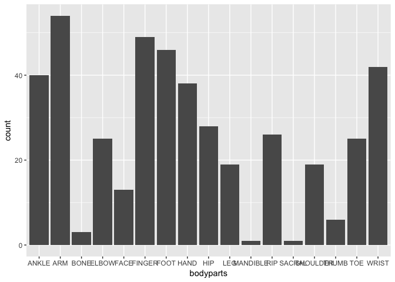
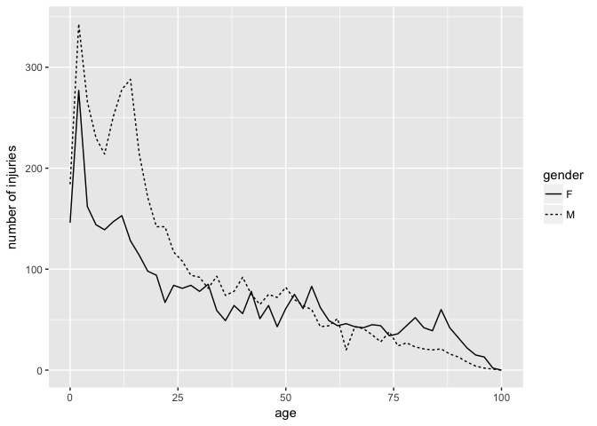

1. Words in Ulysses
-------------------

a) Words with z
---------------

``` r
library(stringr)
```

    ## 
    ## Attaching package: 'stringr'

    ## The following object is masked _by_ '.GlobalEnv':
    ## 
    ##     words

``` r
data <- words$word
number_as <- str_count(data, "z")
table(number_as)
```

    ## number_as
    ##      0      1      2      3 
    ## 264215    909     81      1

``` r
##909 words contain one z, 81 words contain two z's, one word contain 3 z's.
wordswithz <- c(data[number_as==2],data[number_as==3])
twoz<-c(data[number_as==2])
threez<-c(data[number_as==3])

z2<- str_split(twoz,'z',simplify = TRUE)%>%as.data.frame()
str_length(z2$V2)
```

    ##  [1] 0 0 4 0 0 0 0 0 0 0 0 0 0 2 0 0 0 0 0 0 0 0 0 0 0 0 0 0 0 0 0 0 0 0 0
    ## [36] 0 0 0 0 0 0 0 0 0 0 0 0 0 0 0 0 0 0 0 0 1 0 0 0 0 0 2 0 0 0 0 2 2 0 0
    ## [71] 0 0 0 0 0 0 0 0 0 0 0

``` r
z3<- str_split(threez,'z',simplify = TRUE)%>%as.data.frame()
str_length(z3$V2)
```

    ## [1] 1

``` r
str_length(z3$V3)
```

    ## [1] 7

``` r
##This word is "százharminczbrojúgulyás"
```

b) Vowels
---------

``` r
library(rebus)
```

    ## 
    ## Attaching package: 'rebus'

    ## The following object is masked from 'package:stringr':
    ## 
    ##     regex

``` r
vowels <- char_class("aeiouAEIOU")
length(str_subset(data, pattern = "^[aeiouAEIOU]")%>%str_subset(pattern="[aeiouAEIOU]$"))
```

    ## [1] 14458

``` r
## 14458 words start and end with a vowel
length(str_subset(data, pattern = "^[aeiouAEIOU]")%>%str_subset(pattern="^.[aeiouAEIOU]"))
```

    ## [1] 2581

``` r
##2581 words start with two or more vowels
```

``` r
str_subset(data, regex(vowels,vowels,vowels,vowels,vowels,vowels,vowels,vowels,vowels,vowels,vowels,vowels,vowels,vowels,vowels,vowels,vowels,vowels,vowels,vowels))
```

    ## [1] "frseeeeeeeeeeeeeeeeeeeefrong"

``` r
str_subset(data, regex(vowels,vowels,vowels,vowels,vowels,vowels,vowels,vowels,vowels,vowels,vowels,vowels,vowels,vowels,vowels,vowels,vowels,vowels,vowels,vowels,vowels))
```

    ## character(0)

``` r
## There are at most consecutive 20 vowels in a word. This word is "frseeeeeeeeeeeeeeeeeeeefrong".
```

c) English spelling
-------------------

``` r
pattern="[^c]+[i]+[e]"
str_subset(data,pattern)
```

    ##    [1] "cried"                                                
    ##    [2] "quietly"                                              
    ##    [3] "friendly"                                             
    ##    [4] "cried"                                                
    ##    [5] "quietly"                                              
    ##    [6] "cried"                                                
    ##    [7] "handkerchief"                                         
    ##    [8] "handkerchief"                                         
    ##    [9] "quietly"                                              
    ##   [10] "loveliest"                                            
    ##   [11] "parried"                                              
    ##   [12] "die"                                                  
    ##   [13] "impatiently"                                          
    ##   [14] "quietly"                                              
    ##   [15] "anxiety"                                              
    ##   [16] "die"                                                  
    ##   [17] "shielding"                                            
    ##   [18] "memories"                                             
    ##   [19] "friendly"                                             
    ##   [20] "cried"                                                
    ##   [21] "friendship"                                           
    ##   [22] "carried"                                              
    ##   [23] "fried"                                                
    ##   [24] "carried"                                              
    ##   [25] "relief"                                               
    ##   [26] "quietly"                                              
    ##   [27] "cried"                                                
    ##   [28] "patient"                                              
    ##   [29] "field"                                                
    ##   [30] "cried"                                                
    ##   [31] "emptied"                                              
    ##   [32] "tie"                                                  
    ##   [33] "handkerchief"                                         
    ##   [34] "gaiety"                                               
    ##   [35] "quiet"                                                
    ##   [36] "brief"                                                
    ##   [37] "cries"                                                
    ##   [38] "believer"                                             
    ##   [39] "gaiety"                                               
    ##   [40] "believer"                                             
    ##   [41] "believer"                                             
    ##   [42] "believe"                                              
    ##   [43] "heresies"                                             
    ##   [44] "shields"                                              
    ##   [45] "dieu"                                                 
    ##   [46] "tie"                                                  
    ##   [47] "brief"                                                
    ##   [48] "pier"                                                 
    ##   [49] "cried"                                                
    ##   [50] "pennies"                                              
    ##   [51] "cried"                                                
    ##   [52] "priest’s"                                            
    ##   [53] "impatience"                                           
    ##   [54] "pier"                                                 
    ##   [55] "pier"                                                 
    ##   [56] "pier"                                                 
    ##   [57] "pier"                                                 
    ##   [58] "pier"                                                 
    ##   [59] "pierce"                                               
    ##   [60] "possibilities"                                        
    ##   [61] "genevieve"                                            
    ##   [62] "quietly"                                              
    ##   [63] "lies"                                                 
    ##   [64] "lies"                                                 
    ##   [65] "cries"                                                
    ##   [66] "fiery"                                                
    ##   [67] "field"                                                
    ##   [68] "mien"                                                 
    ##   [69] "copied"                                               
    ##   [70] "dried"                                                
    ##   [71] "carried"                                              
    ##   [72] "playfield"                                            
    ##   [73] "field"                                                
    ##   [74] "cried"                                                
    ##   [75] "field"                                                
    ##   [76] "cried"                                                
    ##   [77] "cried"                                                
    ##   [78] "cowries"                                              
    ##   [79] "cried"                                                
    ##   [80] "ties"                                                 
    ##   [81] "mantelpiece"                                          
    ##   [82] "croppies"                                             
    ##   [83] "lie"                                                  
    ##   [84] "brief"                                                
    ##   [85] "friends"                                              
    ##   [86] "bookies"                                              
    ##   [87] "field"                                                
    ##   [88] "hurried"                                              
    ##   [89] "playfield"                                            
    ##   [90] "bodies"                                               
    ##   [91] "bloodied"                                             
    ##   [92] "industries"                                           
    ##   [93] "supplies"                                             
    ##   [94] "difficulties"                                         
    ##   [95] "belied"                                               
    ##   [96] "patience"                                             
    ##   [97] "patient"                                              
    ##   [98] "playfield"                                            
    ##   [99] "happier"                                              
    ##  [100] "copies"                                               
    ##  [101] "field"                                                
    ##  [102] "cries"                                                
    ##  [103] "playfield"                                            
    ##  [104] "bullockbefriending"                                   
    ##  [105] "cried"                                                
    ##  [106] "bodies"                                               
    ##  [107] "bodies"                                               
    ##  [108] "dominie"                                              
    ##  [109] "liberties"                                            
    ##  [110] "orient"                                               
    ##  [111] "crozier"                                              
    ##  [112] "married"                                              
    ##  [113] "gondoliers"                                           
    ##  [114] "richie"                                               
    ##  [115] "moiety"                                               
    ##  [116] "requiescat"                                           
    ##  [117] "richie"                                               
    ##  [118] "crissie"                                              
    ##  [119] "richie"                                               
    ##  [120] "richie"                                               
    ##  [121] "richie"                                               
    ##  [122] "fried"                                                
    ##  [123] "jackpriests"                                          
    ##  [124] "priest"                                               
    ##  [125] "apiece"                                               
    ##  [126] "epiphanies"                                           
    ##  [127] "copies"                                               
    ##  [128] "died"                                                 
    ##  [129] "libraries"                                            
    ##  [130] "sieved"                                               
    ##  [131] "crucified"                                            
    ##  [132] "vie"                                                  
    ##  [133] "friend"                                               
    ##  [134] "dieu"                                                 
    ##  [135] "tie"                                                  
    ##  [136] "fiery"                                                
    ##  [137] "pier"                                                 
    ##  [138] "kerchiefed"                                           
    ##  [139] "beauties"                                             
    ##  [140] "sétier"                                              
    ##  [141] "vieille"                                              
    ##  [142] "patrie"                                               
    ##  [143] "died"                                                 
    ##  [144] "messieurs"                                            
    ##  [145] "monsieur"                                             
    ##  [146] "soldier"                                              
    ##  [147] "bodies"                                               
    ##  [148] "gautier’s"                                           
    ##  [149] "maries"                                               
    ##  [150] "courtiers"                                            
    ##  [151] "medieval"                                             
    ##  [152] "abstrusiosities"                                      
    ##  [153] "skirties"                                             
    ##  [154] "shrieked"                                             
    ##  [155] "field"                                                
    ##  [156] "drier"                                                
    ##  [157] "lies"                                                 
    ##  [158] "buried"                                               
    ##  [159] "shefiend’s"                                          
    ##  [160] "veniet"                                               
    ##  [161] "field"                                                
    ##  [162] "flutiest"                                             
    ##  [163] "field"                                                
    ##  [164] "flutier"                                              
    ##  [165] "grief"                                                
    ##  [166] "stevie"                                               
    ##  [167] "quiet"                                                
    ##  [168] "lie"                                                  
    ##  [169] "tiens"                                                
    ##  [170] "pied"                                                 
    ##  [171] "friend"                                               
    ##  [172] "diebus"                                               
    ##  [173] "patiens"                                              
    ##  [174] "lies"                                                 
    ##  [175] "monsieur"                                             
    ##  [176] "handkerchief"                                         
    ##  [177] "fried"                                                
    ##  [178] "fried"                                                
    ##  [179] "cried"                                                
    ##  [180] "cried"                                                
    ##  [181] "fried"                                                
    ##  [182] "quietly"                                              
    ##  [183] "quietly"                                              
    ##  [184] "quietly"                                              
    ##  [185] "cries"                                                
    ##  [186] "priest"                                               
    ##  [187] "headpiece"                                            
    ##  [188] "empties"                                              
    ##  [189] "slieve"                                               
    ##  [190] "polonies"                                             
    ##  [191] "multiplied"                                           
    ##  [192] "patiently"                                            
    ##  [193] "melonfields"                                          
    ##  [194] "quiet"                                                
    ##  [195] "navvies"                                              
    ##  [196] "cities"                                               
    ##  [197] "pieces"                                               
    ##  [198] "piece"                                                
    ##  [199] "carried"                                              
    ##  [200] "carried"                                              
    ##  [201] "fierce"                                               
    ##  [202] "families"                                             
    ##  [203] "dies"                                                 
    ##  [204] "believe"                                              
    ##  [205] "masterpiece"                                          
    ##  [206] "believe"                                              
    ##  [207] "cried"                                                
    ##  [208] "hurried"                                              
    ##  [209] "flurried"                                             
    ##  [210] "dies"                                                 
    ##  [211] "die"                                                  
    ##  [212] "friends"                                              
    ##  [213] "babies"                                               
    ##  [214] "dies"                                                 
    ##  [215] "piece"                                                
    ##  [216] "piece"                                                
    ##  [217] "piece"                                                
    ##  [218] "friend"                                               
    ##  [219] "pier"                                                 
    ##  [220] "ladies"                                               
    ##  [221] "o’brien"                                             
    ##  [222] "quietly"                                              
    ##  [223] "yielding"                                             
    ##  [224] "yielding"                                             
    ##  [225] "quietly"                                              
    ##  [226] "patiently"                                            
    ##  [227] "quietly"                                              
    ##  [228] "envied"                                               
    ##  [229] "ponchielli’s"                                        
    ##  [230] "lorries"                                              
    ##  [231] "oriental"                                             
    ##  [232] "quietly"                                              
    ##  [233] "relieved"                                             
    ##  [234] "niente"                                               
    ##  [235] "waterlilies"                                          
    ##  [236] "tried"                                                
    ##  [237] "bodies"                                               
    ##  [238] "soldiers"                                             
    ##  [239] "reviewing"                                            
    ##  [240] "soldiers"                                             
    ##  [241] "soldier"                                              
    ##  [242] "grenadier"                                            
    ##  [243] "fusiliers"                                            
    ##  [244] "easier"                                               
    ##  [245] "tie"                                                  
    ##  [246] "yield"                                                
    ##  [247] "friend"                                               
    ##  [248] "believe"                                              
    ##  [249] "died"                                                 
    ##  [250] "friend"                                               
    ##  [251] "friendliness"                                         
    ##  [252] "vienna"                                               
    ##  [253] "die"                                                  
    ##  [254] "grief"                                                
    ##  [255] "carried"                                              
    ##  [256] "cabbies"                                              
    ##  [257] "piece"                                                
    ##  [258] "patience"                                             
    ##  [259] "quiet"                                                
    ##  [260] "tried"                                                
    ##  [261] "priest"                                               
    ##  [262] "priest"                                               
    ##  [263] "stupefies"                                            
    ##  [264] "believe"                                              
    ##  [265] "priest"                                               
    ##  [266] "priest"                                               
    ##  [267] "priest"                                               
    ##  [268] "quietly"                                              
    ##  [269] "priest"                                               
    ##  [270] "priest"                                               
    ##  [271] "monasteries"                                          
    ##  [272] "priest"                                               
    ##  [273] "priest"                                               
    ##  [274] "priest"                                               
    ##  [275] "strawberries"                                         
    ##  [276] "believe"                                              
    ##  [277] "died"                                                 
    ##  [278] "friend"                                               
    ##  [279] "crissie"                                              
    ##  [280] "richie"                                               
    ##  [281] "believe"                                              
    ##  [282] "cried"                                                
    ##  [283] "quiet"                                                
    ##  [284] "quietly"                                              
    ##  [285] "experience"                                           
    ##  [286] "crosbie"                                              
    ##  [287] "grief"                                                
    ##  [288] "patience"                                             
    ##  [289] "jarvies"                                              
    ##  [290] "handier"                                              
    ##  [291] "antient"                                              
    ##  [292] "grief"                                                
    ##  [293] "gaiety"                                               
    ##  [294] "reviewed"                                             
    ##  [295] "satisfied"                                            
    ##  [296] "chief"                                                
    ##  [297] "o’brien"                                             
    ##  [298] "tried"                                                
    ##  [299] "cried"                                                
    ##  [300] "cried"                                                
    ##  [301] "quietly"                                              
    ##  [302] "chummies"                                             
    ##  [303] "unmarried"                                            
    ##  [304] "married"                                              
    ##  [305] "piebald"                                              
    ##  [306] "friendly"                                             
    ##  [307] "view"                                                 
    ##  [308] "died"                                                 
    ##  [309] "die"                                                  
    ##  [310] "cried"                                                
    ##  [311] "tanneries"                                            
    ##  [312] "grief"                                                
    ##  [313] "relieved"                                             
    ##  [314] "friend"                                               
    ##  [315] "grief"                                                
    ##  [316] "handkerchief"                                         
    ##  [317] "requiem"                                              
    ##  [318] "heavier"                                              
    ##  [319] "friends"                                              
    ##  [320] "believe"                                              
    ##  [321] "died"                                                 
    ##  [322] "lie"                                                  
    ##  [323] "bier"                                                 
    ##  [324] "priest"                                               
    ##  [325] "bier"                                                 
    ##  [326] "priest"                                               
    ##  [327] "priest"                                               
    ##  [328] "requiem"                                              
    ##  [329] "priest"                                               
    ##  [330] "priest"                                               
    ##  [331] "carried"                                              
    ##  [332] "buried"                                               
    ##  [333] "buried"                                               
    ##  [334] "quietly"                                              
    ##  [335] "daisies"                                              
    ##  [336] "friend"                                               
    ##  [337] "friend"                                               
    ##  [338] "buried"                                               
    ##  [339] "daniel"                                               
    ##  [340] "field"                                                
    ##  [341] "field"                                                
    ##  [342] "fields"                                               
    ##  [343] "buried"                                               
    ##  [344] "cemeteries"                                           
    ##  [345] "poppies"                                              
    ##  [346] "dried"                                                
    ##  [347] "ladies"                                               
    ##  [348] "died"                                                 
    ##  [349] "buries"                                               
    ##  [350] "buried"                                               
    ##  [351] "buries"                                               
    ##  [352] "lie"                                                  
    ##  [353] "bier"                                                 
    ##  [354] "buried"                                               
    ##  [355] "buried"                                               
    ##  [356] "mummies"                                              
    ##  [357] "married"                                              
    ##  [358] "quietly"                                              
    ##  [359] "believe"                                              
    ##  [360] "priest"                                               
    ##  [361] "died"                                                 
    ##  [362] "pierce"                                               
    ##  [363] "quietly"                                              
    ##  [364] "fields"                                               
    ##  [365] "died"                                                 
    ##  [366] "carried"                                              
    ##  [367] "chief’s"                                             
    ##  [368] "quiet"                                                
    ##  [369] "chainies"                                             
    ##  [370] "died"                                                 
    ##  [371] "buried"                                               
    ##  [372] "priests"                                              
    ##  [373] "flies"                                                
    ##  [374] "buried"                                               
    ##  [375] "putrefied"                                            
    ##  [376] "mortified"                                            
    ##  [377] "courier"                                              
    ##  [378] "liveried"                                             
    ##  [379] "crozier"                                              
    ##  [380] "accompanied"                                          
    ##  [381] "machineries"                                          
    ##  [382] "queries"                                              
    ##  [383] "cashier"                                              
    ##  [384] "hurried"                                              
    ##  [385] "patiently"                                            
    ##  [386] "obedient"                                             
    ##  [387] "quietly"                                              
    ##  [388] "view"                                                 
    ##  [389] "handkerchief"                                         
    ##  [390] "handkerchief"                                         
    ##  [391] "cried"                                                
    ##  [392] "serried"                                              
    ##  [393] "believe"                                              
    ##  [394] "gabriel"                                              
    ##  [395] "believe"                                              
    ##  [396] "serried"                                              
    ##  [397] "cried"                                                
    ##  [398] "impatiently"                                          
    ##  [399] "cried"                                                
    ##  [400] "cried"                                                
    ##  [401] "cried"                                                
    ##  [402] "mantelpiece"                                          
    ##  [403] "incipient"                                            
    ##  [404] "piece"                                                
    ##  [405] "monsieur"                                             
    ##  [406] "cried"                                                
    ##  [407] "quiet"                                                
    ##  [408] "chief"                                                
    ##  [409] "cried"                                                
    ##  [410] "experience"                                           
    ##  [411] "notoriety"                                            
    ##  [412] "bullockbefriending"                                   
    ##  [413] "bloodiest"                                            
    ##  [414] "vienna"                                               
    ##  [415] "fieldmarshal"                                         
    ##  [416] "quietly"                                              
    ##  [417] "kyrie"                                                
    ##  [418] "kyrie"                                                
    ##  [419] "kyrie"                                                
    ##  [420] "liege"                                                
    ##  [421] "retrieve"                                             
    ##  [422] "ties"                                                 
    ##  [423] "quiet"                                                
    ##  [424] "lieutenant"                                           
    ##  [425] "cried"                                                
    ##  [426] "piece"                                                
    ##  [427] "friend"                                               
    ##  [428] "cried"                                                
    ##  [429] "cried"                                                
    ##  [430] "daddies"                                              
    ##  [431] "cried"                                                
    ##  [432] "view"                                                 
    ##  [433] "brief"                                                
    ##  [434] "friend"                                               
    ##  [435] "cried"                                                
    ##  [436] "quietly"                                              
    ##  [437] "died"                                                 
    ##  [438] "earlier"                                              
    ##  [439] "interviewer"                                          
    ##  [440] "steadied"                                             
    ##  [441] "believe"                                              
    ##  [442] "briefly"                                              
    ##  [443] "ladies"                                               
    ##  [444] "friend"                                               
    ##  [445] "highpriest"                                           
    ##  [446] "highpriest"                                           
    ##  [447] "cities"                                               
    ##  [448] "cities"                                               
    ##  [449] "priesthood"                                           
    ##  [450] "babemaries"                                           
    ##  [451] "ladies"                                               
    ##  [452] "view"                                                 
    ##  [453] "died"                                                 
    ##  [454] "carried"                                              
    ##  [455] "cried"                                                
    ##  [456] "quietly"                                              
    ##  [457] "views"                                                
    ##  [458] "pennies"                                              
    ##  [459] "proprietress"                                         
    ##  [460] "friend"                                               
    ##  [461] "cried"                                                
    ##  [462] "cried"                                                
    ##  [463] "interview"                                            
    ##  [464] "copied"                                               
    ##  [465] "view"                                                 
    ##  [466] "cried"                                                
    ##  [467] "waxies"                                               
    ##  [468] "trickies"                                             
    ##  [469] "cried"                                                
    ##  [470] "belief"                                               
    ##  [471] "handkerchiefs"                                        
    ##  [472] "tummies"                                              
    ##  [473] "dowie"                                                
    ##  [474] "priest"                                               
    ##  [475] "families"                                             
    ##  [476] "butteries"                                            
    ##  [477] "collie"                                               
    ##  [478] "bridgepiers"                                          
    ##  [479] "serried"                                              
    ##  [480] "handkerchief"                                         
    ##  [481] "believe"                                              
    ##  [482] "priest"                                               
    ##  [483] "priest"                                               
    ##  [484] "pie"                                                  
    ##  [485] "obituaries"                                           
    ##  [486] "married"                                              
    ##  [487] "fried"                                                
    ##  [488] "died"                                                 
    ##  [489] "married"                                              
    ##  [490] "died"                                                 
    ##  [491] "flies"                                                
    ##  [492] "rabbitpie"                                            
    ##  [493] "happier"                                              
    ##  [494] "atelier"                                              
    ##  [495] "priestylooking"                                       
    ##  [496] "pieces"                                               
    ##  [497] "die"                                                  
    ##  [498] "friend"                                               
    ##  [499] "died"                                                 
    ##  [500] "believe"                                              
    ##  [501] "friends"                                              
    ##  [502] "quietly"                                              
    ##  [503] "handkerchief"                                         
    ##  [504] "believe"                                              
    ##  [505] "josie"                                                
    ##  [506] "skullpiece"                                           
    ##  [507] "skullpiece"                                           
    ##  [508] "richie"                                               
    ##  [509] "lizzie"                                               
    ##  [510] "field"                                                
    ##  [511] "handkerchief"                                         
    ##  [512] "bellies"                                              
    ##  [513] "babies"                                               
    ##  [514] "hornies"                                              
    ##  [515] "billies"                                              
    ##  [516] "societies"                                            
    ##  [517] "loonies"                                              
    ##  [518] "dies"                                                 
    ##  [519] "cities"                                               
    ##  [520] "lizzie"                                               
    ##  [521] "healthier"                                            
    ##  [522] "tried"                                                
    ##  [523] "fieldglasses"                                         
    ##  [524] "believe"                                              
    ##  [525] "fairview"                                             
    ##  [526] "slowlier"                                             
    ##  [527] "quiet"                                                
    ##  [528] "relief"                                               
    ##  [529] "chummies"                                             
    ##  [530] "flies"                                                
    ##  [531] "happier"                                              
    ##  [532] "yielded"                                              
    ##  [533] "bodies"                                               
    ##  [534] "yielded"                                              
    ##  [535] "fields"                                               
    ##  [536] "priests"                                              
    ##  [537] "fieldmarshals"                                        
    ##  [538] "handkerchief"                                         
    ##  [539] "pieces"                                               
    ##  [540] "chief"                                                
    ##  [541] "hygiene"                                              
    ##  [542] "easier"                                               
    ##  [543] "soldier"                                              
    ##  [544] "quiet"                                                
    ##  [545] "piece"                                                
    ##  [546] "terrier"                                              
    ##  [547] "berries"                                              
    ##  [548] "magories"                                             
    ##  [549] "ladies"                                               
    ##  [550] "flies"                                                
    ##  [551] "fields"                                               
    ##  [552] "buried"                                               
    ##  [553] "cities"                                               
    ##  [554] "yielding"                                             
    ##  [555] "flies"                                                
    ##  [556] "quiet"                                                
    ##  [557] "quiet"                                                
    ##  [558] "cried"                                                
    ##  [559] "terrier"                                              
    ##  [560] "piers"                                                
    ##  [561] "priest"                                               
    ##  [562] "cronies"                                              
    ##  [563] "lieutenant"                                           
    ##  [564] "quiet"                                                
    ##  [565] "quietly"                                              
    ##  [566] "grief"                                                
    ##  [567] "monsieur"                                             
    ##  [568] "follies"                                              
    ##  [569] "fields"                                               
    ##  [570] "interviewer"                                          
    ##  [571] "hiesos"                                               
    ##  [572] "fie"                                                  
    ##  [573] "thief"                                                
    ##  [574] "rarefied"                                             
    ##  [575] "view"                                                 
    ##  [576] "wielding"                                             
    ##  [577] "lies"                                                 
    ##  [578] "studied"                                              
    ##  [579] "died"                                                 
    ##  [580] "buried"                                               
    ##  [581] "impatiently"                                          
    ##  [582] "villiers"                                             
    ##  [583] "pandies"                                              
    ##  [584] "centuries"                                            
    ##  [585] "died"                                                 
    ##  [586] "died"                                                 
    ##  [587] "pennies"                                              
    ##  [588] "lies"                                                 
    ##  [589] "believes"                                             
    ##  [590] "quiet"                                                
    ##  [591] "carried"                                              
    ##  [592] "ugliest"                                              
    ##  [593] "lie"                                                  
    ##  [594] "cornfield"                                            
    ##  [595] "ryefield"                                             
    ##  [596] "lie"                                                  
    ##  [597] "tried"                                                
    ##  [598] "caulfield"                                            
    ##  [599] "ladies"                                               
    ##  [600] "creecries"                                            
    ##  [601] "friendly"                                             
    ##  [602] "loneliest"                                            
    ##  [603] "bullockbefriending"                                   
    ##  [604] "views"                                                
    ##  [605] "view"                                                 
    ##  [606] "ladies"                                               
    ##  [607] "believed"                                             
    ##  [608] "possibilities"                                        
    ##  [609] "libraries"                                            
    ##  [610] "highpriest"                                           
    ##  [611] "belief"                                               
    ##  [612] "bodies"                                               
    ##  [613] "unquiet"                                              
    ##  [614] "tried"                                                
    ##  [615] "experience"                                           
    ##  [616] "review"                                               
    ##  [617] "juliet"                                               
    ##  [618] "belief"                                               
    ##  [619] "cornfield"                                            
    ##  [620] "ryefield"                                             
    ##  [621] "lie"                                                  
    ##  [622] "lies"                                                 
    ##  [623] "dienen"                                               
    ##  [624] "fiends"                                               
    ##  [625] "believe"                                              
    ##  [626] "willie"                                               
    ##  [627] "willie"                                               
    ##  [628] "hughie"                                               
    ##  [629] "willie"                                               
    ##  [630] "gratified"                                            
    ##  [631] "wheatbellied"                                         
    ##  [632] "priestified"                                          
    ##  [633] "apiece"                                               
    ##  [634] "pampooties"                                           
    ##  [635] "patient"                                              
    ##  [636] "cried"                                                
    ##  [637] "patient"                                              
    ##  [638] "herringpies"                                          
    ##  [639] "gooseberried"                                         
    ##  [640] "ringocandies"                                         
    ##  [641] "vie"                                                  
    ##  [642] "dallied"                                              
    ##  [643] "birdsnies"                                            
    ##  [644] "cochonneries"                                         
    ##  [645] "friends"                                              
    ##  [646] "married"                                              
    ##  [647] "buried"                                               
    ##  [648] "died"                                                 
    ##  [649] "believe"                                              
    ##  [650] "cronies"                                              
    ##  [651] "believe"                                              
    ##  [652] "friends"                                              
    ##  [653] "died"                                                 
    ##  [654] "died"                                                 
    ##  [655] "highfield"                                            
    ##  [656] "replied"                                              
    ##  [657] "histories"                                            
    ##  [658] "fullbellied"                                          
    ##  [659] "tried"                                                
    ##  [660] "studies"                                              
    ##  [661] "replied"                                              
    ##  [662] "gorbellied"                                           
    ##  [663] "viennese"                                             
    ##  [664] "die"                                                  
    ##  [665] "requiescat"                                           
    ##  [666] "lies"                                                 
    ##  [667] "believers"                                            
    ##  [668] "enemies"                                              
    ##  [669] "codpiece"                                             
    ##  [670] "experience"                                           
    ##  [671] "bestialities"                                         
    ##  [672] "friend"                                               
    ##  [673] "monsieur"                                             
    ##  [674] "field"                                                
    ##  [675] "cavaliers"                                            
    ##  [676] "toadied"                                              
    ##  [677] "fields"                                               
    ##  [678] "satisfied"                                            
    ##  [679] "skies"                                                
    ##  [680] "handkerchief"                                         
    ##  [681] "dieppe"                                               
    ##  [682] "eagerquietly"                                         
    ##  [683] "marries"                                              
    ##  [684] "richie"                                               
    ##  [685] "apothecaries"                                         
    ##  [686] "unshielded"                                           
    ##  [687] "buries"                                               
    ##  [688] "married"                                              
    ##  [689] "petrified"                                            
    ##  [690] "variety"                                              
    ##  [691] "dies"                                                 
    ##  [692] "lizzie"                                               
    ##  [693] "richie"                                               
    ##  [694] "glorified"                                            
    ##  [695] "cried"                                                
    ##  [696] "happied"                                              
    ##  [697] "married"                                              
    ##  [698] "unmarried"                                            
    ##  [699] "believe"                                              
    ##  [700] "believe"                                              
    ##  [701] "believes"                                             
    ##  [702] "believes"                                             
    ##  [703] "believes"                                             
    ##  [704] "believe"                                              
    ##  [705] "unbelief"                                             
    ##  [706] "believe"                                              
    ##  [707] "unbelieve"                                            
    ##  [708] "believe"                                              
    ##  [709] "unbelieve"                                            
    ##  [710] "pieces"                                               
    ##  [711] "pieces"                                               
    ##  [712] "interview"                                            
    ##  [713] "ladies"                                               
    ##  [714] "rosalie"                                              
    ##  [715] "monsieur"                                             
    ##  [716] "priesteen"                                            
    ##  [717] "purlieu"                                              
    ##  [718] "priests"                                              
    ##  [719] "watercarrier"                                         
    ##  [720] "rosalie"                                              
    ##  [721] "lies"                                                 
    ##  [722] "priests"                                              
    ##  [723] "hierophantic"                                         
    ##  [724] "soldiers"                                             
    ##  [725] "kerchief"                                             
    ##  [726] "tie"                                                  
    ##  [727] "mien"                                                 
    ##  [728] "die"                                                  
    ##  [729] "daniel"                                               
    ##  [730] "lie"                                                  
    ##  [731] "xavier’s"                                            
    ##  [732] "pennies"                                              
    ##  [733] "worries"                                              
    ##  [734] "thief"                                                
    ##  [735] "quiet"                                                
    ##  [736] "mulieris"                                             
    ##  [737] "field"                                                
    ##  [738] "field"                                                
    ##  [739] "cries"                                                
    ##  [740] "cries"                                                
    ##  [741] "quiet"                                                
    ##  [742] "daisies"                                              
    ##  [743] "sentried"                                             
    ##  [744] "viewed"                                               
    ##  [745] "fields"                                               
    ##  [746] "cried"                                                
    ##  [747] "cried"                                                
    ##  [748] "quietly"                                              
    ##  [749] "bridgepiers"                                          
    ##  [750] "tangier"                                              
    ##  [751] "strawberries"                                         
    ##  [752] "tie"                                                  
    ##  [753] "soldiers"                                             
    ##  [754] "friendly"                                             
    ##  [755] "grazie"                                               
    ##  [756] "gillies"                                              
    ##  [757] "marie"                                                
    ##  [758] "replied"                                              
    ##  [759] "died"                                                 
    ##  [760] "cried"                                                
    ##  [761] "piebald"                                              
    ##  [762] "cried"                                                
    ##  [763] "handkerchief"                                         
    ##  [764] "richie"                                               
    ##  [765] "impatience"                                           
    ##  [766] "marie"                                                
    ##  [767] "chief"                                                
    ##  [768] "pies"                                                 
    ##  [769] "sallied"                                              
    ##  [770] "masterpiece"                                          
    ##  [771] "costliest"                                            
    ##  [772] "frillies"                                             
    ##  [773] "yielded"                                              
    ##  [774] "viewed"                                               
    ##  [775] "cries"                                                
    ##  [776] "wylie"                                                
    ##  [777] "died"                                                 
    ##  [778] "cried"                                                
    ##  [779] "pennies"                                              
    ##  [780] "casualties"                                           
    ##  [781] "quietly"                                              
    ##  [782] "lieutenant’s"                                        
    ##  [783] "buried"                                               
    ##  [784] "siege"                                                
    ##  [785] "hurried"                                              
    ##  [786] "rubies"                                               
    ##  [787] "orient"                                               
    ##  [788] "believers"                                            
    ##  [789] "lieabed"                                              
    ##  [790] "rectifiers"                                           
    ##  [791] "believe"                                              
    ##  [792] "friend’s"                                            
    ##  [793] "believe"                                              
    ##  [794] "friend"                                               
    ##  [795] "liberties"                                            
    ##  [796] "fierce"                                               
    ##  [797] "unfriendly"                                           
    ##  [798] "lieutenantgeneral"                                    
    ##  [799] "quietly"                                              
    ##  [800] "belief"                                               
    ##  [801] "vienna"                                               
    ##  [802] "piece"                                                
    ##  [803] "fierce"                                               
    ##  [804] "soldiers"                                             
    ##  [805] "marie"                                                
    ##  [806] "accompanied"                                          
    ##  [807] "lieutenantcolonel"                                    
    ##  [808] "smithfield"                                           
    ##  [809] "richie"                                               
    ##  [810] "deputies"                                             
    ##  [811] "lieutenant"                                           
    ##  [812] "lieutenant"                                           
    ##  [813] "lieutenantgeneral"                                    
    ##  [814] "dernier"                                              
    ##  [815] "marie"                                                
    ##  [816] "lieutenantcolonel"                                    
    ##  [817] "tie"                                                  
    ##  [818] "ladies"                                               
    ##  [819] "laddies"                                              
    ##  [820] "fierce"                                               
    ##  [821] "view"                                                 
    ##  [822] "cried"                                                
    ##  [823] "rhapsodies"                                           
    ##  [824] "believe"                                              
    ##  [825] "hurried"                                              
    ##  [826] "replied"                                              
    ##  [827] "adieu"                                                
    ##  [828] "replied"                                              
    ##  [829] "cried"                                                
    ##  [830] "cried"                                                
    ##  [831] "antient"                                              
    ##  [832] "shriek"                                               
    ##  [833] "shrieking"                                            
    ##  [834] "cried"                                                
    ##  [835] "believe"                                              
    ##  [836] "piercing"                                             
    ##  [837] "died"                                                 
    ##  [838] "married"                                              
    ##  [839] "cried"                                                
    ##  [840] "married"                                              
    ##  [841] "married"                                              
    ##  [842] "replied"                                              
    ##  [843] "cried"                                                
    ##  [844] "patience"                                             
    ##  [845] "impatience"                                           
    ##  [846] "softlier"                                             
    ##  [847] "lies"                                                 
    ##  [848] "richie"                                               
    ##  [849] "richie"                                               
    ##  [850] "friend"                                               
    ##  [851] "hie"                                                  
    ##  [852] "cried"                                                
    ##  [853] "sunnier"                                              
    ##  [854] "impatience"                                           
    ##  [855] "richie"                                               
    ##  [856] "friend"                                               
    ##  [857] "carried"                                              
    ##  [858] "richie"                                               
    ##  [859] "pie"                                                  
    ##  [860] "fried"                                                
    ##  [861] "richie"                                               
    ##  [862] "pie"                                                  
    ##  [863] "married"                                              
    ##  [864] "impatience"                                           
    ##  [865] "cried"                                                
    ##  [866] "lieutenant"                                           
    ##  [867] "lieutenant"                                           
    ##  [868] "lieuten"                                              
    ##  [869] "lieutenant"                                           
    ##  [870] "friends"                                              
    ##  [871] "obedient"                                             
    ##  [872] "obedient"                                             
    ##  [873] "richie"                                               
    ##  [874] "pie"                                                  
    ##  [875] "richie"                                               
    ##  [876] "richie’s"                                            
    ##  [877] "rhapsodies"                                           
    ##  [878] "believes"                                             
    ##  [879] "lies"                                                 
    ##  [880] "richie"                                               
    ##  [881] "incipient"                                            
    ##  [882] "richie"                                               
    ##  [883] "richie"                                               
    ##  [884] "ladies"                                               
    ##  [885] "richie"                                               
    ##  [886] "richie"                                               
    ##  [887] "unwearied"                                            
    ##  [888] "richie"                                               
    ##  [889] "cried"                                                
    ##  [890] "grief"                                                
    ##  [891] "cried"                                                
    ##  [892] "impatience"                                           
    ##  [893] "died"                                                 
    ##  [894] "richie"                                               
    ##  [895] "richie"                                               
    ##  [896] "richie"                                               
    ##  [897] "richie"                                               
    ##  [898] "believe"                                              
    ##  [899] "believe"                                              
    ##  [900] "believe"                                              
    ##  [901] "believe"                                              
    ##  [902] "multiplied"                                           
    ##  [903] "blumenlied"                                           
    ##  [904] "shield"                                               
    ##  [905] "patience"                                             
    ##  [906] "believe"                                              
    ##  [907] "believe"                                              
    ##  [908] "richie’s"                                            
    ##  [909] "kiernan’s"                                           
    ##  [910] "friend"                                               
    ##  [911] "ladies"                                               
    ##  [912] "friends"                                              
    ##  [913] "rhapsodies"                                           
    ##  [914] "richie"                                               
    ##  [915] "richie"                                               
    ##  [916] "priest"                                               
    ##  [917] "priest’s"                                            
    ##  [918] "priest’s"                                            
    ##  [919] "die"                                                  
    ##  [920] "die"                                                  
    ##  [921] "priest"                                               
    ##  [922] "richie"                                               
    ##  [923] "grief"                                                
    ##  [924] "priest"                                               
    ##  [925] "siege"                                                
    ##  [926] "richie"                                               
    ##  [927] "cried"                                                
    ##  [928] "priest"                                               
    ##  [929] "soldier"                                              
    ##  [930] "die"                                                  
    ##  [931] "empties"                                              
    ##  [932] "died"                                                 
    ##  [933] "empties"                                              
    ##  [934] "cried"                                                
    ##  [935] "richie"                                               
    ##  [936] "believed"                                             
    ##  [937] "frillies"                                             
    ##  [938] "shriek"                                               
    ##  [939] "cried"                                                
    ##  [940] "cried"                                                
    ##  [941] "bier"                                                 
    ##  [942] "towncrier"                                            
    ##  [943] "viewed"                                               
    ##  [944] "richie"                                               
    ##  [945] "viewed"                                               
    ##  [946] "thief"                                                
    ##  [947] "alienated"                                            
    ##  [948] "friend"                                               
    ##  [949] "kiernan’s"                                           
    ##  [950] "lies"                                                 
    ##  [951] "supplied"                                             
    ##  [952] "slievemargy"                                          
    ##  [953] "chieftain"                                            
    ##  [954] "chieftains"                                           
    ##  [955] "fields"                                               
    ##  [956] "tallies"                                              
    ##  [957] "strawberries"                                         
    ##  [958] "sieves"                                               
    ##  [959] "gooseberries"                                         
    ##  [960] "strawberries"                                         
    ##  [961] "raspberries"                                          
    ##  [962] "varieties"                                            
    ##  [963] "declivities"                                          
    ##  [964] "kiernan’s"                                           
    ##  [965] "friends"                                              
    ##  [966] "friends"                                              
    ##  [967] "fieldlark"                                            
    ##  [968] "loftier"                                              
    ##  [969] "extremities"                                          
    ##  [970] "sarsfield"                                            
    ##  [971] "alighieri"                                            
    ##  [972] "soldier"                                              
    ##  [973] "friend"                                               
    ##  [974] "barnfield"                                            
    ##  [975] "experience"                                           
    ##  [976] "berries"                                              
    ##  [977] "chief"                                                
    ##  [978] "costliest"                                            
    ##  [979] "orangefiery"                                          
    ##  [980] "entities"                                             
    ##  [981] "possibilities"                                        
    ##  [982] "experience"                                           
    ##  [983] "relief"                                               
    ##  [984] "mischief"                                             
    ##  [985] "queried"                                              
    ##  [986] "friends"                                              
    ##  [987] "friend"                                               
    ##  [988] "quiet"                                                
    ##  [989] "married"                                              
    ##  [990] "field"                                                
    ##  [991] "jessie"                                               
    ##  [992] "jewies"                                               
    ##  [993] "die"                                                  
    ##  [994] "married"                                              
    ##  [995] "cried"                                                
    ##  [996] "friends"                                              
    ##  [997] "belfries"                                             
    ##  [998] "pieces"                                               
    ##  [999] "testified"                                            
    ## [1000] "chief"                                                
    ## [1001] "pennies"                                              
    ## [1002] "ladies"                                               
    ## [1003] "friends"                                              
    ## [1004] "monsieur"                                             
    ## [1005] "pierrepaul"                                           
    ## [1006] "kriegfried"                                           
    ## [1007] "courier"                                              
    ## [1008] "parties"                                              
    ## [1009] "ladies"                                               
    ## [1010] "quietly"                                              
    ## [1011] "tried"                                                
    ## [1012] "ladies"                                               
    ## [1013] "handkerchiefs"                                        
    ## [1014] "cries"                                                
    ## [1015] "piercingly"                                           
    ## [1016] "rienzi"                                               
    ## [1017] "supplied"                                             
    ## [1018] "sheffield"                                            
    ## [1019] "fried"                                                
    ## [1020] "authorities"                                          
    ## [1021] "serried"                                              
    ## [1022] "audience"                                             
    ## [1023] "grief"                                                
    ## [1024] "handkerchiefs"                                        
    ## [1025] "audience"                                             
    ## [1026] "lieutenantcolonel"                                    
    ## [1027] "died"                                                 
    ## [1028] "friends"                                              
    ## [1029] "dietary"                                              
    ## [1030] "achievements"                                         
    ## [1031] "believe"                                              
    ## [1032] "believe"                                              
    ## [1033] "kiernan"                                              
    ## [1034] "friend"                                               
    ## [1035] "believe"                                              
    ## [1036] "pie"                                                  
    ## [1037] "friend"                                               
    ## [1038] "field"                                                
    ## [1039] "countries"                                            
    ## [1040] "grazier"                                              
    ## [1041] "field"                                                
    ## [1042] "field"                                                
    ## [1043] "friend"                                               
    ## [1044] "audience"                                             
    ## [1045] "soldier"                                              
    ## [1046] "bulkier"                                              
    ## [1047] "courtesies"                                           
    ## [1048] "frenzied"                                             
    ## [1049] "lie"                                                  
    ## [1050] "implies"                                              
    ## [1051] "marries"                                              
    ## [1052] "married"                                              
    ## [1053] "lie"                                                  
    ## [1054] "skivvies"                                             
    ## [1055] "tried"                                                
    ## [1056] "skies"                                                
    ## [1057] "died"                                                 
    ## [1058] "chief"                                                
    ## [1059] "obedient"                                             
    ## [1060] "colonies"                                             
    ## [1061] "tonguetied"                                           
    ## [1062] "friend"                                               
    ## [1063] "potteries"                                            
    ## [1064] "tanneries"                                            
    ## [1065] "peltries"                                             
    ## [1066] "hobbies"                                              
    ## [1067] "duties"                                               
    ## [1068] "die"                                                  
    ## [1069] "chieftain"                                            
    ## [1070] "chevalier"                                            
    ## [1071] "chief"                                                
    ## [1072] "carried"                                              
    ## [1073] "relieved"                                             
    ## [1074] "hollyberries"                                         
    ## [1075] "quiet"                                                
    ## [1076] "field"                                                
    ## [1077] "tie"                                                  
    ## [1078] "believe"                                              
    ## [1079] "believe"                                              
    ## [1080] "believe"                                              
    ## [1081] "scarified"                                            
    ## [1082] "curried"                                              
    ## [1083] "shielings"                                            
    ## [1084] "tried"                                                
    ## [1085] "died"                                                 
    ## [1086] "sarsfield"                                            
    ## [1087] "fieldmarshal"                                         
    ## [1088] "priests"                                              
    ## [1089] "handkerchief"                                         
    ## [1090] "cornerpieces"                                         
    ## [1091] "field"                                                
    ## [1092] "juliet"                                               
    ## [1093] "chief"                                                
    ## [1094] "chief"                                                
    ## [1095] "facilities"                                           
    ## [1096] "chief"                                                
    ## [1097] "chief"                                                
    ## [1098] "juries"                                               
    ## [1099] "industries"                                           
    ## [1100] "piece"                                                
    ## [1101] "cried"                                                
    ## [1102] "mien"                                                 
    ## [1103] "cried"                                                
    ## [1104] "cried"                                                
    ## [1105] "shield"                                               
    ## [1106] "friends"                                              
    ## [1107] "cried"                                                
    ## [1108] "cried"                                                
    ## [1109] "cried"                                                
    ## [1110] "believe"                                              
    ## [1111] "died"                                                 
    ## [1112] "brief"                                                
    ## [1113] "cordeliers"                                           
    ## [1114] "kieran"                                               
    ## [1115] "lilies"                                               
    ## [1116] "venient"                                              
    ## [1117] "kiernan"                                              
    ## [1118] "ladies"                                               
    ## [1119] "friends"                                              
    ## [1120] "accompanied"                                          
    ## [1121] "recipient"                                            
    ## [1122] "slieve"                                               
    ## [1123] "slieve"                                               
    ## [1124] "slieve"                                               
    ## [1125] "buried"                                               
    ## [1126] "accompanied"                                          
    ## [1127] "parties"                                              
    ## [1128] "ordinaries"                                           
    ## [1129] "quiet"                                                
    ## [1130] "friends"                                              
    ## [1131] "patient"                                              
    ## [1132] "beauties"                                             
    ## [1133] "grief"                                                
    ## [1134] "cries"                                                
    ## [1135] "friends"                                              
    ## [1136] "cried"                                                
    ## [1137] "queried"                                              
    ## [1138] "lie"                                                  
    ## [1139] "wylie"                                                
    ## [1140] "piercing"                                             
    ## [1141] "kerchief"                                             
    ## [1142] "piece"                                                
    ## [1143] "handkerchief"                                         
    ## [1144] "tried"                                                
    ## [1145] "undies"                                               
    ## [1146] "chief"                                                
    ## [1147] "nighties"                                             
    ## [1148] "grief"                                                
    ## [1149] "untied"                                               
    ## [1150] "relieve"                                              
    ## [1151] "wylie"                                                
    ## [1152] "married"                                              
    ## [1153] "wylie"                                                
    ## [1154] "wylie"                                                
    ## [1155] "believe"                                              
    ## [1156] "wylie’s"                                             
    ## [1157] "quiet"                                                
    ## [1158] "pinnies"                                              
    ## [1159] "quiet"                                                
    ## [1160] "died"                                                 
    ## [1161] "buried"                                               
    ## [1162] "studied"                                              
    ## [1163] "cries"                                                
    ## [1164] "cried"                                                
    ## [1165] "cried"                                                
    ## [1166] "cried"                                                
    ## [1167] "formalities"                                          
    ## [1168] "wylie"                                                
    ## [1169] "girlie"                                               
    ## [1170] "transpierced"                                         
    ## [1171] "quiet"                                                
    ## [1172] "gabriel"                                              
    ## [1173] "mantelpiece"                                          
    ## [1174] "views"                                                
    ## [1175] "piece"                                                
    ## [1176] "prettier"                                             
    ## [1177] "daintier"                                             
    ## [1178] "replied"                                              
    ## [1179] "mischief"                                             
    ## [1180] "quiet"                                                
    ## [1181] "tidied"                                               
    ## [1182] "brief"                                                
    ## [1183] "quiet"                                                
    ## [1184] "pieces"                                               
    ## [1185] "pie"                                                  
    ## [1186] "quiet"                                                
    ## [1187] "ivied"                                                
    ## [1188] "easier"                                               
    ## [1189] "wylie"                                                
    ## [1190] "copied"                                               
    ## [1191] "transient"                                            
    ## [1192] "tried"                                                
    ## [1193] "married"                                              
    ## [1194] "soldiers"                                             
    ## [1195] "friends"                                              
    ## [1196] "rossies"                                              
    ## [1197] "married"                                              
    ## [1198] "priests"                                              
    ## [1199] "view"                                                 
    ## [1200] "cried"                                                
    ## [1201] "cried"                                                
    ## [1202] "unsullied"                                            
    ## [1203] "field"                                                
    ## [1204] "cried"                                                
    ## [1205] "kerchief"                                             
    ## [1206] "quiet"                                                
    ## [1207] "monthlies"                                            
    ## [1208] "pennies"                                              
    ## [1209] "lingerie"                                             
    ## [1210] "tie"                                                  
    ## [1211] "believe"                                              
    ## [1212] "friends"                                              
    ## [1213] "rosaries"                                             
    ## [1214] "josie"                                                
    ## [1215] "tie"                                                  
    ## [1216] "drimmie’s"                                           
    ## [1217] "necktie"                                              
    ## [1218] "richie"                                               
    ## [1219] "kiddies"                                              
    ## [1220] "married"                                              
    ## [1221] "lieutenant"                                           
    ## [1222] "babies"                                               
    ## [1223] "handkerchief"                                         
    ## [1224] "carries"                                              
    ## [1225] "kiernan’s"                                           
    ## [1226] "relief"                                               
    ## [1227] "hubbies"                                              
    ## [1228] "piece"                                                
    ## [1229] "strawberries"                                         
    ## [1230] "priests"                                              
    ## [1231] "flies"                                                
    ## [1232] "priest"                                               
    ## [1233] "chandeliers"                                          
    ## [1234] "quiet"                                                
    ## [1235] "believed"                                             
    ## [1236] "grief"                                                
    ## [1237] "priest’s"                                            
    ## [1238] "gabriel"                                              
    ## [1239] "handkerchief"                                         
    ## [1240] "married"                                              
    ## [1241] "kiernan’s"                                           
    ## [1242] "buried"                                               
    ## [1243] "porkpie"                                              
    ## [1244] "ladies"                                               
    ## [1245] "lie"                                                  
    ## [1246] "die"                                                  
    ## [1247] "piece"                                                
    ## [1248] "frillies"                                             
    ## [1249] "mantelpiece"                                          
    ## [1250] "priest’s"                                            
    ## [1251] "fried"                                                
    ## [1252] "sapience"                                             
    ## [1253] "studied"                                              
    ## [1254] "o’shiels"                                            
    ## [1255] "experience"                                           
    ## [1256] "patient"                                              
    ## [1257] "chiefly"                                              
    ## [1258] "chiefly"                                              
    ## [1259] "parturient"                                           
    ## [1260] "lie"                                                  
    ## [1261] "lie"                                                  
    ## [1262] "wariest"                                              
    ## [1263] "heavied"                                              
    ## [1264] "friend"                                               
    ## [1265] "masspriest"                                           
    ## [1266] "died"                                                 
    ## [1267] "died"                                                 
    ## [1268] "misbelieving"                                         
    ## [1269] "nie"                                                  
    ## [1270] "lie"                                                  
    ## [1271] "liege"                                                
    ## [1272] "hied"                                                 
    ## [1273] "goodliest"                                            
    ## [1274] "mien"                                                 
    ## [1275] "friendship"                                           
    ## [1276] "die"                                                  
    ## [1277] "pothecaries"                                          
    ## [1278] "die"                                                  
    ## [1279] "believed"                                             
    ## [1280] "cried"                                                
    ## [1281] "die"                                                  
    ## [1282] "grieved"                                              
    ## [1283] "brief"                                                
    ## [1284] "lie"                                                  
    ## [1285] "die"                                                  
    ## [1286] "experience"                                           
    ## [1287] "shrieking"                                            
    ## [1288] "died"                                                 
    ## [1289] "lie"                                                  
    ## [1290] "friend’s"                                            
    ## [1291] "grieved"                                              
    ## [1292] "plied"                                                
    ## [1293] "veniet"                                               
    ## [1294] "aventried"                                            
    ## [1295] "dieu"                                                 
    ## [1296] "cried"                                                
    ## [1297] "quiet"                                                
    ## [1298] "obedience"                                            
    ## [1299] "priests"                                              
    ## [1300] "kyries"                                               
    ## [1301] "friend"                                               
    ## [1302] "lie"                                                  
    ## [1303] "orient"                                               
    ## [1304] "atrocities"                                           
    ## [1305] "die"                                                  
    ## [1306] "etienne"                                              
    ## [1307] "applepie"                                             
    ## [1308] "cried"                                                
    ## [1309] "die"                                                  
    ## [1310] "die"                                                  
    ## [1311] "believe"                                              
    ## [1312] "believe"                                              
    ## [1313] "flatteries"                                           
    ## [1314] "believe"                                              
    ## [1315] "goodliest"                                            
    ## [1316] "shield"                                               
    ## [1317] "shield"                                               
    ## [1318] "grievous"                                             
    ## [1319] "fields"                                               
    ## [1320] "kerchief"                                             
    ## [1321] "drier"                                                
    ## [1322] "died"                                                 
    ## [1323] "queerities"                                           
    ## [1324] "bookies"                                              
    ## [1325] "ladies"                                               
    ## [1326] "friendly"                                             
    ## [1327] "chief"                                                
    ## [1328] "believe"                                              
    ## [1329] "experience"                                           
    ## [1330] "chief"                                                
    ## [1331] "portlier"                                             
    ## [1332] "friend"                                               
    ## [1333] "lie"                                                  
    ## [1334] "fields"                                               
    ## [1335] "courtiers"                                            
    ## [1336] "copied"                                               
    ## [1337] "friends"                                              
    ## [1338] "accompanied"                                          
    ## [1339] "friend"                                               
    ## [1340] "chief"                                                
    ## [1341] "friend"                                               
    ## [1342] "proclivities"                                         
    ## [1343] "grieved"                                              
    ## [1344] "inconvenient"                                         
    ## [1345] "diet"                                                 
    ## [1346] "chillies"                                             
    ## [1347] "kerchief"                                             
    ## [1348] "shielded"                                             
    ## [1349] "piebald"                                              
    ## [1350] "eulogies"                                             
    ## [1351] "analogies"                                            
    ## [1352] "applied"                                              
    ## [1353] "friend"                                               
    ## [1354] "replied"                                              
    ## [1355] "incipient"                                            
    ## [1356] "rallied"                                              
    ## [1357] "liveliest"                                            
    ## [1358] "salient"                                              
    ## [1359] "achieved"                                             
    ## [1360] "bien"                                                 
    ## [1361] "monsieur"                                             
    ## [1362] "monsieur"                                             
    ## [1363] "field"                                                
    ## [1364] "tyrannies"                                            
    ## [1365] "cried"                                                
    ## [1366] "monsieur"                                             
    ## [1367] "cries"                                                
    ## [1368] "friend"                                               
    ## [1369] "monsieur"                                             
    ## [1370] "cries"                                                
    ## [1371] "monsieur"                                             
    ## [1372] "butterflies"                                          
    ## [1373] "proprieties"                                          
    ## [1374] "sallies"                                              
    ## [1375] "cried"                                                
    ## [1376] "cried"                                                
    ## [1377] "patience"                                             
    ## [1378] "proprieties"                                          
    ## [1379] "pliers"                                               
    ## [1380] "readiest"                                             
    ## [1381] "experience"                                           
    ## [1382] "testified"                                            
    ## [1383] "dundrearies"                                          
    ## [1384] "view"                                                 
    ## [1385] "seminaries"                                           
    ## [1386] "votaries"                                             
    ## [1387] "relieve"                                              
    ## [1388] "alien"                                                
    ## [1389] "piece"                                                
    ## [1390] "belie"                                                
    ## [1391] "denied"                                               
    ## [1392] "piety"                                                
    ## [1393] "ties"                                                 
    ## [1394] "seedfield"                                            
    ## [1395] "lies"                                                 
    ## [1396] "orient"                                               
    ## [1397] "easier"                                               
    ## [1398] "exemplified"                                          
    ## [1399] "classified"                                           
    ## [1400] "masterpiece"                                          
    ## [1401] "beliefs"                                              
    ## [1402] "abnormalities"                                        
    ## [1403] "views"                                                
    ## [1404] "carried"                                              
    ## [1405] "obedience"                                            
    ## [1406] "briefly"                                              
    ## [1407] "tried"                                                
    ## [1408] "relief"                                               
    ## [1409] "bandolierwise"                                        
    ## [1410] "handkerchief"                                         
    ## [1411] "studied"                                              
    ## [1412] "bridie"                                               
    ## [1413] "bridie"                                               
    ## [1414] "pasturefields"                                        
    ## [1415] "magnified"                                            
    ## [1416] "skies"                                                
    ## [1417] "bullockbefriending"                                   
    ## [1418] "field"                                                
    ## [1419] "cried"                                                
    ## [1420] "cried"                                                
    ## [1421] "mischievously"                                        
    ## [1422] "posies"                                               
    ## [1423] "friend"                                               
    ## [1424] "field"                                                
    ## [1425] "brevier"                                              
    ## [1426] "carries"                                              
    ## [1427] "priests"                                              
    ## [1428] "mysteries"                                            
    ## [1429] "orangefiery"                                          
    ## [1430] "recipient"                                            
    ## [1431] "loftiest"                                             
    ## [1432] "varied"                                               
    ## [1433] "view"                                                 
    ## [1434] "die"                                                  
    ## [1435] "soldiers"                                             
    ## [1436] "unfructified"                                         
    ## [1437] "prophesied"                                           
    ## [1438] "babies"                                               
    ## [1439] "ladies"                                               
    ## [1440] "deliveries"                                           
    ## [1441] "earlier"                                              
    ## [1442] "relief"                                               
    ## [1443] "signifies"                                            
    ## [1444] "patience"                                             
    ## [1445] "patient"                                              
    ## [1446] "memories"                                             
    ## [1447] "lies"                                                 
    ## [1448] "studied"                                              
    ## [1449] "brief"                                                
    ## [1450] "friend"                                               
    ## [1451] "cherries"                                             
    ## [1452] "quietude"                                             
    ## [1453] "serried"                                              
    ## [1454] "field"                                                
    ## [1455] "diet"                                                 
    ## [1456] "quiet"                                                
    ## [1457] "circumambient"                                        
    ## [1458] "fructified"                                           
    ## [1459] "daddies"                                              
    ## [1460] "jeremies"                                             
    ## [1461] "die"                                                  
    ## [1462] "brollies"                                             
    ## [1463] "tootsies"                                             
    ## [1464] "prairie"                                              
    ## [1465] "timepiece"                                            
    ## [1466] "mincepies"                                            
    ## [1467] "believed"                                             
    ## [1468] "jesified"                                             
    ## [1469] "hielentman’s"                                        
    ## [1470] "shrieks"                                              
    ## [1471] "compagnie"                                            
    ## [1472] "poxfiend"                                             
    ## [1473] "puttiest"                                             
    ## [1474] "cookies"                                              
    ## [1475] "married"                                              
    ## [1476] "hornies"                                              
    ## [1477] "piccaninnies"                                         
    ## [1478] "darkies"                                              
    ## [1479] "tiens"                                                
    ## [1480] "tiens"                                                
    ## [1481] "gradient"                                             
    ## [1482] "jappies"                                              
    ## [1483] "dowie"                                                
    ## [1484] "friend"                                               
    ## [1485] "palsied"                                              
    ## [1486] "egredientem"                                          
    ## [1487] "married"                                              
    ## [1488] "spaniel"                                              
    ## [1489] "hurries"                                              
    ## [1490] "thieves"                                              
    ## [1491] "retriever"                                            
    ## [1492] "harriers"                                             
    ## [1493] "cries"                                                
    ## [1494] "fiercely"                                             
    ## [1495] "friendly"                                             
    ## [1496] "terrier"                                              
    ## [1497] "bridie"                                               
    ## [1498] "bridie"                                               
    ## [1499] "bloodied"                                             
    ## [1500] "married"                                              
    ## [1501] "frieze"                                               
    ## [1502] "hurriedly"                                            
    ## [1503] "christies"                                            
    ## [1504] "josie"                                                
    ## [1505] "prettiest"                                            
    ## [1506] "flies"                                                
    ## [1507] "ladies"                                               
    ## [1508] "ladies"                                               
    ## [1509] "onepiece"                                             
    ## [1510] "friend"                                               
    ## [1511] "richie"                                               
    ## [1512] "ladies"                                               
    ## [1513] "polonies"                                             
    ## [1514] "haddies"                                              
    ## [1515] "richie"                                               
    ## [1516] "richie"                                               
    ## [1517] "richie"                                               
    ## [1518] "terrier"                                              
    ## [1519] "scarftie"                                             
    ## [1520] "fieldglasses"                                         
    ## [1521] "bandolier"                                            
    ## [1522] "relieving"                                            
    ## [1523] "retriever"                                            
    ## [1524] "friend"                                               
    ## [1525] "spaniel"                                              
    ## [1526] "ladies"                                               
    ## [1527] "married"                                              
    ## [1528] "pluckiest"                                            
    ## [1529] "quiet"                                                
    ## [1530] "stories"                                              
    ## [1531] "handkerchief"                                         
    ## [1532] "carries"                                              
    ## [1533] "lie"                                                  
    ## [1534] "crier"                                                
    ## [1535] "quiet"                                                
    ## [1536] "retrieve"                                             
    ## [1537] "ladies"                                               
    ## [1538] "client"                                               
    ## [1539] "familiarities"                                        
    ## [1540] "client’s"                                            
    ## [1541] "client’s"                                            
    ## [1542] "oriental"                                             
    ## [1543] "client"                                               
    ## [1544] "client"                                               
    ## [1545] "applies"                                              
    ## [1546] "handkerchief"                                         
    ## [1547] "chief"                                                
    ## [1548] "monsieur"                                             
    ## [1549] "believe"                                              
    ## [1550] "thief"                                                
    ## [1551] "darbies"                                              
    ## [1552] "extremities"                                          
    ## [1553] "earliest"                                             
    ## [1554] "ladies"                                               
    ## [1555] "married"                                              
    ## [1556] "believe"                                              
    ## [1557] "mien"                                                 
    ## [1558] "timepiece"                                            
    ## [1559] "timepiece"                                            
    ## [1560] "crier"                                                
    ## [1561] "hypertrophied"                                        
    ## [1562] "tied"                                                 
    ## [1563] "toadbellied"                                          
    ## [1564] "poppies"                                              
    ## [1565] "field"                                                
    ## [1566] "friend"                                               
    ## [1567] "heavier"                                              
    ## [1568] "oriental"                                             
    ## [1569] "orient"                                               
    ## [1570] "lies"                                                 
    ## [1571] "hierushaloim"                                         
    ## [1572] "tie"                                                  
    ## [1573] "lies"                                                 
    ## [1574] "chief"                                                
    ## [1575] "tie"                                                  
    ## [1576] "carried"                                              
    ## [1577] "chiefly"                                              
    ## [1578] "ladies"                                               
    ## [1579] "fusiliers"                                            
    ## [1580] "fusiliers"                                            
    ## [1581] "oriental"                                             
    ## [1582] "chief"                                                
    ## [1583] "friends"                                              
    ## [1584] "farriers"                                             
    ## [1585] "lapidaries"                                           
    ## [1586] "hosiers"                                              
    ## [1587] "ladies"                                               
    ## [1588] "balconies"                                            
    ## [1589] "territories"                                          
    ## [1590] "liege"                                                
    ## [1591] "vizier"                                               
    ## [1592] "embodied"                                             
    ## [1593] "yield"                                                
    ## [1594] "counties"                                             
    ## [1595] "die"                                                  
    ## [1596] "believe"                                              
    ## [1597] "poppies"                                              
    ## [1598] "enemies"                                              
    ## [1599] "graziers"                                             
    ## [1600] "tied"                                                 
    ## [1601] "friends"                                              
    ## [1602] "handkerchiefs"                                        
    ## [1603] "palsied"                                              
    ## [1604] "friend"                                               
    ## [1605] "daniel"                                               
    ## [1606] "o’brien"                                             
    ## [1607] "die"                                                  
    ## [1608] "pansies"                                              
    ## [1609] "hygiene"                                              
    ## [1610] "believe"                                              
    ## [1611] "funniest"                                             
    ## [1612] "lassie"                                               
    ## [1613] "dies"                                                 
    ## [1614] "dowie"                                                
    ## [1615] "fiendish"                                             
    ## [1616] "earliest"                                             
    ## [1617] "cities"                                               
    ## [1618] "pieces"                                               
    ## [1619] "friend"                                               
    ## [1620] "believe"                                              
    ## [1621] "patient’s"                                           
    ## [1622] "priests"                                              
    ## [1623] "dried"                                                
    ## [1624] "countries"                                            
    ## [1625] "companies"                                            
    ## [1626] "beaconsfield"                                         
    ## [1627] "vingtetunieme"                                        
    ## [1628] "vingtetunieme"                                        
    ## [1629] "ladies"                                               
    ## [1630] "flatties"                                             
    ## [1631] "lieutenant"                                           
    ## [1632] "friend"                                               
    ## [1633] "frillies"                                             
    ## [1634] "o’brien"                                             
    ## [1635] "accompanied"                                          
    ## [1636] "handkerchief"                                         
    ## [1637] "lie"                                                  
    ## [1638] "grieve"                                               
    ## [1639] "ladies"                                               
    ## [1640] "preoccupied"                                          
    ## [1641] "spaniel"                                              
    ## [1642] "chandelier"                                           
    ## [1643] "flies"                                                
    ## [1644] "tapestried"                                           
    ## [1645] "mantelpiece"                                          
    ## [1646] "chandelier"                                           
    ## [1647] "series"                                               
    ## [1648] "tie"                                                  
    ## [1649] "priests"                                              
    ## [1650] "chief"                                                
    ## [1651] "vient"                                                
    ## [1652] "sieurs"                                               
    ## [1653] "rien"                                                 
    ## [1654] "occupies"                                             
    ## [1655] "gillie’s"                                            
    ## [1656] "pie"                                                  
    ## [1657] "snappiest"                                            
    ## [1658] "dowie"                                                
    ## [1659] "believe"                                              
    ## [1660] "audience"                                             
    ## [1661] "married"                                              
    ## [1662] "friend"                                               
    ## [1663] "tied"                                                 
    ## [1664] "chandelier"                                           
    ## [1665] "nixie’s"                                             
    ## [1666] "backview"                                             
    ## [1667] "lingerie"                                             
    ## [1668] "pannier"                                              
    ## [1669] "brief"                                                
    ## [1670] "friend"                                               
    ## [1671] "brief"                                                
    ## [1672] "extendified"                                          
    ## [1673] "friend"                                               
    ## [1674] "friend"                                               
    ## [1675] "cries"                                                
    ## [1676] "carries"                                              
    ## [1677] "interview"                                            
    ## [1678] "impatiently"                                          
    ## [1679] "priest"                                               
    ## [1680] "priest"                                               
    ## [1681] "pieces"                                               
    ## [1682] "fiercely"                                             
    ## [1683] "cries"                                                
    ## [1684] "fierce"                                               
    ## [1685] "worries"                                              
    ## [1686] "prettier"                                             
    ## [1687] "daintier"                                             
    ## [1688] "genitories"                                           
    ## [1689] "cries"                                                
    ## [1690] "rapier"                                               
    ## [1691] "priest"                                               
    ## [1692] "lies"                                                 
    ## [1693] "lies"                                                 
    ## [1694] "piece"                                                
    ## [1695] "piece"                                                
    ## [1696] "piece"                                                
    ## [1697] "piercing"                                             
    ## [1698] "priest"                                               
    ## [1699] "minnie"                                               
    ## [1700] "married"                                              
    ## [1701] "bodies"                                               
    ## [1702] "believed"                                             
    ## [1703] "richie"                                               
    ## [1704] "experienced"                                          
    ## [1705] "manfield’s"                                          
    ## [1706] "ladies"                                               
    ## [1707] "piercing"                                             
    ## [1708] "lies"                                                 
    ## [1709] "pliers"                                               
    ## [1710] "lingerie"                                             
    ## [1711] "tried"                                                
    ## [1712] "naughties"                                            
    ## [1713] "lieutenant"                                           
    ## [1714] "d’olier"                                             
    ## [1715] "conveniences"                                         
    ## [1716] "lie"                                                  
    ## [1717] "piece"                                                
    ## [1718] "ladies"                                               
    ## [1719] "tied"                                                 
    ## [1720] "piercer"                                              
    ## [1721] "fowlingpiece"                                         
    ## [1722] "cries"                                                
    ## [1723] "menfriends"                                           
    ## [1724] "groceries"                                            
    ## [1725] "carried"                                              
    ## [1726] "bowieknife"                                           
    ## [1727] "lie"                                                  
    ## [1728] "die"                                                  
    ## [1729] "married"                                              
    ## [1730] "minnie"                                               
    ## [1731] "stories"                                              
    ## [1732] "proprietary"                                          
    ## [1733] "married"                                              
    ## [1734] "supplied"                                             
    ## [1735] "faculties"                                            
    ## [1736] "ladies"                                               
    ## [1737] "hosiery"                                              
    ## [1738] "ladies"                                               
    ## [1739] "friend"                                               
    ## [1740] "birdchief"                                            
    ## [1741] "watercarrier"                                         
    ## [1742] "mucosities"                                           
    ## [1743] "tried"                                                
    ## [1744] "riviera"                                              
    ## [1745] "sweeties"                                             
    ## [1746] "apologies"                                            
    ## [1747] "carries"                                              
    ## [1748] "quietly"                                              
    ## [1749] "quietly"                                              
    ## [1750] "married"                                              
    ## [1751] "married"                                              
    ## [1752] "married"                                              
    ## [1753] "married"                                              
    ## [1754] "flies"                                                
    ## [1755] "lie"                                                  
    ## [1756] "friends"                                              
    ## [1757] "strawberries"                                         
    ## [1758] "dignified"                                            
    ## [1759] "married"                                              
    ## [1760] "hurries"                                              
    ## [1761] "ladies"                                               
    ## [1762] "clowneries"                                           
    ## [1763] "nudities"                                             
    ## [1764] "contraries"                                           
    ## [1765] "cries"                                                
    ## [1766] "cries"                                                
    ## [1767] "cries"                                                
    ## [1768] "field"                                                
    ## [1769] "buried"                                               
    ## [1770] "bookies"                                              
    ## [1771] "field"                                                
    ## [1772] "field"                                                
    ## [1773] "chandelier"                                           
    ## [1774] "friend"                                               
    ## [1775] "impatiently"                                          
    ## [1776] "pennies"                                              
    ## [1777] "kerchief"                                             
    ## [1778] "abilities"                                            
    ## [1779] "cavaliers"                                            
    ## [1780] "cavaliers"                                            
    ## [1781] "cavaliers"                                            
    ## [1782] "shrieks"                                              
    ## [1783] "trickies"                                             
    ## [1784] "grief"                                                
    ## [1785] "chandelier"                                           
    ## [1786] "flies"                                                
    ## [1787] "hurries"                                              
    ## [1788] "replies"                                              
    ## [1789] "hurries"                                              
    ## [1790] "friend"                                               
    ## [1791] "handsomemarriedwomanrubbedagainstwidebehindinclonskea"
    ## [1792] "drimmie’s"                                           
    ## [1793] "retriever"                                            
    ## [1794] "soldier"                                              
    ## [1795] "soldiers"                                             
    ## [1796] "soldier"                                              
    ## [1797] "friend"                                               
    ## [1798] "soldier"                                              
    ## [1799] "handkerchief"                                         
    ## [1800] "soldiers"                                             
    ## [1801] "priest"                                               
    ## [1802] "friendly"                                             
    ## [1803] "view"                                                 
    ## [1804] "die"                                                  
    ## [1805] "die"                                                  
    ## [1806] "die"                                                  
    ## [1807] "vieille"                                              
    ## [1808] "medieval"                                             
    ## [1809] "soldiers"                                             
    ## [1810] "accompanied"                                          
    ## [1811] "ladies"                                               
    ## [1812] "retrieved"                                            
    ## [1813] "handkerchiefs"                                        
    ## [1814] "applied"                                              
    ## [1815] "tries"                                                
    ## [1816] "terrified"                                            
    ## [1817] "trophies"                                             
    ## [1818] "fierce"                                               
    ## [1819] "fusiliers"                                            
    ## [1820] "halberdiers"                                          
    ## [1821] "cries"                                                
    ## [1822] "cries"                                                
    ## [1823] "shrieks"                                              
    ## [1824] "thieves"                                              
    ## [1825] "eyries"                                               
    ## [1826] "bodies"                                               
    ## [1827] "ladies"                                               
    ## [1828] "o’brien"                                             
    ## [1829] "daniel"                                               
    ## [1830] "fieldaltar"                                           
    ## [1831] "lies"                                                 
    ## [1832] "htengier"                                             
    ## [1833] "retriever"                                            
    ## [1834] "lies"                                                 
    ## [1835] "retriever"                                            
    ## [1836] "soldier"                                              
    ## [1837] "soldier"                                              
    ## [1838] "retriever"                                            
    ## [1839] "retriever"                                            
    ## [1840] "friend"                                               
    ## [1841] "injuries"                                             
    ## [1842] "grief"                                                
    ## [1843] "tries"                                                
    ## [1844] "friend"                                               
    ## [1845] "believe"                                              
    ## [1846] "bobbies"                                              
    ## [1847] "pierce"                                               
    ## [1848] "view"                                                 
    ## [1849] "expedient"                                            
    ## [1850] "propriety"                                            
    ## [1851] "preliminaries"                                        
    ## [1852] "handkerchief"                                         
    ## [1853] "farrier’s"                                           
    ## [1854] "amiens"                                               
    ## [1855] "amiens"                                               
    ## [1856] "commodities"                                          
    ## [1857] "faculties"                                            
    ## [1858] "quiet"                                                
    ## [1859] "soldiers"                                             
    ## [1860] "aperient"                                             
    ## [1861] "believer"                                             
    ## [1862] "piece"                                                
    ## [1863] "brazier"                                              
    ## [1864] "brazier"                                              
    ## [1865] "friend"                                               
    ## [1866] "believed"                                             
    ## [1867] "anxiety"                                              
    ## [1868] "married"                                              
    ## [1869] "married"                                              
    ## [1870] "proclivities"                                         
    ## [1871] "friends"                                              
    ## [1872] "replied"                                              
    ## [1873] "m’conachie"                                          
    ## [1874] "lieu"                                                 
    ## [1875] "tried"                                                
    ## [1876] "tried"                                                
    ## [1877] "pennies"                                              
    ## [1878] "brazier"                                              
    ## [1879] "quiet"                                                
    ## [1880] "queried"                                              
    ## [1881] "believe"                                              
    ## [1882] "friend"                                               
    ## [1883] "apiece"                                               
    ## [1884] "friend"                                               
    ## [1885] "verified"                                             
    ## [1886] "skerries"                                             
    ## [1887] "friendliness"                                         
    ## [1888] "abilities"                                            
    ## [1889] "experienced"                                          
    ## [1890] "parties"                                              
    ## [1891] "diversified"                                          
    ## [1892] "commodities"                                          
    ## [1893] "quietly"                                              
    ## [1894] "jarvies"                                              
    ## [1895] "dissatisfied"                                         
    ## [1896] "replied"                                              
    ## [1897] "murphies"                                             
    ## [1898] "audience"                                             
    ## [1899] "replied"                                              
    ## [1900] "replied"                                              
    ## [1901] "shieling"                                             
    ## [1902] "stories"                                              
    ## [1903] "piece"                                                
    ## [1904] "believes"                                             
    ## [1905] "jarvies"                                              
    ## [1906] "die"                                                  
    ## [1907] "friend"                                               
    ## [1908] "shanties"                                             
    ## [1909] "osier"                                                
    ## [1910] "diddies"                                              
    ## [1911] "believer"                                             
    ## [1912] "friend’s"                                            
    ## [1913] "ladies"                                               
    ## [1914] "field"                                                
    ## [1915] "opportunities"                                        
    ## [1916] "trieste"                                              
    ## [1917] "defied"                                               
    ## [1918] "variety"                                              
    ## [1919] "eighties"                                             
    ## [1920] "complied"                                             
    ## [1921] "tried"                                                
    ## [1922] "experienced"                                          
    ## [1923] "queried"                                              
    ## [1924] "view"                                                 
    ## [1925] "queried"                                              
    ## [1926] "brief"                                                
    ## [1927] "flusterfied"                                          
    ## [1928] "relief"                                               
    ## [1929] "viewing"                                              
    ## [1930] "authorities"                                          
    ## [1931] "believe"                                              
    ## [1932] "believe"                                              
    ## [1933] "acquiesced"                                           
    ## [1934] "believe"                                              
    ## [1935] "applies"                                              
    ## [1936] "believe"                                              
    ## [1937] "views"                                                
    ## [1938] "experienced"                                          
    ## [1939] "unbelief"                                             
    ## [1940] "belief"                                               
    ## [1941] "forgeries"                                            
    ## [1942] "piece"                                                
    ## [1943] "qualified"                                            
    ## [1944] "believe"                                              
    ## [1945] "dried"                                                
    ## [1946] "friend’s"                                            
    ## [1947] "stories"                                              
    ## [1948] "lie"                                                  
    ## [1949] "jarvies"                                              
    ## [1950] "lies"                                                 
    ## [1951] "brief"                                                
    ## [1952] "friend"                                               
    ## [1953] "occupied"                                             
    ## [1954] "gaiety"                                               
    ## [1955] "identified"                                           
    ## [1956] "friers"                                               
    ## [1957] "variety"                                              
    ## [1958] "quiet"                                                
    ## [1959] "quietus"                                              
    ## [1960] "believe"                                              
    ## [1961] "piece"                                                
    ## [1962] "petrified"                                            
    ## [1963] "piers"                                                
    ## [1964] "brief"                                                
    ## [1965] "brazier"                                              
    ## [1966] "piece"                                                
    ## [1967] "queried"                                              
    ## [1968] "grievances"                                           
    ## [1969] "quantities"                                           
    ## [1970] "view"                                                 
    ## [1971] "series"                                               
    ## [1972] "countries"                                            
    ## [1973] "chummies"                                             
    ## [1974] "soldiers"                                             
    ## [1975] "propensities"                                         
    ## [1976] "injuries"                                             
    ## [1977] "friend"                                               
    ## [1978] "died"                                                 
    ## [1979] "priest"                                               
    ## [1980] "believe"                                              
    ## [1981] "die"                                                  
    ## [1982] "friendlier"                                           
    ## [1983] "readiest"                                             
    ## [1984] "queried"                                              
    ## [1985] "vagaries"                                             
    ## [1986] "friends"                                              
    ## [1987] "briefly"                                              
    ## [1988] "seventies"                                            
    ## [1989] "notorieties"                                          
    ## [1990] "chiefly"                                              
    ## [1991] "ladies"                                               
    ## [1992] "impropriety"                                          
    ## [1993] "untied"                                               
    ## [1994] "experiences"                                          
    ## [1995] "lie"                                                  
    ## [1996] "satisfied"                                            
    ## [1997] "brief"                                                
    ## [1998] "obsequies"                                            
    ## [1999] "friends"                                              
    ## [2000] "carried"                                              
    ## [2001] "fillies"                                              
    ## [2002] "heavier"                                              
    ## [2003] "fusilier"                                             
    ## [2004] "priests"                                              
    ## [2005] "memories"                                             
    ## [2006] "died"                                                 
    ## [2007] "friend"                                               
    ## [2008] "terrier"                                              
    ## [2009] "lie"                                                  
    ## [2010] "proprietor"                                           
    ## [2011] "weeklies"                                             
    ## [2012] "ties"                                                 
    ## [2013] "married"                                              
    ## [2014] "carried"                                              
    ## [2015] "priests"                                              
    ## [2016] "adieu"                                                
    ## [2017] "premier"                                              
    ## [2018] "thievery"                                             
    ## [2019] "viewing"                                              
    ## [2020] "apologies"                                            
    ## [2021] "makebelieve"                                          
    ## [2022] "tries"                                                
    ## [2023] "o’brienite"                                          
    ## [2024] "earlier"                                              
    ## [2025] "friend"                                               
    ## [2026] "parties"                                              
    ## [2027] "aggrieved"                                            
    ## [2028] "believed"                                             
    ## [2029] "duties"                                               
    ## [2030] "married"                                              
    ## [2031] "pities"                                               
    ## [2032] "ladies"                                               
    ## [2033] "piece"                                                
    ## [2034] "views"                                                
    ## [2035] "friend"                                               
    ## [2036] "kiernan’s"                                           
    ## [2037] "casualties"                                           
    ## [2038] "chiefly"                                              
    ## [2039] "eventualities"                                        
    ## [2040] "worried"                                              
    ## [2041] "beauties"                                             
    ## [2042] "accompanied"                                          
    ## [2043] "chief"                                                
    ## [2044] "piece"                                                
    ## [2045] "impatience"                                           
    ## [2046] "queried"                                              
    ## [2047] "occupied"                                             
    ## [2048] "niente"                                               
    ## [2049] "replied"                                              
    ## [2050] "brazier"                                              
    ## [2051] "fields"                                               
    ## [2052] "chiefly"                                              
    ## [2053] "yielded"                                              
    ## [2054] "kiernan’s"                                           
    ## [2055] "field"                                                
    ## [2056] "occupied"                                             
    ## [2057] "friendly"                                             
    ## [2058] "industries"                                           
    ## [2059] "pieter"                                               
    ## [2060] "die"                                                  
    ## [2061] "niceties"                                             
    ## [2062] "festivities"                                          
    ## [2063] "ladies"                                               
    ## [2064] "patient"                                              
    ## [2065] "married"                                              
    ## [2066] "enemies"                                              
    ## [2067] "friendship"                                           
    ## [2068] "diet"                                                 
    ## [2069] "experience"                                           
    ## [2070] "disbelief"                                            
    ## [2071] "views"                                                
    ## [2072] "views"                                                
    ## [2073] "dietary"                                              
    ## [2074] "views"                                                
    ## [2075] "views"                                                
    ## [2076] "bloomfield"                                           
    ## [2077] "bloomfield"                                           
    ## [2078] "field"                                                
    ## [2079] "experience"                                           
    ## [2080] "accompanied"                                          
    ## [2081] "certified"                                            
    ## [2082] "applied"                                              
    ## [2083] "quiescent"                                            
    ## [2084] "d’olier"                                             
    ## [2085] "richie"                                               
    ## [2086] "xavier"                                               
    ## [2087] "studies"                                              
    ## [2088] "pier"                                                 
    ## [2089] "handkerchiefs"                                        
    ## [2090] "ladies"                                               
    ## [2091] "extremities"                                          
    ## [2092] "carried"                                              
    ## [2093] "relieving"                                            
    ## [2094] "gradient"                                             
    ## [2095] "supplied"                                             
    ## [2096] "watercarrier"                                         
    ## [2097] "quiescence"                                           
    ## [2098] "promontories"                                         
    ## [2099] "tributaries"                                          
    ## [2100] "eddies"                                               
    ## [2101] "exemplified"                                          
    ## [2102] "gullies"                                              
    ## [2103] "properties"                                           
    ## [2104] "variety"                                              
    ## [2105] "estuaries"                                            
    ## [2106] "tanneries"                                            
    ## [2107] "aquacities"                                           
    ## [2108] "hygiene"                                              
    ## [2109] "dietary"                                              
    ## [2110] "qualities"                                            
    ## [2111] "applied"                                              
    ## [2112] "quiet"                                                
    ## [2113] "applied"                                              
    ## [2114] "justified"                                            
    ## [2115] "semisolidified"                                       
    ## [2116] "proveniences"                                         
    ## [2117] "kiernan’s"                                           
    ## [2118] "oriental"                                             
    ## [2119] "difficulties"                                         
    ## [2120] "satisfied"                                            
    ## [2121] "satisfied"                                            
    ## [2122] "ingredients"                                          
    ## [2123] "handkerchiefs"                                        
    ## [2124] "accompanied"                                          
    ## [2125] "applied"                                              
    ## [2126] "piece"                                                
    ## [2127] "gaiety"                                               
    ## [2128] "whittier"                                             
    ## [2129] "jessie"                                               
    ## [2130] "difficulties"                                         
    ## [2131] "daniel"                                               
    ## [2132] "smithfield"                                           
    ## [2133] "fieldglasses"                                         
    ## [2134] "memories"                                             
    ## [2135] "terrier"                                              
    ## [2136] "incipient"                                            
    ## [2137] "achieve"                                              
    ## [2138] "families"                                             
    ## [2139] "earlier"                                              
    ## [2140] "vienna"                                               
    ## [2141] "grier"                                                
    ## [2142] "applied"                                              
    ## [2143] "aries"                                                
    ## [2144] "orreries"                                             
    ## [2145] "achieved"                                             
    ## [2146] "possibilities"                                        
    ## [2147] "anniversaries"                                        
    ## [2148] "hurries"                                              
    ## [2149] "died"                                                 
    ## [2150] "relieved"                                             
    ## [2151] "thief"                                                
    ## [2152] "possibilities"                                        
    ## [2153] "studies"                                              
    ## [2154] "certified"                                            
    ## [2155] "achievement"                                          
    ## [2156] "variety"                                              
    ## [2157] "proprietress"                                         
    ## [2158] "disoccupied"                                          
    ## [2159] "hieroglyphics"                                        
    ## [2160] "carried"                                              
    ## [2161] "implied"                                              
    ## [2162] "supplied"                                             
    ## [2163] "modified"                                             
    ## [2164] "hieroglyphs"                                          
    ## [2165] "identities"                                           
    ## [2166] "dowie"                                                
    ## [2167] "allied"                                               
    ## [2168] "lies"                                                 
    ## [2169] "hierarchy"                                            
    ## [2170] "replied"                                              
    ## [2171] "memories"                                             
    ## [2172] "lieutenant"                                           
    ## [2173] "memories"                                             
    ## [2174] "brief"                                                
    ## [2175] "auguries"                                             
    ## [2176] "abnormalities"                                        
    ## [2177] "exemplified"                                          
    ## [2178] "necessities"                                          
    ## [2179] "moiety"                                               
    ## [2180] "modified"                                             
    ## [2181] "ratified"                                             
    ## [2182] "series"                                               
    ## [2183] "proprietors"                                          
    ## [2184] "audience"                                             
    ## [2185] "believed"                                             
    ## [2186] "agonies"                                              
    ## [2187] "factories"                                            
    ## [2188] "maladies"                                             
    ## [2189] "incipient"                                            
    ## [2190] "cavities"                                             
    ## [2191] "bodies"                                               
    ## [2192] "bodies"                                               
    ## [2193] "bodies"                                               
    ## [2194] "bodies"                                               
    ## [2195] "carried"                                              
    ## [2196] "occupied"                                             
    ## [2197] "series"                                               
    ## [2198] "easier"                                               
    ## [2199] "inalienably"                                          
    ## [2200] "vanities"                                             
    ## [2201] "vanities"                                             
    ## [2202] "vanities"                                             
    ## [2203] "discoveries"                                          
    ## [2204] "verrier"                                              
    ## [2205] "bodies"                                               
    ## [2206] "bodies"                                               
    ## [2207] "belief"                                               
    ## [2208] "affinities"                                           
    ## [2209] "supplied"                                             
    ## [2210] "aungier"                                              
    ## [2211] "trajectories"                                         
    ## [2212] "accompanied"                                          
    ## [2213] "incipient"                                            
    ## [2214] "patience"                                             
    ## [2215] "brief"                                                
    ## [2216] "occupied"                                             
    ## [2217] "occupied"                                             
    ## [2218] "occupied"                                             
    ## [2219] "ladies"                                               
    ## [2220] "mantelpiece"                                          
    ## [2221] "applied"                                              
    ## [2222] "oriental"                                             
    ## [2223] "mantelpiece"                                          
    ## [2224] "timepiece"                                            
    ## [2225] "pierglass"                                            
    ## [2226] "beauties"                                             
    ## [2227] "o’brien"                                             
    ## [2228] "victories"                                            
    ## [2229] "hozier’s"                                            
    ## [2230] "bloomfield"                                           
    ## [2231] "brevier"                                              
    ## [2232] "pardies"                                              
    ## [2233] "friend"                                               
    ## [2234] "occupied"                                             
    ## [2235] "hozier’s"                                            
    ## [2236] "necktie"                                              
    ## [2237] "salient"                                              
    ## [2238] "patiently"                                            
    ## [2239] "brief"                                                
    ## [2240] "unoccupied"                                           
    ## [2241] "localities"                                           
    ## [2242] "medieval"                                             
    ## [2243] "oriental"                                             
    ## [2244] "chandelier"                                           
    ## [2245] "frieze"                                               
    ## [2246] "tierod"                                               
    ## [2247] "hygienic"                                             
    ## [2248] "necessaries"                                          
    ## [2249] "biennial"                                             
    ## [2250] "inventoried"                                          
    ## [2251] "facilities"                                           
    ## [2252] "achieving"                                            
    ## [2253] "fieldwork"                                            
    ## [2254] "masterpieces"                                         
    ## [2255] "field"                                                
    ## [2256] "families"                                             
    ## [2257] "hierarchical"                                         
    ## [2258] "animosities"                                          
    ## [2259] "earliest"                                             
    ## [2260] "disbelief"                                            
    ## [2261] "view"                                                 
    ## [2262] "daniel"                                               
    ## [2263] "friendship"                                           
    ## [2264] "theories"                                             
    ## [2265] "o’brien"                                             
    ## [2266] "friendly"                                             
    ## [2267] "securities"                                           
    ## [2268] "occupier"                                             
    ## [2269] "repositories"                                         
    ## [2270] "melonfields"                                          
    ## [2271] "properties"                                           
    ## [2272] "view"                                                 
    ## [2273] "diet"                                                 
    ## [2274] "multiplied"                                           
    ## [2275] "galleries"                                            
    ## [2276] "graziers"                                             
    ## [2277] "believed"                                             
    ## [2278] "chiefly"                                              
    ## [2279] "liquefied"                                            
    ## [2280] "brief"                                                
    ## [2281] "relief"                                               
    ## [2282] "ladies"                                               
    ## [2283] "friends"                                              
    ## [2284] "relief"                                               
    ## [2285] "accompanied"                                          
    ## [2286] "josie"                                                
    ## [2287] "cemeteries"                                           
    ## [2288] "atelier"                                              
    ## [2289] "proprietor"                                           
    ## [2290] "experience"                                           
    ## [2291] "impatience"                                           
    ## [2292] "beliefs"                                              
    ## [2293] "beliefs"                                              
    ## [2294] "beliefs"                                              
    ## [2295] "vienna"                                               
    ## [2296] "accompanied"                                          
    ## [2297] "experiences"                                          
    ## [2298] "indignities"                                          
    ## [2299] "parties"                                              
    ## [2300] "multiplied"                                           
    ## [2301] "parties"                                              
    ## [2302] "parties"                                              
    ## [2303] "localities"                                           
    ## [2304] "petrified"                                            
    ## [2305] "divinities"                                           
    ## [2306] "die"                                                  
    ## [2307] "friends"                                              
    ## [2308] "occupied"                                             
    ## [2309] "occupied"                                             
    ## [2310] "unoccupied"                                           
    ## [2311] "holies"                                               
    ## [2312] "kiernan’s"                                           
    ## [2313] "brief"                                                
    ## [2314] "insentient"                                           
    ## [2315] "divinities"                                           
    ## [2316] "gaiety"                                               
    ## [2317] "fusiliers"                                            
    ## [2318] "amiens"                                               
    ## [2319] "amiens"                                               
    ## [2320] "ladies"                                               
    ## [2321] "ladies"                                               
    ## [2322] "series"                                               
    ## [2323] "series"                                               
    ## [2324] "series"                                               
    ## [2325] "series"                                               
    ## [2326] "gaiety"                                               
    ## [2327] "series"                                               
    ## [2328] "series"                                               
    ## [2329] "varied"                                               
    ## [2330] "field"                                                
    ## [2331] "enemies"                                              
    ## [2332] "injuries"                                             
    ## [2333] "alienation"                                           
    ## [2334] "families"                                             
    ## [2335] "contrarieties"                                        
    ## [2336] "incipient"                                            
    ## [2337] "kiernan"                                              
    ## [2338] "gaiety"                                               
    ## [2339] "salient"                                              
    ## [2340] "series"                                               
    ## [2341] "lie"                                                  
    ## [2342] "carried"                                              
    ## [2343] "lies"                                                 
    ## [2344] "married"                                              
    ## [2345] "gaiety"                                               
    ## [2346] "died"                                                 
    ## [2347] "cries"                                                
    ## [2348] "priest"                                               
    ## [2349] "married"                                              
    ## [2350] "satisfied"                                            
    ## [2351] "johnnies"                                             
    ## [2352] "believe"                                              
    ## [2353] "satisfied"                                            
    ## [2354] "married"                                              
    ## [2355] "josie"                                                
    ## [2356] "josie"                                                
    ## [2357] "married"                                              
    ## [2358] "die"                                                  
    ## [2359] "ladies"                                               
    ## [2360] "believe"                                              
    ## [2361] "poppies"                                              
    ## [2362] "believe"                                              
    ## [2363] "believe"                                              
    ## [2364] "missies"                                              
    ## [2365] "copied"                                               
    ## [2366] "lieut"                                                
    ## [2367] "review"                                               
    ## [2368] "fireflies"                                            
    ## [2369] "married"                                              
    ## [2370] "lie"                                                  
    ## [2371] "quiet"                                                
    ## [2372] "tie"                                                  
    ## [2373] "tried"                                                
    ## [2374] "die"                                                  
    ## [2375] "handkerchiefs"                                        
    ## [2376] "priest"                                               
    ## [2377] "priest"                                               
    ## [2378] "lilies"                                               
    ## [2379] "mischief"                                             
    ## [2380] "believe"                                              
    ## [2381] "titties"                                              
    ## [2382] "relieved"                                             
    ## [2383] "tried"                                                
    ## [2384] "tried"                                                
    ## [2385] "families"                                             
    ## [2386] "sentries"                                             
    ## [2387] "friend"                                               
    ## [2388] "married"                                              
    ## [2389] "wilkie"                                               
    ## [2390] "centuries"                                            
    ## [2391] "believe"                                              
    ## [2392] "soldiers"                                             
    ## [2393] "died"                                                 
    ## [2394] "married"                                              
    ## [2395] "believe"                                              
    ## [2396] "gillespie"                                            
    ## [2397] "died"                                                 
    ## [2398] "friend"                                               
    ## [2399] "believe"                                              
    ## [2400] "ladies"                                               
    ## [2401] "priest"                                               
    ## [2402] "believed"                                             
    ## [2403] "married"                                              
    ## [2404] "galleries"                                            
    ## [2405] "die"                                                  
    ## [2406] "lie"                                                  
    ## [2407] "tried"                                                
    ## [2408] "handkerchief"                                         
    ## [2409] "lieutenant"                                           
    ## [2410] "married"                                              
    ## [2411] "married"                                              
    ## [2412] "josie"                                                
    ## [2413] "married"                                              
    ## [2414] "tangier"                                              
    ## [2415] "handkerchief"                                         
    ## [2416] "marie"                                                
    ## [2417] "marie"                                                
    ## [2418] "beauties"                                             
    ## [2419] "soldiers"                                             
    ## [2420] "die"                                                  
    ## [2421] "married"                                              
    ## [2422] "quietly"                                              
    ## [2423] "relief"                                               
    ## [2424] "sierra"                                               
    ## [2425] "piece"                                                
    ## [2426] "gaiety"                                               
    ## [2427] "ladies"                                               
    ## [2428] "believe"                                              
    ## [2429] "friery"                                               
    ## [2430] "friends"                                              
    ## [2431] "gaiety"                                               
    ## [2432] "drimmies"                                             
    ## [2433] "tied"                                                 
    ## [2434] "patience"                                             
    ## [2435] "married"                                              
    ## [2436] "believe"                                              
    ## [2437] "napier"                                               
    ## [2438] "drimmies"                                             
    ## [2439] "lies"                                                 
    ## [2440] "believe"                                              
    ## [2441] "babies"                                               
    ## [2442] "masterpiece"                                          
    ## [2443] "dies"                                                 
    ## [2444] "josie"                                                
    ## [2445] "married"                                              
    ## [2446] "tried"                                                
    ## [2447] "friendship"                                           
    ## [2448] "families"                                             
    ## [2449] "piece"                                                
    ## [2450] "married"                                              
    ## [2451] "married"                                              
    ## [2452] "priest"                                               
    ## [2453] "married"                                              
    ## [2454] "friends"                                              
    ## [2455] "gipsies"                                              
    ## [2456] "bloomfield"                                           
    ## [2457] "studies"                                              
    ## [2458] "satisfied"                                            
    ## [2459] "buried"                                               
    ## [2460] "friends"                                              
    ## [2461] "siete"                                                
    ## [2462] "bien"                                                 
    ## [2463] "tried"                                                
    ## [2464] "studies"                                              
    ## [2465] "pieta"                                                
    ## [2466] "believe"                                              
    ## [2467] "friendly"                                             
    ## [2468] "priest"                                               
    ## [2469] "cherries"                                             
    ## [2470] "fields"                                               
    ## [2471] "priest"                                               
    ## [2472] "pier"                                                 
    ## [2473] "trieste"

2. Emergency Hospital Injuries
------------------------------

a) Length of Narratives
-----------------------

``` r
library(readr)
library(knitr)

getwd()
```

    ## [1] "/Users/xiangyu/Documents/GitHub/liu-xiangyu/hw06"

``` r
opts_chunk$set(root.dir = "/Users/xiangyu")
emergency <- read_csv("/Users/xiangyu/Documents/GitHub/Course_Material/Exercises/hw06/emergency.csv",col_names = FALSE)
```

    ## Parsed with column specification:
    ## cols(
    ##   X1 = col_character()
    ## )

``` r
nchar <- nchar(emergency$X1)
max(nchar)
```

    ## [1] 143

``` r
##The longest description
emergency$X1[nchar==max(nchar)]
```

    ##  [1] "40YOM-C/O FOOT/HEEL PAIN RUNNIJNG BACKWARDS FELT TEARING SENSATION IN F OOT AFTER WARM UP EXERCISES FOR SOCCER  DX PLANTER FASCITIS ACUTE FLARE"  
    ##  [2] "19MOWF  PARENTS HOLDING PT.  DAD STATES SHE WAS SLIDING DOWN SLIDE, WEA RING SHOES & LEG GOT CAUGHT ON THE SLIDE AT PARK.  DX. FX L PROX TIBIA."  
    ##  [3] "44YOF  PT HAVING SEVERE R ARM PAIN THAT IS RADIATING INTO NECK, BEGAN Y ESTEREDAY.  PLAYED TENNIS ON MONDAY, DESCRIBES AS THROBBING. DX. R SHOU"  
    ##  [4] "57 YO F WAS POURING KEROSENE OVER AN OPEN FLAME TO LIGHT GRILL WHEN FLA ME CAUGHT ON HAND. FAMILY MEMBER PUT OUT FLAME. NOT FDA. DX:1ST DG BURN"  
    ##  [5] "13YOM DID OUTDOOR WORKOUT X1 1/2 HRS, DEVELOEPD HEADACHE, TUNNEL VISION , THEN PLAYED FOOTBALL, WATCHING TV AFTER W/HEADACHE; MIGRAINE HEADACHE"  
    ##  [6] "DX NASAL CONTU AND ABRASION: 5YOM PLAYING ON COUCH, FELL OFF STRUCK NOS E AND FACE, NASAL SWELLING AND ABRASIONS. FELL HITTING TABLE FACIAL INJ"  
    ##  [7] "55YOF PT DROPPED CHAMPAIGN BOTTLE AT HOME WHICH HIT BACK OF HER LEG THE N PT STEPPED ON GLASS.  DX.  LAC R HEEL & LAC L GREAT TOE, ACHILLE TEND"  
    ##  [8] "75YOM  PT IN BATHROOM AT NH, TURNED TO GO TO BED AND HIT HEAD ON DOOR F RAME & THEN FELL DOWN AND HIT BACK.  DX.  HEAD INJURY, LUMBOSACRAL STRA"  
    ##  [9] "TRAUAMTIC ARM PAIN CHOPPING WOOD WITH AN AXE, AXE HEAD FLEW OFF HIT PT. DX-NAIL  IN UPPER ARM. DX-FOREIGN BODY UPPER ARM, PUNCTURE WOUND WRIST."  
    ## [10] "^64YOM LIFTING A CAR BATTERY OUT OF HIS CAR AND TWISTED AWKWARDLY AND N OW HAVING SEVERE PAIN DOWN LOWER BACK ADMIT FOR INTRACTABLE LUMBAR PAIN"  
    ## [11] "CHI W/SCALP LAC.& FOREHEAD CONT.:20MOM DAD SHUT REFRIGERATOR DOOR,GLASS CAKE PAN FELL FROM FRIDGE,HIT STOVE,BROKE,HIT PT IN HEAD, LG CONT, LAC."  
    ## [12] "43YOM WAS USING A CIRCULAR SAW LAST PM CUTTING WOOD WHILE DRINKING ETOH &IT SLIPPED C/O LEFT RING FINGER PAIN.DX:LEFT RING FINGER AMPUTATION,+E"  
    ## [13] "91YOWM  PT BROUGHT FROM INDEP LIVING, ON HOSPICE CARE, WAS USING A CHAI R TO BALANCE HIMSELF & FELL OFF CHAIR & HIT BACK OF HEAD. DX. LAC SCALP"  
    ## [14] "26YOF  PT C/O R FOOT PAIN W/BRUISING AND SWELLING, STATES LAST NIGHT SH E WENT TO KICK A BALL TO HER DOG AND KICKED HER DRESSER. DX. FX R 5TH M"  
    ## [15] "26 YO M INJECTING MORPHINE INTO R ARM, DEVELOPED SWELLING AND USED RAZO R BLADE TO CUT OPEN AREA AND DRAIN, NOW PAINFUL DX R FOREARM CELLULITIS"  
    ## [16] "12YOF FELL OFF OF A BENCH WHILE AT SCHOOL, THE BENCH FELL AND HIT HER L LEG AND THEN SHE FELL ONTO LEG PT HAS PAIN, DX CONTUSION TO L LOWER LEG"  
    ## [17] "PT FELL AND STRUCK BACK OF HEAD ON A CONCRETE FLOOR DURING A COMPETITIV E DANCE COMP 2 DAYS AGO. NO LOC. NAUSEA, HEADACHES SINCE. DX CONCUSSION"  
    ## [18] "10YOM; PT WAS GETTING DRESSED IN FRONT OF THE HEATER WHEN HE BEGAN TO G ET A HEADACHE AND FELT SICK & PASSED OUT.  D: CARBON MONOXIDE POISONING"  
    ## [19] "58YO F ON BICYCLE WHEN HER HUSBAND, ALSO ON BICYCLE, CRASHED IN FRONT O F HER CAUSING HER TO HIT HIS BIKE. WEARING HELMET. DX:HIP/THIGH CONTUS."  
    ## [20] "11 YOF WAS JUMPING ON THE BED, AT HOME, & FELL ONTO A PAIR OF SCISSORS, THEY WENT INTO HER CHEST.  DX: HEMOTHORAX SECONDARY TO PENETRAT. TRAUMA"  
    ## [21] "40 YO M WITH SYNCOPE AND DIZZINESS. RECENT SCUBA DIVING EXPERIENCE 4 DA YS AGO WHERE HE DID 2 DIVES 2X A DAY UP TO 80FT. DX; SYNCOPE, HEADACHE."  
    ## [22] "DX SYNCOPE/LAC FACE/TOOTH FX: 25YOF STOOD F TOILET, FELT DIZZY, SYNCOPA L, 1CM LAC TO CHIN, + CHIP' 3 TEETH TO L UPPER, PN TO CHIN, WOKE ON FLR"  
    ## [23] "37YOM  PT STATES HE HAD A NAIL STUCK IN HIS L FOOT 2 WKS. AGO.  DOG HAS STEPPED ON HIS FOOT TWICE & FOOT HAS SWELLING.  DX.  PW L FOOT, CELLULI"  
    ## [24] "61 YOM, WOKE UP, DIZZY,HAND FELL THRU WINDOW, CUT FINGER, DAUGHTER CLEA NED FINGER,PT'S EYES ROLLED BACK,UNRESPONSIVE DX: TIA VS SYNCOPE VS SEI"  
    ## [25] "8MOF; PT WAS GAGGING AND MOM SWIPED A PIECE OF TAPE OUT OF BABYS THROAT ; PT WAS SEEN PLAYING WITH A SNOWFLAKE THAT HAD TAPE ON BACK.  D: CHOKI"  
    ## [26] "24YOM  R HAND/R WRIST PAIN AFTER HITTING A WALL TODAY.  PER PT, WAS SHA DOW BOXING TODAY & ACCIDENTALLY HIT WALL.  DX. FX R 5TH METACARPAL BASE"  
    ## [27] "3MOF IN GRANDMAS ARMS, WENT TO SIT DOWN ON COUCH, HIT EDGE AND SLID ONT O FLOOR, PT FELL ONTO FLOOR ON HER BACK. FUSSY SINCE. DX BACK CONTUSION"  
    ## [28] "AT  HOUSE- FELL ONTO BACK OF HIS HEAD, WHILE  ROLLERSKATING,THEN PASSED OUT, HIT HIS FACE ON THE FLOOR-LOC FOR 1 MIN. WEARING GLASSES. DX: CHI,"  
    ## [29] "44YOWM  PT C/O L HAND LAC AFTER CUTTING IT AT HIS HOME WITH A KNIFE WHI LE TRYING TO PRY APART FROZEN MEAT.  DX. LAC PALM OF HAND 1 1/2 IN LONG"  
    ## [30] "89YOWF  RESIDENT OF NH FOUND ON FLOOR.  C/O L LHIP PAIN, CHRONIC R SHOU LDER PAIN, CONT TO L FH.  HAD FALLEN FROM CHAIR.  DX.  L FH HEMATOMA, L"  
    ## [31] "17MOBM  MOM STATES CHILD WAS IN THE FLOOR AND SHE NOTED STRANGE SMELL T O BREATH, SMELLED OF FINGERNAIL POLISH REMOVER.  DX. INGESTION NON-ACET"  
    ## [32] "79 YO F, C/O RT SHOULDER, FACIAL PAIN, WAS WALKING DOWN 3 STEPS, KNEE G AVE OUT,SHE FELL,STRIKING RT SHOULDER,FACE,DX UPPER ARM FX,FOREHEAD ABR"  
    ## [33] "DX CONTU ABD WALL/CONTU HIP: 46YOF MISSTEPED ON TOP STEP AND \"BUMPED\" R UQ AFTER FALLING DOWN 5 WOODEN STAIRS; PN OVER COCYX AND PN OVER R RIBS"
    ## [34] "7YOM PT TRIPPED AND FELL HITTING HIS HEAD ON A METAL FENCE. NO LOC. ACT ING FINE THEN BEGAN HAVING SEIZURE ACT. POST ICTAL. DX CONCUSSION W/ SZ"  
    ## [35] "HELMETED 41YOM RIDING W/A GROUP OF CYCLISTS@UNK SPEED WHEN PT WAS CLIPP ED BY ANOTHER CYCLIST GOING OVER HANDLES C/O BACK PAIN.DX:T8 FX S/P BCC"  
    ## [36] "DX SYNCOPE/PROLONGED QT/CHEST PN: 49YOF COMPETING AT SPECIAL OLYMPICS T ODAY (SOCCER THIS A.M. AND INDIVIDUAL SKILLS THIS P.M. HAND SYNCOPAL EP"  
    ## [37] "17YOM WITH FINGER FX LAST WEEK, HAD SPLINT PLACED IN ED, DECIDED TO PLA Y FOOTBALL GAME REINJURING SAME FINGER, TRAINER PUT BACK IN PLACE;REINJ"  
    ## [38] "9 YO M PT WAS CLIMBING ON A FISH TANK AND FELL THROUGH CUTTING BOTH THI GHS ON SOME STAPLES HOLDING TANK TOGETHER.DX 5CM LACERATION BOTH THIGHS"  
    ## [39] "16YOF IN FRIEND'S CAR WHEN PUT ON LATEX GLOVES, REMOVED GLOVE & PUT THU MB IN MOUTH, DEVELOPED TONGUE NUMBNESS, LIP SWELLING; ALLERGIC REACTION"  
    ## [40] "UNHELMETED PT RIDING MOTOR SCOOTER WHEN HE WAS GOING TOO FAST DOWN A HI LL & WAS GRAZED BY A CAR @ UNK SPEED.DX:KNEE FRACTURE,KNEE SPRAIN,CONTU"  
    ## [41] "19YO HISP MALE AT HOME WAS SHOT IN R EYE WITH PAINTBALL GUN, MILD BLURR Y VISION & PAIN, DX EYE CONTUSION,MONOCULAR VISION LOSS TRAUMATIC HYPHE"  
    ## [42] "DX PNEUMOMEDIASTINUM: 19YOM WT-LIFT' (BENCH PRESS & SQUATS) @ GYM TODAY , TAK' NAP ~3HRS LATER & WOKE UP W CHEST & NECK PN DESCRIBED AS PRESSUR"  
    ## [43] "21MOF IN LIVING ROOM,FOUND W/BURN THUMB,OTTOMAN ON FIRE NEXT TO GAS FIR EPLACE NOT LIT,THINKS PUT CHRISTMAS TREE TWIG IN PILOT LIGHT;BURN NO FD"  
    ## [44] "2YOF DX: CONTUSION,FACE(EXCEPT EYES). PT PLAYING W/ SIBLING & FELL INTO CORNER OF TABLE IN LIVING RM FROM STANDING POSITION, MARK BELOW RT EYE*"  
    ## [45] "68YOF  PT WITH DECREASE ROM TO R ELBOW X 2-3 DAYS.  MAY HAVE INJURED EL BOW ROLLING OUT OF BED AT HOME.  DX. PAIN R ELBOW, R LATERAL EPICONDYLI"  
    ## [46] "21 YOM LACERATION TO LT HAND REPORTS WAS OPENING UP A BOTTLE OF CHAMPAG NE W/A CORK OPENER WHEN THE CORK FLEW & BOTTLE BROKE.+LAC TO LT FINGER%"  
    ## [47] "1MOF COUGH/WHEEZE X2W OR SINCE BIRTH, POSS INHALED SMOKE 1.5WA WHEN ELE CTRIC STOVE CAUGHT FIRE @ HOME, FIRE ISOLATED 2 STOVE, FD?;COUGH/WHEEZE"  
    ## [48] "72YOM AT HOME IN THE GARAGE STANDING ON A WOODEN SHELVE & IT BROKE CAUS ED PT TO FALL DX LIP LACERATION, RIB FRACTURE, SKIN TEAR, MECHANICAL FA"  
    ## [49] "14YOF PT DIABETIC, HAVING INTENSIVE VOLLEYBALL TRY OUTS LAST COUPLE WEE KS, STARTED VOMITNG, ELEVATED BLOOD SUGAR LAST NIGHT; VOMITING, HIGH BS"  
    ## [50] "55YOF  PT WAS WORKING ON TILLER AT HOME AND WHEN FIRED IT UP, IT HIT ME .  THE FENDER OF TILLER SLICED L LEG TO BONE. DX. L LOWER LEG LAC, LEFT"  
    ## [51] "10 YOM WAS PLAYING BASEBALL, WITH A FRIEND, & GOT HIT IN THE MOUTH BY A BASEBALL- TEETH ARE LOOSE, GUM BLEEDING.DX; DENTAL TRAUMA, LIP HEMATOMA"  
    ## [52] "116 YOM-@ SCHOOL PLAYING BASKETBALL-KNOCKED DOWN-FELL ON R SHOULDER & A NOTHER PLAYER STEPPED ON L CLAVICLE       DX  CONTUSION L SHOULDER POSS"  
    ## [53] "DX CARPAL TUNNEL SYNDROME/TRAPEZIUS SPASM/FASICULATIONS MUSCLE: 35YOM C /O R GLUTEAL NUMBNESS AFTER SITTING IN CHAIR PLAY'G POKER +SQUATS W WTS"  
    ## [54] "30YOWF  PT WAS ASSEMBLING A BIRTHDAY PRESENT FOR HER SON & WAS TRYING T O CUT THE TIE STRIPS OFF WITH A KNIFE & CUT L HAND. DX. LAC L HAND/PALM"  
    ## [55] "17 YO F SLIPPED AT POOL WHEN FEET WENT OUT IN FRONT OF HER LANDING ON B UTTOCKS. HIT HEAD ON POOL DECK. DX: CHI, NECK STRAIN, LOWER BACK STRAIN"  
    ## [56] "51YOM W/BURNS TO PERINEUM,FLANK,UPPER EXT,THUMB & LOWER EXT (~15-20%TBS A) 2/2 SPILLING HOT WATER ON HIMSELF 5 DAYS AGO.WENT TO URGENT CARE CTR"  
    ## [57] "26YO WHITE MALE STS TRIED PUTTING OUT FIRE AT APT COMPLEX ?UNK FD,INHAL DED SMOKE,C/O CHEST TIGHTNESS,TWISTED R FOOT/ANKLE,DX FOOT SPRAIN,WHEEZ"  
    ## [58] "16YOM  PT'S L SHOULDER POPPED OUT FOR A MOMENT WHILE SWINGING BAT PLAYI NG BASEBALL YEST.  VERY SORE TODAY.  DX. DISLOCATED L INTERIOR SHOULDER"  
    ## [59] "26 YO F, C/O TENDER GROWTH ON HEAD,HAS HAD IT SINCE CHILDHOOD,BUT WAS A T HAIRDRESSER TODAY,ACCIDENTALLY SCRAPED W/ HAIRBRUSHADX SCALP ABRASION"  
    ## [60] "8 YOM-PT WAS HIT FR BEHIND BY ANOTHER PLAYER @ FOOTBALL PRACTICE TONIGH T-C/O MID BP & WORSE WHEN PT TRIED TO SIT UPDX ACUTE PARA THORACIS SPRA"  
    ## [61] "69YOF  PT C/O TRIPPING AND FALLING WHILE AT BEAUTY SALON.  STATES SHE F ELL DOWN STAIRS.  DX. BLUNT HEAD INJ, FX CLAVICLE, CONT HEAD/L SHOULDER"  
    ## [62] "20 YO M, RUNNING FROM POLICE AFTER AN ALLEGED HOME INVASION, JUMPED OVE R FENCES & FELL OFF ROOF DURING CHASE. DX:CHI, AC SEPARATION, ANKLE SPR"  
    ## [63] "22YOM WAS LIGHTING PROPANE PIZZA OVEN ON FRI. WHEN HE WAS BURNED ON FAC E, CHEST, HAND. HAS BEEN TREATING AT HOME. ?FDA. NO DETAILS.  DX:BURNS."  
    ## [64] "45YOWM  TONIGHT PT WAS TRYING TO MOVE HIS FATHER FROM WHEELCHAIR TO REL CINER AFTER DINNER AND AGGREVATED SCIATICA L BUTTOCKS DOWN L LEG. DX.SC"  
    ## [65] "PT.INJ.NOSE,HAND,WRIST,ELBOW WHEN RIDING BIKE DOWN HILL,LOST CONTROL FE LW OVER HANDLEBARS INTO A CHAIN LINK FENCE. DX; LAC.NOSE,L.ELBOW,F.X. H"  
    ## [66] "15YF ON BUS TO SOCCER GAME&NOTICED \"FUNNY SMELL\", AFTER BEING OFF BUS&P LACING SOCCER FOR 30-45MIN SHE&FELLOW RIDERS BECAME LTHARGIC/HA>CO EXPO"

``` r
##The shortest discription 
emergency$X1[nchar==min(nchar)]
```

    ## [1] "ABR HIP ON FLOOR" "INGESTION OF ***"

b) Fractures
------------

``` r
fractures <- ("(FRACTURE|FRACTURES|FRACTURING|FRACTURED)")
str_subset(emergency$X1, pattern = fractures)
```

    ##   [1] "10 MO F FELL OUT OF SHOPPING CART;DX FRACTURED SKULL"                                                                                           
    ##   [2] "8YOF FRACTURED FINGER FELL OFF HER BIKE"                                                                                                        
    ##   [3] "41YO HISP MALE POKED R INDEX FINGER WITH A SCREWDRIVER DX CLOSED FRACTURE OF HAND, FELON"                                                       
    ##   [4] "5 YR M FELL OFF FENCE;DX FRACTURED ELBOW"                                                                                                       
    ##   [5] "FELL AND INJURED R ANKLE AT SKATE RINK   FRACTURE R ANKLE 30YOM"                                                                                
    ##   [6] "13YOM FOUND DOWN WHILE SNOWBOARDING, UNWITNESSED TRAUMA, PT AMNESTIC, D X HEAD INJURY, PELVIC FRACTURE"                                         
    ##   [7] "16YOM WAS ELBOWED IN FACE WHILE PLAYING FOOTBALL NASAL BONE FRACTURE"                                                                           
    ##   [8] "40YOM WITH FRACTURE TO THUMB AFTER GETTING IT CAUGHT IN TABLE SAW AT HO ME."                                                                    
    ##   [9] "22YOM GOT HIT IN CHEST WITH BASEBALL PLAAYING DX: RIB FRACTURE"                                                                                 
    ##  [10] "81YOF FELL FROM A CHAIR ONTO RIGHT HIP FRACTURED HIP"                                                                                           
    ##  [11] "63YOF AT BROTHERS HOME MISSED A STEP LANDED ON R KNEE DX FEMUR FRACTURE"                                                                        
    ##  [12] "20 YO M PT WAS FISHING AND WALKED INTO A TREE BRANCH CUTTING HIS RT SID E FACE AND PAIN FACE. DX ORBITAL WALL FRACTURE ADMITTED"                
    ##  [13] "PT JAMMED LEFT THUMB ON BASKETBALL.  D:  SPRAIN LEFT THUMB / FRACTURE L EFT HAND"                                                               
    ##  [14] "7 YOM WHOSE CARETAKER REPORTS PT SUS INJURY OF THE LEFT ELBOW WHENHE FE LL FROM A ***. DX ELBOW FRACTURE%"                                      
    ##  [15] "27 YOM FRACTURED LT. FOREARM- REPORTS FELL OFF BIKE TODAY & LANDED ON L T. ARM ON THE CURB WHILE DRINKING ETOH.*"                               
    ##  [16] "FELL OVER RUG FRACTURED HUMERUS"                                                                                                                
    ##  [17] "PT RAN TOES UNDER CABINET WHILE IN WHEELCHAIR AND CUT AND FRACTURED 3RD TOE, RIGHT, OPEN. 63 YOF*"                                              
    ##  [18] "90 YOF WHO HAD A MECHANICAL FALL TRIPPED ON A WATER HOSE INJURING RT LO WER TRUNK- DX- FRACTURE RT LOWER TRUNK"                                 
    ##  [19] "8YOM INJURED RIGHT INDEX FINGER PLAYING FOOTBALL FINGER FRACTURE"                                                                               
    ##  [20] "10 YR M HIT WITH BALL;DX FRACTURED FINGER"                                                                                                      
    ##  [21] "11YOF- WAS RUNNING THROUGH HOME TRIPPED ONTO A BOX FOOSH ONTO ARMS NOW LEFT FOREARM PAIN. DX LEFT RADIUS ULNA FRACTURE."                        
    ##  [22] "20 YOF PRESENT TO ER AFTER A INJURY TO NOSE WHILE PLAYING SOFTBALL TODA Y- DX- FRACTURE FACE (NOSE)"                                            
    ##  [23] "HURT IN GYMNASTICS . FRACTURE L HAND"                                                                                                           
    ##  [24] "10YR F FELL FROM SKATEBOARD; DX ANKLE FRACTURE"                                                                                                 
    ##  [25] "4 YO F PT WAS PLAYING ON SCOOTER AND JUMPED OFF TWISTING LT FOOT. PAINF UL. DX FRACTURE LT FOOT"                                                
    ##  [26] "44YOF SLIPPED ON RUG AND FELL TO FLOOR ONTO HIP DX: HIP FRACTURE"                                                                               
    ##  [27] "30YO HISP MALE ATTEMPTED TO STEP INTO VAN & TRIPPED OVER SHOELACES& FEL L LANDED ON R HAND DX CLOSED FRACTURE OF HAND"                          
    ##  [28] "7YR F FELL OFF SLIDE;DX FOREARM FRACTURE"                                                                                                       
    ##  [29] "57YOF WITH FRACTURE TO MID AND LOW BACK AFTER TRIPPING ON RUG AND FALLI NG AGAINST THE DOOR OF THE HOUSE. DX FRACTURE."                         
    ##  [30] "13YOM PLAYING FOOTBALL AND TACKLED SUSTAINED A HAND FRACTURE"                                                                                   
    ##  [31] "56 YOM FELL FROM LADDER ABOUT TWO FEET ONTO CONCRETE FRACTURING HIS LEFT SHOULDER"                                                              
    ##  [32] "17 YOF DROPED A BOWLING BALL ON HER TOE/TOE FRACTURE"                                                                                           
    ##  [33] "12 YR M FELL WHEN ROLLERSKATING;DX FRACTURED LOWER LEG"                                                                                         
    ##  [34] "11 YOM RIDING A BIKE, LOST CONTROL AND RAN INTO A WALL.  DX: CONCUSSION , FRACTURE ORBIT."                                                      
    ##  [35] "PT WITH FRACTURED WRIST FROM FOOTBALL"                                                                                                          
    ##  [36] "89YOF GOING INTO THE KITCHEN LOST BALANCE FELL TO THE FLOOR INJURING LT HIP;HIP FRACTURE"                                                       
    ##  [37] "3 YOM PLAYING AT HOME JUMPED OFF A BOX AND FELL FRACTURING RIGHT ELBOW"                                                                         
    ##  [38] "FINGER CAUGHT IN BATHROOM DOOR 23 MO OLD F OPEN FRACTURE L 3RD FINGER #"                                                                        
    ##  [39] "FELL ON KITCHEN FLOOR FRACTURE RIBS 96 YO F #"                                                                                                  
    ##  [40] "PT WAS PLAYING SOCCER & FELL INJURING WRIST  DX; FRACTURED LEFT WRIST"                                                                          
    ##  [41] "75 YO F RAN INTO TELEVISION, FELL IN FLOOR AT HOME. DX HIP FRACTURE"                                                                            
    ##  [42] "14YOM FELL OFF SKATEBOARD AND TWISTED ANKLE ANKLE FRACTURE"                                                                                     
    ##  [43] "15YOM PLAYING ORGANIZED BASKETBALL YESTERDAY WHEN HE JAMMED RT INDEX FINGER ON ANOTHER PLAYER;FINGER FRACTURE"                                  
    ##  [44] "14YR M PLAYING SOCCER;DX TOE FRACTURE"                                                                                                          
    ##  [45] "17 YR M HIT WHEN PLAYING BASKETBALL;DX FRACTURED NOSE"                                                                                          
    ##  [46] "PT PRESENT TO ER AFTER STATNDING ON A WOODEN CONTAINER FELL DOWN AND IN JURED SHOULDER- DX- SHOULDER FRACTURE"                                  
    ##  [47] "86YOM COMPRESSION FRACTURE LUMBAR SPINE FELL HITTING THE FLOOR AT THE N URSING HOME PT ADMITTED*"                                               
    ##  [48] "FELL OFF BED ONTO TOY AT HOME.  DX SHOULDER FRACTURE"                                                                                           
    ##  [49] "14YOM WAS TACKLED TO GROUND WHILE PLAYING FOOTBALL AT SCHOOL CLOSED HUMERUS FRACTURE"                                                           
    ##  [50] "10 YR M FELL OFF MONKEYBARS;DX FRACTURED ANKLE"                                                                                                 
    ##  [51] "23YOF FELL ON STAIRS CAUSING DX FRACTURE TOE"                                                                                                   
    ##  [52] "FELL TO FLOOR AT HOME FRACTURED WRIST"                                                                                                          
    ##  [53] "4YOM HAD A BBQ GRILL FALL ON LEFT MIDDLE FINGER, FRACTURE OF LEFT MIDDLE FINGER AND NAIL AVULSION"                                              
    ##  [54] "38YOF STRUCK A TREE WHILE RIDING BIKE SHOULDER FRACTURE"                                                                                        
    ##  [55] "34 YOF FELL ON ICY STEPS REINJURING LOW BACK SACRAL FRACTURE"                                                                                   
    ##  [56] "STUBBED TOE ON TABLE AT HOME TOE FRACTURE"                                                                                                      
    ##  [57] "95 YOF CLOSED HEAD INJURY & FRACTURED RT. HIP- REPORTS FELL & HIT HEAD ON METAL SHELF WHILE USING WALKER TO TRANSFER TO BED AT HOME. + LAC.*"   
    ##  [58] "6 YR M FELL ON DECORATIVE YARD EQUIPMENT;DX FRACTURED ELBOW"                                                                                    
    ##  [59] "PT FELL OUT OF BED STRUCK FACE ON THE FLOOR AT THE NURSING HOME SUSTAIN ED A FACIAL MANDIBLE FRACTURE"                                          
    ##  [60] "62YOM FELL WHILE CLIMBING INTO TREE STAND AND INJURED LOWER BACK.  LUMB ER VERTEBRAL COMPRESSION FRACTURE*"                                     
    ##  [61] "59 YO F FELL IN FLOOR AT NURSING HOME. DX HIP FRACTURE"                                                                                         
    ##  [62] "FRACTURED WRIST 5 YO F FELL OFF SCOOTER"                                                                                                        
    ##  [63] "46YOF WAS PLAYING WITH HER KIDS AND CAUGHT FINGER IN SHIRT WHEN PULLING ON IT, LEFT RING FINGER FRACTURE"                                       
    ##  [64] "39 YOM REPORTS 3 DAYS AGO HE WAS DOING A BACK FLIP AND HIT HIS RT FOOT ON THE EDGE OF A COUCH. DX 4TH AND 5TH TOE FRACTURES%"                   
    ##  [65] "72 YOM, TRIPPED OVER SHOES,FELL, FRACTURE FOOT"                                                                                                 
    ##  [66] "25 YOM GOT ELBOWED TO NOSE WHEN DOING MARTIAL ARTS NASAL BONE FRACTURE"                                                                         
    ##  [67] "SLIPPED OFF PORCH AT HOME.  DX ANKLE FRACTURE"                                                                                                  
    ##  [68] "34YOM C/O LOW BACK PAIN. PT STATES HE WAS INVOLVED IN AN ATV ROLLOVER W RECK. PT WAS THE DRIVER DX: FRACTURE*"                                  
    ##  [69] "67 YOM, FELL INTO DOOR, FRACTURE FINGER"                                                                                                        
    ##  [70] "17 YOM FELL PLAYING BASKETBALL FRACTURED LEFT WRIST"                                                                                            
    ##  [71] "9YOM FELL OFF THE SKATEBOARD AND INJURED RIGHT FOREARM, RIGHT FOREARM FRACTURE"                                                                 
    ##  [72] "45 YOM BIKE WRECK, HURT ARM. DX ULNA FRACTURE"                                                                                                  
    ##  [73] "34 YOF PUNCHED A WALL LAST NIGHT WHILE ARGUING WITH HER BF. DX HAND FRACTURE%"                                                                  
    ##  [74] "12YOM FELL FROM THE MONKEY BARS LANDING ON L ARM, C/O PAIN, DX FRACTURE TO L RADIUS AND ULNA"                                                   
    ##  [75] "10 Y/O BM WAS PLAYING FOOTBALL AT SCHOOL SUSTAINED A FRACTURE TO LOWER LEG"                                                                     
    ##  [76] "16YOF WITH FRACTURED NOSE DURING CHEERLEADING"                                                                                                  
    ##  [77] "25YOF BANGED SHOULDER ON CABINET AT HOME CLAVICLE FRACTURE"                                                                                     
    ##  [78] "2 YO F PER MOM PT FELL OUT OF HER CRIB ONTO THE FLOOR LANDING ON RT FOREARM DEFORMITY. DX FRACTURE RT FOREARM"                                  
    ##  [79] "6 Y/O WM FELL OFF COUNTER HIT FLOOR AND FRACTURED CLAVICLE"                                                                                     
    ##  [80] "PT WENT TO SIT ON A CHAIR WITH INDEX FINGER UNDER THE CHAIR CHAIR CRUNC HED DOWN ONTO TIP OF FINGER FRACTURED FINGER"                           
    ##  [81] "16 YR M PLAYING BASKETBALL;DX FRACTURED ANKLE"                                                                                                  
    ##  [82] "5YR M FELL OFF SLIDE; DX DX TIBIA FRACTURE"                                                                                                     
    ##  [83] "19YOF WAS RUNNING DOWN THE STEPS AT HOME MISSED TWO STEPS TWISTING RT FOOT;FOOT FRACTURE"                                                       
    ##  [84] "15 YR M PLAYING FOOTBALL;DX FRACTURED CLAVICLE"                                                                                                 
    ##  [85] "62YOF FELL WHILE JOGGING YESTERDAY RIB FRACTURE"                                                                                                
    ##  [86] "FRACTURED FINGER ON A GRINDER"                                                                                                                  
    ##  [87] "13YOM RIDER OF A BICYCLE AND HIT BY A CAR FRACTURED LOWER LEG"                                                                                  
    ##  [88] "5 YR M FELL OFF MONKEYBARS;DX FRACTURED ELBOW"                                                                                                  
    ##  [89] "53 YOF FELL DOWN STEPS FRACTURING LEFT ANKLE"                                                                                                   
    ##  [90] "76 Y/O FEMALE WAS ON A STEP LADDER CLEANING CABINETS & LOST BALANCE FALLING ON ARM  DX: FRACTURED RIGHT FOREARM"                                
    ##  [91] "34YOM ANGRY AND PUNCHED A DRESSER FRACTURED RIGHT HAND"                                                                                         
    ##  [92] "9YOF FELL OFF THE MONKEY BARS AND FRACTURED LOWER ARM"                                                                                          
    ##  [93] "77YOF CAUGHT TOE ON CARPET AND FELL ON LEFT KNEE, PAIN ABOVE LEFT KNEE, FEMUR FRACTURE"                                                         
    ##  [94] "PT WAS TALKING ON PHONE AND TRIPPED AND FELL OVER CURB. FRACTURE RADIUS W/ULNA, LEFT, CLOSED. 59 YOF*"                                          
    ##  [95] "37 YOM INJURED FINGER PLAYING BASKETBALL, JAMMED. DX-RIGHT 4TH DIGIT FRACTURE"                                                                  
    ##  [96] "3 YR F FELL IN AMUSEMENT BOUNCE HOUSE;DX FRACTURE D LOWER ARM"                                                                                  
    ##  [97] "47YOF C/O WRIST PAIN , STS SHE FELL HIT WRIST ON CABINET LANDING ON KIT CHEN FLOOR @ HOME DX RIGHT RADIUS & ULNA FRACTURES ~"                   
    ##  [98] "75 YOM WAS WALKING AND HIS PANTS GOT CAUGHT ON THE CHAIR AND HE FELL DO WN/FEMUR FRACTURE"                                                      
    ##  [99] "71YOF TRIPEPD OVER A BOX AT HOME AND FELL ONTO HIP FRACTURED HIP"                                                                               
    ## [100] "58 YO F FELL OFF BICYCLE. DX PATELLA FRACTURE WITH EFFUSION"                                                                                    
    ## [101] "30YOF WITH FRACTURE TO ANKLE AFTER SLIPPING ON WET DANCE FLOOR AT BAR. HAS THREE SHOTS AND ONE BEER. DX FRACTURE."                              
    ## [102] "9YR F FELL TO BATHROOM TILE FLOOR;DX CLAVICLE FRACTURE"                                                                                         
    ## [103] "PT CLOSED LEFT FIFTH FINGER IN DOOR    FRACTURE FINGER  46YOM"                                                                                  
    ## [104] "10YOM HURT WRIST DURING FALL FROM SKATEBOARD DX: WRIST FRACTURE"                                                                                
    ## [105] "3YOM PT COMPLAINING OF TRIPPING OVER DOG GETTING TANGLED IN LEASH FRACT URE FEMUR DX FRACTURE#"                                                 
    ## [106] "9 YR M FELL ON SKATEBOARD;DX FRACTURED HAND"                                                                                                    
    ## [107] "14 YOM PLAYING BASKETBALL, ATTEMPTING TO DEFLECT BASKETBALL AND BALL JA MMED FINGER.  DX: FRACTURE FINGER."                                     
    ## [108] "LOW BACK INJURY FROM SLIDING OFF BED. DX-LEFT HIP STRAIN, LEFT KNEE STRAIN, L4 COMPRESSION FRACTURE"                                            
    ## [109] "11 YR M FELLON TRAMPOLINE;DX FRACTURED LOWER ARM"                                                                                               
    ## [110] "5YOF C/O LEG PAIN AFTER FALL FROM TRAMPOLINE, DX TIBIA FIBULA FRACTURE"                                                                         
    ## [111] "PT JAMMED RIGHT FIFTH TOE AGAINST A DOOR FRAME AT HOME FRACTURED TOE"                                                                           
    ## [112] "60YOF FRACTURED ELBOW FACIAL CONTUSION PUTTING A BLANKET ON HORSE, IT S TARTED KICKING AROUND IN THE STALL *"                                   
    ## [113] "73 YOF SLIPPED AND FELL ON FLOOR SUSTAINING LUMBAR FRACTURE"                                                                                    
    ## [114] "51YOM FELL OFF BIKE WHILE RIDING IN RACE CLAVICLE FRACTURE"                                                                                     
    ## [115] "6 YOF FRACTURED RT. 5TH TOE S/P HITTING TOE ON THE BOTTOM OF A DOOR AT A RESTAURANT.*"                                                          
    ## [116] "73 YO M, C/O LT SHOULDER PAIN AFTER FALLING OUT OF BED LAST NIGHT, DX C LAVICLE FRACTURE"                                                       
    ## [117] "52 YOF WAS ROLLER SKATING - FELL AND INJURED LOWER ARM. FRACTURE, LEFT LOWER ARM"                                                               
    ## [118] "TACKLED PLAYING FOOTBALL;DX FRACTURED CLAVICLE"                                                                                                 
    ## [119] "9 YOF WHILE BATHING WAS BEING PUT IN TUB WHEN SHE FLUNG ARM OUT TO SIDE .  DX: FRACTURE HUMERUS."                                               
    ## [120] "PT WAS PUTTING UP YARD SALE SIGN, TRIPPED AND FELL. FRACTURE NASAL BONE . 67 YOF*"                                                              
    ## [121] "91 YOF HAD MECHANICAL FALL AT HOME WHILE MOVING FROM THE BED TO TOILET. DX LEFT ANKLE FRACTURE, FALL%"                                          
    ## [122] "PT STATES WAS WALKING AND TRIPPED AND FELL ON FLOOR AT NURSING HOME DX: RIB FRACTURE"                                                           
    ## [123] "PT FELL DOWN STEPS AT FRIENDS HOME   FRACTURE DISTAL FIBULA  22YOF"                                                                             
    ## [124] "14 YOF FINGER CAUGHT BETWEEN 2 XYLEPHONES.  DX: FRACTURE FINGER."                                                                               
    ## [125] "56 YOM FELL DOWN STAIRS AT HOME FRACTURED TOE"                                                                                                  
    ## [126] "15YOM FRACTURED FOREARM, SPRAINED WRIST FELL OFF HIS BIKE ONTO CONCRETE *"                                                                      
    ## [127] "12YOM- PT KICKED @ A METAL POLE  NOW RIGHT FOOT /BIG TOE WITH PAIN. DX RIGHT GREAT TOE FRACTURE."                                               
    ## [128] "72YOM WAS TURKEY HUNTING TRIPPED OVER A WIRE THAT SENT HIM INTO A METAL FENCE INJURED RIBS;RIB FRACTURE"                                        
    ## [129] "6 YR M FELL OFF MONKEYBARS;DX FRACTURED ELBOW"                                                                                                  
    ## [130] "PT HAS A KNEE FRACTURE AND TODAY WHILE GETTING INTO THE SHOWER FELL ON THE SAME KNEE- FX KNEE"                                                  
    ## [131] "4YOF FELL OFF A SWINGSET AND SUSTAINED A FOREARM FRACTURE"                                                                                      
    ## [132] "12 YOM INJURED ANKLE AND FOOT, INVERTED WHILE ROLLER SKATING. DX-LEFT ANKLE SPRAIN, LEFT FOOT AVULSION FRACTURE"                                
    ## [133] "7YOF FRACTURED RADIU& ULNA INJURED DOING A BACKFLIP IN GYMNASTICS CLASS *"                                                                      
    ## [134] "18 YOM FELL SKATEBOARDING TO CLASS AND FELL FRACTURING HIS RIGHT WRIST"                                                                         
    ## [135] "5 YR F HURT WITH BOWLING BALL;DX FINGER FRACTURED"                                                                                              
    ## [136] "6 YO M PLAYING TUG-OF-WAR LOST HIS BALANCE FALLING AND TWISTING LT THIG H, HEARD A POP. SEVERE PAIN. DX FRACTURE LT THIGH ADMITTED"             
    ## [137] "1 MO M FELL FROM CARSEAT TO DRIVEWAY;DX FRACTURED SKULL"                                                                                        
    ## [138] "16YOM FRACTURED HAND INJURED PLAYING FOOTBALL"                                                                                                  
    ## [139] "^33 YOM HELPING FRIEND WITH GRANITE COUNTER TOP, THINKS MOVEMENT OFTRUC K CAUSED COUNTER TOP TO FALL OVER A BIT, SUSTAINED FRACTURED TOES"      
    ## [140] "72 YOF SLIPPED ON WET FLOOR AT CASINO AND FELL FRACTURE FOOT"                                                                                   
    ## [141] "12 YR M PLAYING BASKETBALL;DX FRACTURED FOOT"                                                                                                   
    ## [142] "29YOF CLOSED FINGER IN DOOR FINGER FRACTURE"                                                                                                    
    ## [143] "19YOM PLAYING SOCCER AND FRACTURED ANKLE"                                                                                                       
    ## [144] "7YOM FELL OFF SKATEBOARD AT HOME INJURING RT WRIST 2 DAYS AGO C/O SWELLING. DX - DISTAL RADIUS FRACTURE"                                        
    ## [145] "SLAMMED FINGER IN DOOR AT HOME FINGER FRACTURE"                                                                                                 
    ## [146] "2YR F FELL OFF BED;DX CLAVICLE FRACTURE"                                                                                                        
    ## [147] "3YOF- PT FELL DOWN ONTO RIGHT FOREARM WHILE GETTING OFF TRAMPOLINE. FELL ONTO THE GROUND. DX- RIGHT RADIUS/ULNA FRACTURE."                      
    ## [148] "7 MO F FELL IN FLOOR AT HOME. DX CLAVICLE FRACTURE"                                                                                             
    ## [149] "13YOM WITH FRACTURED WRIST IN BASEBALL"                                                                                                         
    ## [150] "68 YOM USING CIRCULAR SAW, INJURY TO HAND. DX OPEN HAND FRACTURE"                                                                               
    ## [151] "9 YR F FELL OFF SCOOTER;DX FRACTURED  FINGER"                                                                                                   
    ## [152] "29 YOM FELL DOWN STEPS AND TWISTED LEFT FOOT FRACTURE FOOT"                                                                                     
    ## [153] "FOOT INJURY FROM RUNNING IN SLIPPERS AND FELL. DX-CALCANIUS FRACTURE, LACERATION RIGHT HEEL"                                                    
    ## [154] "52YOM FELL TWISTED ANKLE PLAYING GOLF DX: ANKLE FRACTURE"                                                                                       
    ## [155] "WAS PLAYING HOCKEY, ON SPORT'S FIELD, & RAN HIS SHOULDER INTO THE GLASS AFTER ANOTHER PLAYER COLLIDED WITH HIM.    DX; RT CLAVICLE FRACTURE"    
    ## [156] "6YOM FOREARM FRACTURE WHEN FELL FROM LADDER OF ***"                                                                                             
    ## [157] "FELL AGAINST METAL HAND RAIL IN BATHROOM. FRACTURE ONE RIB, CLOSED. 82 YOF*"                                                                    
    ## [158] "18YOM FRACTURED FOOT JUMPING ON TRAMPOLINE HIT FOOT ON SRPINGS*"                                                                                
    ## [159] "66YOM MOVING GARBAGE CANS ON HIS DECKING AND FELL TO CONCRETE FRACTURED HIP"                                                                    
    ## [160] "PT WAS AT CHEERLEADING PRACTICE ATTEMPTED BACK FLIP HYPEREXTEND NECK  A ND FELL   FRACTURE CERVICAL SPINE  14YOF"                               
    ## [161] "93 Y/O FEMALE FELL & PASSED OUT ONTO FLOOR AT HOME DX: MUTLIPLE RIB FRACTURES"                                                                  
    ## [162] "FELL DOWN 4 STAIRS;DX FRACTURED LOWER LEG"                                                                                                      
    ## [163] "45 YOF FELL INTO SWIMMING POOL AT BORGATA TOE FRACTURE"                                                                                         
    ## [164] "25 YOM FELL PLAYING SOCCER SUSTAINING A FRACTURED HAND"                                                                                         
    ## [165] "16 YR F CLOSED FINGER IN DOOR;DX FRACTURED FINGER"                                                                                              
    ## [166] "PLAYING FOOTBALL;DX FRACTURED LOWER AMR"                                                                                                        
    ## [167] "46YOF WALKING DOWN A FLIGHT OF STAIRS AND FRACTURED LEFT FOOT"                                                                                  
    ## [168] "SLIPPED ON STAIRS. DX-FRACTURE L FOOT, METATARSAL #"                                                                                            
    ## [169] "55 YOF TRIPPED OVER A CORD AT HOME AND FELL FRACTURING LEFT FOOT AND SPRAINING THE RIGHT FOOT"                                                  
    ## [170] "21YOF FELL OFF A HORSE AND FRACTURED CLAVICLE"                                                                                                  
    ## [171] "12YOM FELL FROM SKATEBOARD DX: CLAVICAL FRACTURE"                                                                                               
    ## [172] "9YOM FELL BACKWARDS WHILE PLAYING FOOTBALL AT SCHOOL AND ANOTHER PLAYER FELL ON PTS ARM;DISTAL RADIUS FRACTURE"                                 
    ## [173] "91 YO F PT WAS FOUND ON FLOOR SHE FELL OUT OF HER WHEEL CHAIR IN THE NURSING HOME LANDED ON LT HIP. DX FRACTURE LT HIP ADMIT"                   
    ## [174] "57YOF FELL DOWN A FLIGHT OF STAIRS AT HOME COMPRESSION FRACTURE TO LOWE R BACK"                                                                 
    ## [175] "8 YR F JUMPED OFF TABLE;DX FRACTURED WRIST"                                                                                                     
    ## [176] "34YOM KICKED A DOOR WITH RIGHT GREAT TOE ACCIDENTLY FRACTURED TOE"                                                                              
    ## [177] "89YOM HAD A SYNCOPAL EVENT AND FELL FACE FIRST TO THE FLOOR AT HOME NAS AL FRACTURE ADMITTED FOR SYNCOPE"                                       
    ## [178] "7 YR M JUMPED OFF COUCH;DX FRACTURED ELBOW"                                                                                                     
    ## [179] "40YOF FELL OFF BIKE LAST NIGHT FINGER FRACTURE"                                                                                                 
    ## [180] "61YOF WITH FRACTURED KNEE, FELL IN RESTAURANT ON FLOOR"                                                                                         
    ## [181] "93 YO F PT TRIPPED AND FELL ONTO HER GRANITE FIREPLACE LANDING ON HER R T SIDE. HIP NAD RT KNEE PAIN. DX RT HIP FRACTURE ADMITTED"              
    ## [182] "73YOF FELL OFF THE EDGE OF HER BED AND FRACTURED RIGHT ANKLE"                                                                                   
    ## [183] "4 YO F FELL OUT OF BED AT GRANDMOTHER'S HOUSE. DX RADIUS FRACTURE"                                                                              
    ## [184] "74 YOF SLIPPED ON FLOOR OF GROCERY STORE AND FELL SUSTAINING A DISLOCAT ED SHOULDER AND FRACTURED KNEE"                                         
    ## [185] "3 YO F FELL OUT OF BED, HURT ARM. DX ELBOW FRACTURE"                                                                                            
    ## [186] "80 YOM FRACTURED A HIP BY FALLING FROM WHEELCHAIR TO CARPETED FLOOR AT HOME."                                                                   
    ## [187] "13YOF HIT LEFT TOE ON CONCRETE FLOOR WHEN RUNNING AWAY FROM DOG, LEFT GREAT TOE FRACTURE"                                                       
    ## [188] "55 Y/O W/M FRACTURED WRIST AND ABRASION TO LOWER LEG WHEN FELL OFF LADDER WHEN IT COLLAPSED AT HOME."                                           
    ## [189] "PT FELL OFF MONKEY BARS AT SCHOOL, RIGHT WRIST FRACTURE"                                                                                        
    ## [190] "38YOM TWISTED RIGHT ANKLE WHILE PLAYING BASKETBALL ANKLE FRACTURE"                                                                              
    ## [191] "9YOF- PT FELL 2 FT FROM A 2 STORY BEDROOM WINDOW IN MOM ROOM WITH NO SCREEN LANDED ONTO ROCKS NOW FOOT PAIN. DX LEFT FOOT FRACTURE."            
    ## [192] "4 YR F JUMPING ON TRAMPOLINE;DX FRACTURED LOWER LEG"                                                                                            
    ## [193] "100 YOF FELL IN BATHROOM INTO THE TUB LANDED ON LEFT SIDE. DX FALL RIB FRACTURE *"                                                              
    ## [194] "60YOF GETTING INTO A SWIMMING POOL AND FELL FRACTURED FOREARM"                                                                                  
    ## [195] "63 YOM FELL WHILE JOGGING FRACTURING LEFT SHOULDER"                                                                                             
    ## [196] "45 YOM FELL THROUGH CEILING ONTO CONRETE FLOOR OF GARAGE SUSTAINING LUMBAR COMPRESSION FRACTURE, FOOT AND ELBOW CONTUSIONS"                     
    ## [197] "PT FELL AT A LOCAL BAR AND HIT FACE ON THE FLOOR    FRACTURE NASAL BONE S  67YOM"                                                               
    ## [198] "FELL OFF BUNKBED;DX FRACTURED ELBOW"                                                                                                            
    ## [199] "7YR F TOY CAR GOT FLIPPED ONTO PT BY SOME KIDS;DX HAND FRACTURE"                                                                                
    ## [200] "PT FELL FROM SCOOTER C/O ANKLE SWELLING DX   ANKLE FRACTURE***"                                                                                 
    ## [201] "7YOF- PT FELL ONTO OUTSTRETCHED HAND/ARM WHILE PLAYING ON A DECK. NOW HAS PAIN TO R ARM. DX- RIGHT DISTAL RADIUS FRACTURE."                     
    ## [202] "91 YO M FELL ONTO A HARD WOODEN CHAIR AGAINST HIS LT SIDE OF HIS CHEST. PAINFUL CHEST AREA. DX FRACTURE RIBS"                                   
    ## [203] "8 Y/O F  F ELL ON TRAMPOLINE FRACTURE ANKLE"                                                                                                    
    ## [204] "16YOM PLAYING FOOTBALL AND INJURED TOE,DEFORMITY;TOE FRACTURE"                                                                                  
    ## [205] "PT WAS ON SOFTBALL FIELD- WAS HIT TO MOUTH ACCIDENTLLY BY A BAT MOUTH INJURY- DX FRACTURED TOOTH,CONTUSION TOOTH-LIP ABRASIONS."                
    ## [206] "8 Y/O F  FELL OFF SCOOTER FRACTURE FINGER"                                                                                                      
    ## [207] "4YOM HURT FINGER FELL FROM SCOOTER DX: FINGER FRACTURE"                                                                                         
    ## [208] "48 YOM DROPPED A DOOR ON HIS FOOT. DX-TOE FRACTURE."                                                                                            
    ## [209] "13YOM FRACTURED FOOT INJURED WHEN SOMEONE FELL ON HIS FOOT WHILE PLAYIN G FOOTBALL"                                                             
    ## [210] "FELL ONTO CARPETED FLOOR TRYING TO MOVE VACUUM CLEANER   FRACTURE FEMUR 77YOF"                                                                  
    ## [211] "93 YO F PT SLIPPED WHILE IN THE BATHTUB HITTING FACE ON EDGE OF TUB DX FACIAL FRACTURES ADMITTED"                                               
    ## [212] "79 YOF SUS FRACTURED RIB DUE TO A FALL IN THE BATHTUB%"                                                                                         
    ## [213] "31YOF STUBBED RIGHT FOOT AGAINST A GLASS TABLE, RIGHT BIG TOE FRACTURE AND FOOT CONTUSION"                                                      
    ## [214] "FELL OUT OF TREEHOUSE TO GROUND;DX FRACTURED ELBOW"                                                                                             
    ## [215] "5YOF WAS CLIMBING OVER A CHILD GATE, & FELL ONTO HER OUTSTRETCHED LT HAND/ ARM.   DX; SUPRACONDYLAR FRACTURE"                                   
    ## [216] "80 YO F PT TRIPPED AT HOME FALLING ONTO THE FLOOR HURTING HER RT WRIST DEFORMITY, DX FRACTURE RT WRIST"                                         
    ## [217] "11YOM- YESTERDAY PT WAS PLAYING BASKETBALL FINGER WAS JAMMED BY BALL HAS SWELLING TO L 5TH FINGER. DX- LEFT 5TH FINGER FRACTURE."               
    ## [218] "15YOF WAS PLAYING RUGBY, & GOT LT 2ND FINGER BENT BACK DX; LT 2ND FINGER PHALANX FRACTURE"                                                      
    ## [219] "7 YO M, C/O RT HAND PAIN 1 DAY S/P LID OF DESK FELL ONTO HAND AT SCHOOL , SWELLING, TENDERNESS, DX HAND FRACTURE"                               
    ## [220] "PT WAS INVOLVED IN BICYCLE VS AUTOMOBILE ACCIDENT, WAS EJECTED OVER HANDLEBARS, C/O BACK DISCOMFORT. DX-COMPRESSION FRACTURE-T12"               
    ## [221] "3YOM WAS RUNNING AT HOME SLIPPED ON TILE FLOOR AND FELL FRACTURED RIGHT LOWER ARM"                                                              
    ## [222] "22 MOF FELL FROM STEP STOOL.  DX: FRACTURE HUMERUS."                                                                                            
    ## [223] "8 YR M FELL PLAYING SOCCER;DX FRACTURED LOWER ARM"                                                                                              
    ## [224] "27YOF RIDING ATV, RAN INTO A TREE AND THE ATV TURNED OVER ON THE PT. DX.   FRACTURED SHOULDER."                                                 
    ## [225] "11YOM PLAYING DODGE BALL AT SCHOO, TWO DAYS AGO AND FRACTURED FINGER"                                                                           
    ## [226] "FELL OFF OF A LADDER HURT WRIST   FRACTURE DISTAL RADIUS  17YOM"                                                                                
    ## [227] "8 YO M FELL OFF TRAMPOLINE AT HOME. DX RADIUS FRACTURE"                                                                                         
    ## [228] "4 YR M FELL OFF PLAYGROUND EQUIPMENT;DX FRACTURED LOWER ARM"                                                                                    
    ## [229] "11 YR F FELL OFF BED;DX FRACTURED WRIST"                                                                                                        
    ## [230] "11YOF WITIH FRACTURED FINGER FROM SOCCER"                                                                                                       
    ## [231] "19YO WHITE MALE AT PARK PLAYING BASKETBALL, JUMPED UP LANDED WRG ROLLED R ANKLE DX R ANKLE FRACTURE, R ANKLE DISLOCATION"                       
    ## [232] "12YOM WAS RIDING HIS SCOOTER AND FELL OFF HURTING HIS L LEG DX FRACTURE TO L TIBIA"                                                             
    ## [233] "19YOM FELL OFF BIKE MANDIBLE FRACTURE"                                                                                                          
    ## [234] "FRACTURE THUMB - 10 YO MALE IS A CATCHER AND HAS BEEN PLAYING ORGANIZED BASEBALL ALL DAY - NOW STATES LEFT THUMB IS VERY PAINFUL"               
    ## [235] "12 YOM WAS ROLLERSKATING FELL AND TWISTED HIS LOWER LEG TIBIA FRACTURE"                                                                         
    ## [236] "FELL OFF STEP STOOL;DX FRACTURED LOWER ARM"                                                                                                     
    ## [237] "4YOM FELL DOWN A FLIGHT OF STAIRS AND FRACTURED ELBOW"                                                                                          
    ## [238] "5YOM PLAYING FOOTBALL AT SCHOOL AND FRACTURED ELBOW"                                                                                            
    ## [239] "34YOF FELL SNOWBOARDING, INJURED RT WRIST   DX: RT RADIUS FRACTURE"                                                                             
    ## [240] "46YOM TRYING TO CARRY A BUNCH OF BAGS DOWN HIS STEPS,SLIPPED INJURED UPPER ARM AND RIBS;RIB CONTUSION AND HUMERUS FRACTURE"                     
    ## [241] "21YOF STUBBED RIGHT 4TH TOE ON A PLASTIC BIN THIS AM C/O TOE PAIN. DX: PHALANX FRACTURE OF TOE"                                                 
    ## [242] "13 YOM PLAYING SOCCER TWISTED RIGHT FOOT SUSTAINING A FRACTURE"                                                                                 
    ## [243] "19YOM FRACTURED CLAVICLE FLIPPED OFF HIS MOTOCROSS BIKE ON THE TRACK WA S WEARING A HELMET"                                                     
    ## [244] "67YOF INJURED RIGHT MIDDLE FINGER WHILE BOWLING FINGER FRACTURE"                                                                                
    ## [245] "3 YO F FELL OFF SLIDE LADDER. DX FOREARM FRACTURE"                                                                                              
    ## [246] "57 YOM INJURED TOE HITTING INTO COUCH 4 DAYS AGO. DX-LEFT 5TH TOE PROXIMAL PHALYNX FRACTURE"                                                    
    ## [247] "14 YOM PLAYING SOCCER AND FRACTURED RIGHT HAND"                                                                                                 
    ## [248] "10 YO M PER MOTHER PT WAS PLAYING FOOTBALL WHEN HE WAS TACKLED FALLING ONTO HIS RT WRIST,+DEFORMITY. DX FRACTURE RT WRIST"                      
    ## [249] "86 Y/O FEMALE FELL YESTERDAY & INJURED WRIST ON FLOOR AT *** VILLAGE  D X: FRACTURED RIGHT WRIST"                                               
    ## [250] "PT FELL TO THE FLOOR AT THE NURSING HOME AND FRACTURED HIP"                                                                                     
    ## [251] "42YO FEMALE WITH RIB FRACTURE FROM FALL DOWN STEPS"                                                                                             
    ## [252] "6YOF FELL FROM MONKEY BARS AND INJURED LEFT ELBOW, LEFT ELBOW FRACTURE"                                                                         
    ## [253] "10YOM WITH FRACTURED WRIST WHILE SNOWBOARDING"                                                                                                  
    ## [254] "PT LOST BALANCE AND FELL ON FLOOR AT *** DX: RIGHT PELVIC FRACTURE DX: RIGHT PELVIC FRACTURE"                                                   
    ## [255] "14 YOM INJURED RIGHT HAND PLAYING BASKETBALL.  DX: FRACTURE HAND."                                                                              
    ## [256] "5YOM WITH LOWER LEG PAIN AFTER FALL AT DAYCARE FROM PLAYGROUND POLE DXT IBIA FRACTURE **"                                                       
    ## [257] "CLOSED FINGER IN DOOR.   FRACTURE PHALANX      56YOF"                                                                                           
    ## [258] "24 YO M PT WAS GOING SLOW DOWN HILL ON A ATV WHEN HE FELL OFF LANDING ON LT ARM. PAINFUL. DX FRACTURE LT FOREARM"                               
    ## [259] "FELL OFF COUCH, AT HOME, & JAMMED THUMB INTO FLOOR DX; SALTER HARRIS II FRACTURE OF RT THUMB"                                                   
    ## [260] "73 YO F FELL AT MAILBOX, LANDED ON HIP AT HOME. DX HIP FRACTURE"                                                                                
    ## [261] "11 YO F BIKE WRECK, HURT ARM. DX FOREARM FRACTURE"                                                                                              
    ## [262] "9 YR F FELL OFF SLIDE;DX FRACTURED LOWER ARM"                                                                                                   
    ## [263] "14 YOM JUMPED A FENCE AND HURT LEFT SHOULDER FRACTURE HUMERAL HEAD"                                                                             
    ## [264] "46YOM STUBBED LEFT FIFTH TOE ON THE DINING ROOM TABLE LEG FRACTURED TOE"                                                                        
    ## [265] "26 YOM INJURED HAND FROM PLAYING VOLLEYBALL, HIT CONCRETE FLOOR. DX-BOXER FRACTURE 5TH METACARPAL RIGHT HAND"                                   
    ## [266] "13 YO M PLAYING FOOTBALL WHEN HE WAS TACKLED AND FELL TO THE GROUND ON OUTSTRETCHED RT ARM. DX FRACTURE RT WRIST"                               
    ## [267] "87YOF FELL TO THE FLOOR ONTO HIP PELVIC FRACTURE"                                                                                               
    ## [268] "14 YOM SUS FRACTURED WRIST WHEN FELL FORWARD WHILE PLAYING FOOTBALL%"                                                                           
    ## [269] "88YOF FELL TO THE FLOOR AT HOME LANDED ONTO SHOULDER AND FRACTURED HUME RUS"                                                                    
    ## [270] "69YOF RIDING BICYCLE AND FELL OFF ONTO RIGHT KNEE AND FRACTURED FEMUR"                                                                          
    ## [271] "4YOM; PT FELL FROM MOMS BED, LANDED ON SHOULDER.  D:  FALL / FRACTURE C LAVICLE"                                                                
    ## [272] "56 YOM C/O INVOLVED IN A MOTOR VEHICLE ACCIDENT THE PT WAS RIDING BICYC LE WITH INJURY TO FACE DX- FACE FRACTURE"                               
    ## [273] "19YOM FELL OFF BIKE IN THE STREET AND INJURED LEFT KNEE, LEFT KNEE FRACTURE"                                                                    
    ## [274] "5YOM FELL OFF *** & INJURED HIS RT FOREARM, +SLIGHT DEFORMITY DX - ACUT E RT FOREARM FRACTURE"                                                  
    ## [275] "17 YOM PLAYING FOOTBALL GAME FRACTURED RIGHT FOOT"                                                                                              
    ## [276] "*58YOF,FELL AND BROKE HIP IN SLIP AND FALL GOING DOWN STAIRS IN *** ISL AND,DX:FRACTURE HIP"                                                    
    ## [277] "PELVIC FX.  68YOF FELL TO FLOOR AT NURSING HOME AND FRACTURED PELVIC."                                                                          
    ## [278] "36 YOM DROPPED A DUMBBELL ON FOOT. DX GREAT TOE FRACTURE"                                                                                       
    ## [279] "15YOM FELL TO RIGHT SHOULDER WHILE SKATING AT RINK SHOULDER FRACTURE"                                                                           
    ## [280] "FELL ON MONKEY BARS AT HOME. FRACTURE RADIUS. 6 YOF*"                                                                                           
    ## [281] "50YOM WAS CLEANING UP LEAVES UNDER DECK AT HOME & HIT CHEST ON DECK MULTIPLE RIB FRACTURES"                                                     
    ## [282] "PT FELL DOWN THE SLIDE AT SCHOOL AND INJURED ANKLE DX: FRACTURED RIGHT ANKLE"                                                                   
    ## [283] "26 YOM FELL OUT OF SHOWER AND INJURED HAND DX  FRACTURE"                                                                                        
    ## [284] "9 YOF FELL OFF BIKE YESTERDAY AND INJURED RIGHT THUMB FRACTURE THUMB"                                                                           
    ## [285] "93YOF LIVES AT *** ACCIDENTLY FELL TODAY STRIKING THE FLOOR, INJURED LT HIP;HIP FRACTURE"                                                       
    ## [286] "11 YOM SUSTAINED RT 5TH DIGIT INJURY WHILE AT SCHOOL DURING A TETHER BA LL EXERCISE. DX- FINGER FRACTURE."                                      
    ## [287] "59YOF FRACTURED LEFT FIFTH TOE STRUCK A PIECE OF FURNITURE"                                                                                     
    ## [288] "13YOF FRACTURED RADIUS FELL WHILE ***"                                                                                                          
    ## [289] "53 YOM WAS SKIING YESTERDAY AND FELL BACKWARDS SUSTAINING A FRACTURED RIB"                                                                      
    ## [290] "9YO F TRIPPED FELL DOWN STEPS, HURT ANKLE. DX ANKLE FRACTURE"                                                                                   
    ## [291] "82YOF FELL TO FLOOR CAUSING DX FRACTURE WRIST"                                                                                                  
    ## [292] "PT WITIH FRACTURED ANKLE FROM FALL DOWN STEPS"                                                                                                  
    ## [293] "14YOM WITH FRACTURE TO UPPER ARM AFTER WRECKING DIRTBIKE AFTER GOING OV ER A JUMP. WEARING HELMET."                                             
    ## [294] "8 YO M PT WAS AT GRANDMAS HOUSE SPINNING ON A SWIVEL DESK CHAIR AND FEL L OFF LANDING ON LT WRIST. DX FRACTURE LT WRIST"                        
    ## [295] "10YOM WITH FRACTURED WRIST, FELL OFF MONKEY BARS"                                                                                               
    ## [296] "16YOM SLIPPED WHILE STEPPING OUT OF THE SHOWER AND HIT R SIDE OF FACE O N TILE FLOOR, PT IN A LOT OF PAIN, DX FRACTURE TO JAW"                  
    ## [297] "4 YOF SUS FRACTURED TOE AFTER HITTING IT INTO THE WALL%"                                                                                        
    ## [298] "11YOM TIBIA/ FIBULA FRACTURE AFTER FALL IN FOOTBALL"                                                                                            
    ## [299] "9YOM WAS SKATEBOARDING AND FELL ONTO L WRIST, C/O PAIN, DX FRACTURE TO L RADIUS"                                                                
    ## [300] "UNHELMETED PT RIDING MOTOR SCOOTER WHEN HE WAS GOING TOO FAST DOWN A HI LL & WAS GRAZED BY A CAR @ UNK SPEED.DX:KNEE FRACTURE,KNEE SPRAIN,CONTU"
    ## [301] "86 YOF FELL TO FLOOR AT HOMEFRACTURE HIP"                                                                                                       
    ## [302] "60YOM WITH FRACTURED RIB PLAYING BASKETBALL"                                                                                                    
    ## [303] "23MOF FRACTURED HUMERUS HIT BY A SWING*"                                                                                                        
    ## [304] "10YR F FELL IN PE ACTIVITY;DX FINGER FRACTURE"                                                                                                  
    ## [305] "50 YOF SUS A FALL TRYING TO GET OUT OF BED, NOW C/O RT LEG PAIN. DX RT FEMORAL NECK FRACTURE, FALL%"                                            
    ## [306] "34 YOF REPORTS INJURING RT HAND WHEN SHE HIT A WALL AFTER HER DOG HAD DIED LAST NIGHT. DX HAND FRACTURE%"                                       
    ## [307] "5 YR M FELL ON TRAMPOLINE;DX FRACTURED FINGER"                                                                                                  
    ## [308] "53YO FEMALE WITH FRACTURED ANKLE FELL DOWN A STEP"                                                                                              
    ## [309] "2YOM FOREARM FRACTURE AFTER FALL FROM BIKE"                                                                                                     
    ## [310] "69YOF FELL OFF HER PORCH ONTO GRASS SUSTAINED A HIP FRACTURE"                                                                                   
    ## [311] "PT WITH FRACTURED ANKLE FROM FALL ONTO FLOOR"                                                                                                   
    ## [312] "A 22 YOM WAS HIT IN THE FACE WITH A BEER BOTTLE. DX: NASAL FRACTURE."                                                                           
    ## [313] "2 YR M FELL OFF BED;DX FRACTURED ELBOW"                                                                                                         
    ## [314] "49 YOF FRACTURED AN ANKLE BY FALLING DOWN STAIRS."                                                                                              
    ## [315] "11YR M PLAYING SOCCER; HIT FINGER ON ANOTHER PLAYER'S SHIN GUARD;DX F INGER FRACTURE"                                                           
    ## [316] "PT FELL OFF A THREE WHEELED BIKE LANDING ONTO RIGHT HIP FRACTURED HIP"                                                                          
    ## [317] "3 YR F GOT HAND CAUGHT IN CLOSET DOOR;DX FRACTURED FINGER"                                                                                      
    ## [318] "7 YOF, FELL OFF OF SWING, FRACTURE ARM"                                                                                                         
    ## [319] "34 YO F FELL OFF PORCH, HURT WRIST. DX WRIST FRACTURE"                                                                                          
    ## [320] "13MOF WAS SLIDING DOWN A SLIDE WHILE SITTING ON SISTER'S LAP WHEN LEG G OT CAUGHT; TIBIA FRACTURE"                                              
    ## [321] "66YO WHITE MALE AT HOME FELL 10 FEET FROM LADDER OPEN RIGHT PROXIMAL ULNA/OLECRANON FRACTURE"                                                   
    ## [322] "7YOM JUMPING ON A TRAMPOLINE AT HOME AND FELL OFF FRACTURED LOWER ARM"                                                                          
    ## [323] "12 Y/O M  FELL PLAYING DODGEBALL FRACTURE RADIUS"                                                                                               
    ## [324] "FRACTURED RIB 31 YO M FRACTURED RIB WHEN FELL ON BED"                                                                                           
    ## [325] "WRESTLING AND FELL TO FLOOR;DX FRACTURED LOWER LEG"                                                                                             
    ## [326] "38YOM SUSTAINED A HAND FRACTURE KICKED IN THE RIGHT HAND DURING KARATE PRACTICE"                                                                
    ## [327] "41YOF SLAMMED FINGER IN DRESSER DRAWER DX FRACTURE FINGER"                                                                                      
    ## [328] "4MOF FELL DOWN STAIRS WHILE BEING CARRIED, PT LANDED ON L LEG, LEG BRUI SED, DX FRACTURE TO L FIBULA AND TIBULA"                                
    ## [329] "PT WALKING DOWN A FLIGHT OF STAIRS WHILE WEARING A PAIR OF HIGH HEELED SHOES AND FELL FRACTURED ANKLE"                                          
    ## [330] "*30 YOM, PT STATES HE TWISTED HIS FOOT WHEN GOING DOWN STAIRS. DX; RT A NKLE FRACTURE"                                                          
    ## [331] "58YOM FRACTURED FINGER INJURED WHEN CATCHING A THROWN FOOTBALL WHEN PLA YING WITH HIS SON*"                                                     
    ## [332] "55YOF HAD SOMEONE PULL LEAF BLOWER OUT OF HAND & INJ FINGER FINGER FRACTURE"                                                                    
    ## [333] "41YOM FELL DOWN A FLIGHT OF CONCRETE STAIRS AND FRACTURED LEFT GREAT T OE"                                                                      
    ## [334] "33 YOF WAS VACUUMING UNDER HER COUCH AND HIT HER TOE AGAINST LEG OF COU CH AND SUSTAINED A TOE FRACTURE"                                        
    ## [335] "PT WAS @ THE MALL, FELL OFF A 3 FT SLIDE FELL ONTO OUTSTRETCHED ARM. DX LEFT RADIAL ULNA FRACTURE."                                             
    ## [336] "PT FELL OFF A 6 FOOT FENCE INJURYING RIGHT ANKLE, FRACTURE OF RIGHT ANKLE"                                                                      
    ## [337] "30YOF TRIPPED ON STAIRS AND TWISTED RIGHT ANKLE ANKLE FRACTURE"                                                                                 
    ## [338] "63 YOM CUTTING TREE DOWN, FELL ROLLED DOWN HILL, HURT . DX H IP FRACTURE"                                                                       
    ## [339] "4 YR M FELL OFF SWING;DX FRACTURED LOWER ARM"                                                                                                   
    ## [340] "82YOF PT SLIPPED ON BATHROOM FLOOR GETTING OFF TOILET INJURING R. LET. DX: CLOSED TIBIA/FIBULA FRACTURE. $"                                     
    ## [341] "PT FELL IN THE BATHROOM AND HIT HER SIDE ON THE SINK AFTER GETTING DIZZY, DX: CONTUSION TO RIB, ANKLE FRACTURE"                                 
    ## [342] "70YOM FELL FROM TOP OF 5FT LADDER SHOULDER FRACTURE"                                                                                            
    ## [343] "4 YOM SITTING ON A KITCHEN STOOL WHEN IT TIPPED OVER PINNING L FOOT BET WEEN RUNG OF STOOL AND FLOOR DX CLOSED FRACTURE FOOT"                   
    ## [344] "24YOM TRIMMING A TREE LIMB AND IT FELL ONTO CHEST RIB FRACTURE"                                                                                 
    ## [345] "86 YOF FRACTURED NASAL BONES & FRACTURED LT. KNEE S/P FALLING FORWARD O NTO FLOOR.*"                                                            
    ## [346] "46 YOF WEARING HIGH HEELED SHOES, CAUGHT ON CARPETING AND FELL SUSTAINI NG A FRACTURED ANKLE"                                                   
    ## [347] "12 YR M PLAYING SOCCER;DX FRACTURED CLAVICLE"                                                                                                   
    ## [348] "7 Y/O WF FELL OFF BICYCLE FRACTURED LOWER ARM"                                                                                                  
    ## [349] "PT FELL WHILE PLAYING TENNIS AND LANDED ONTO LEFT HIP FRACTURED HIP"                                                                            
    ## [350] "HAND CAUGHT IN HANDRAIL.  DX FINGER FRACTURE"                                                                                                   
    ## [351] "86 YOF TRIPPED ON STEPS, FELL INTO WALL AT HOME. DX FEMUR FRACTURE"                                                                             
    ## [352] "9YOF FELL OFF ROPE SWING DX FRACTURE WRIST"                                                                                                     
    ## [353] "24YOF UNRESTRAIONED FS PASSENGER IN AN MVC SWERVED TO AVOID A BUCKET IN THE STREET AND CRASHED OPEN FRACTURE TO WRIST"                          
    ## [354] "11 YOF INJURED RT LITTLE FINGER WHEN SHE WAS PLAYING BASKETBALL AT HER FRIEND'S HOUSE THIS EVENING. DX FINGER FRACTURE%"                        
    ## [355] "FL96 Y/O W/FM FRACTURED LOWER LEG WHEN GOT UP TO ANSWER PHONE AND FELL ONTO THE FLOOR BETWEEN BED AND THE TABLE AT ASSISTED LIVING FACILITY."   
    ## [356] "73YOM C/O ARM PAIN. STS HIT AN ALUMINUM SINK. ADMITS TO DRINKING TODAY. ETOH 256. DX UNLA FRACTURE"                                             
    ## [357] "14 YOM PLAYING SOCCER COLLIDED HEAD TO HEAD WITH ANOTHER PLAYER SUSTAINING A CONCUSSION AND FACIAL FRACTURE"                                    
    ## [358] "12 YR M PLAYING SOCCER;DX FRACTURED LOWER ARM"                                                                                                  
    ## [359] "12YO BLACK MALE FELL IN FOOTBALL PRACTICE AT SCHOOL,TWISTED L HAND DX RADIUS & ULNA FRACTURE"                                                   
    ## [360] "33YOM PT COMPLAINING OF RIB PAIN FELL ON STEPS AT HOME FRACTURED RIB DX FRACTURE#"                                                              
    ## [361] "14YOF TRIPPED OVER A STEP AND FELL ON LEFT SHOULDER, LEFT CLAVICLE FRACTURE"                                                                    
    ## [362] "6YOF HURT WRIST FELL FROM CHAIR DX: WRIST FRACTURE"                                                                                             
    ## [363] "9 YOF WAS JUMPING DOWN STEPS AND FELL SUSTAINING A FRACTURED ANKLE"                                                                             
    ## [364] "82 YOF FELL OUT OF BED THIS MORNING AT NURSING HOME SUSTAINING FRACTURE D HIP"                                                                  
    ## [365] "23YOM INJURED FINGER WHILE PLAYING FOOTBALL FINGER FRACTURE"                                                                                    
    ## [366] "88YOM FELL BACKWARD WHILE TRYING TO OPEN DOOR HIP FRACTURE"                                                                                     
    ## [367] "32YOM FELL OFF AN ATV ON LEFT ARM, LEFT FOREARM FRACTURE"                                                                                       
    ## [368] "79 YO M PT WAS LIFTING A PROPANE TANK AND FELT SUDDEN PAIN IN HIS UPPER BACK. DX FRACTURE THORACIC SPINE"                                       
    ## [369] "89YOF FRACTURED TOE WITH LACERATION WINDOW BROKE AT NURSING HOME FELL O N PTS FOOT*"                                                            
    ## [370] "13 YR M FELL OFF TOP BLEACHER;DX FRACTURED LOWER ARM"                                                                                           
    ## [371] "14  Y/O M    FELL ON TRAMPOLINE FRACTURE FOOT"                                                                                                  
    ## [372] "10YR M FELL OFF SCOOTER; DX TOE FRACTURE"                                                                                                       
    ## [373] "72YOM AT HOME IN THE GARAGE STANDING ON A WOODEN SHELVE & IT BROKE CAUS ED PT TO FALL DX LIP LACERATION, RIB FRACTURE, SKIN TEAR, MECHANICAL FA"
    ## [374] "13YOM GOT FINGER HIT PLAYING BASKETBALL DX: FINGER FRACTURE"                                                                                    
    ## [375] "44 YR OLD MALE STUMBLED GETTING OUT OF BED AND STRUCK SHOULDER ON WALL  AT HOME  DX: FRACTURED SHOULDER"                                        
    ## [376] "FELL WHILE OUT WALKING AND HURT HAND FRACTURE FINGER"                                                                                           
    ## [377] "35 YO F HIT TREE WHILE SLEDDING. DX HAND FRACTURE"                                                                                              
    ## [378] "7YOM WITH FRACTURED ELBOW IN FALL FROM SCOOTER"                                                                                                 
    ## [379] "49 YOM PRESENT TO ER WITH INJURY TO WRIST AFTER HE FELL FROM BICYCLE - DX- FRACTURE WRIST"                                                      
    ## [380] "7 YOM FELL FROM PORCH AT HOME FRACTURING HIS LEFT WRIST"                                                                                        
    ## [381] "11YOM C/O FINGER PAIN PLAYING FOOTBALL, DX FINGER FRACTURE"                                                                                     
    ## [382] "33YOF WITH WRIST FRACTURE FROM FALL WHILE ICE SKATING"                                                                                          
    ## [383] "29 YOM WAS SEXIN HIS GIRL AND SHE FELL ON HIS ARM AND IT HIT THE HEATER AND SHE IS NOT SMALL  -  FRACTURE ELBOW"                                
    ## [384] "6 Y/O F  FELL OFF MONKEY BARS FRACTURE RADIUS"                                                                                                  
    ## [385] "5YOM GOT LEFT THIRD FINGER CAUGHT IN THE WHEEL OF A SHOPPING CART AT ** * FRACTURED FINGER"                                                     
    ## [386] "13 YO F INJURY TO HAND SKIING. DX HAND FRACTURE"                                                                                                
    ## [387] "65 YOF INJURED UPPER ARM, FELL FROM HORSE. DX-ACUTE LEFT HUMERUS FRACTURE"                                                                      
    ## [388] "FELL OFF MONKEYBARS;DX FRACTURED LOWER ARM"                                                                                                     
    ## [389] "41YOF FRACTURED FIBULA ROLLED ANKLE WHEN PLAYING VOLLEYBALL"                                                                                    
    ## [390] "12YOM AT SCHOOL PLAYING FOOTBALL - HURT L HAND DX BUCKLE FRACTURE"                                                                              
    ## [391] "PT GOT UP IN THE MIDDLE OF THE NIGHT AND TRIPPED OVER A DOG TO THE FLOO R AND FRACTURED RIGHT LOWER ARM"                                        
    ## [392] "39YOM AT THE HOSPITAL AND RECEIVED NEWS ABOUT A FAMILY DEATH AND PUNCHE D A WALL FRACTURED HAND"                                                
    ## [393] "FRACTURE FOOT - 48 YO FEMALE STATES SHE TWISTED HER FOOT COMING OF THE LAST STEP OF A SET OF STAIRS AT HOME EARLIER TODAY"                      
    ## [394] "5 YR M PLAYING FOOTBALL;DX FRACTURED CLAVICLE"                                                                                                  
    ## [395] "32YOM FRACTURED HAND PT HAD A SEIZURE HAND HIT THE BEDPOST CAUSING INJU RY*"                                                                    
    ## [396] "5 YOF INJURED WRIST, FALL FROM SKATEBOARD. DX-FALL, RIGHT WRIST FRACTURE"                                                                       
    ## [397] "11YOF WITH FRACTURED WRIST SNOWBOARDING"                                                                                                        
    ## [398] "14YOM GOT FINGER BENT BACK PLAYING FOOTBALL DX: FINGER FRACTURE"                                                                                
    ## [399] "PT FELL ON OUTSTRETCHED ARM WHILE ***, NOW W/PAIN, SWELLING AND DEFORMI TY TO WRIST; DISTAL RADIAL FRACTURE, ULNAR STYLOID FRACTURE"            
    ## [400] "WAS MAD AT CHILD AND PUNCHED A WALL AT HOME, HAS HAND FRACTURE."                                                                                
    ## [401] "75YOM FELL TO THE FLOOR AT THE NURSING HOME AND FRACTURED RIGHT HIP"                                                                            
    ## [402] "46YO WHITE FEMALE FELL IN A STORE,BATHROOM DOOR CAUGHT ON FLIP FLOP HEMATOMA R FOREHEAD, DX L TIBIAL FRACTURE"                                  
    ## [403] "38 YO F WEARING FLIP FLOPS, SLIPPED ON FROSTY GROUND. DX ANKLE FRACTURE S"                                                                      
    ## [404] "13YOM RIDER OF A *** BIKE ON A TRACK AND FELL OFF FRACTURED ANKLE"                                                                              
    ## [405] "49 YOF FELL TO MARBLE FLOOR IN CASINO HIP FRACTURE"                                                                                             
    ## [406] "47 YO F PT WAS OUTSIDE WALKING TO LOSE WEIGHT WHEN SHE HAD SEVERE RT HE EL PAIN, INCREASING PAIN. DX FRACTURE RT HEEL SPUR"                     
    ## [407] "45 YOM TRIPPED AND FELL DOWN STAIRS AND INJURED TOE DX  FRACTURE"                                                                               
    ## [408] "12 YR M PLAYING SOCCER;DX FRACTURED LOWER ARM"                                                                                                  
    ## [409] "FRACTURE RT.ELBOW.PT.REFERS TRIP FALLING DOWN ON FLOOR AT HOME."                                                                                
    ## [410] "51 YO M, C/O RT 4TH FINGER PAIN, PT WAS CARRYING A LUGGAGE DOWN STAIRS WHEN HE FELL AND JAMMED HIS FINGER, DX FINGER FRACTURE"                  
    ## [411] "68 YOF HAD A MECHANICAL FALL WITH INJURY UPPER LEG WHEN SHE HIT THE FLO OR AND WAS UNABLE TO GET UP- DX- FRACTURE RT UPPER LEG"                 
    ## [412] "81 YOF FELL ON FLOOR OF NURSING HOME SUSTAINING A LUMBAR FRACTURE"                                                                              
    ## [413] "92YOF DAUGHTER HEARD MOTHER FALL ONTO THE FLOOR IN BEDROOM INJURED LT FEMUR ABOVE KNEE;UPPER LEG FRACTURE"                                      
    ## [414] "PT BECAME DIZZY , FELL AND HIT HARDWOOD FLOOR   FRACTURE LEFT ANKLE  72 YOM"                                                                    
    ## [415] "25 YOM PLAYING *** *** COLLIDED WITH ANOTHER PLAYER TWISTINGHIS RI GHT ANKLE, DX: ANKLE FRACTURE"                                               
    ## [416] "87YOF FELL OUT OF BED TO FLOOR AT NURSING HOME LUMBAR SPINE COMPRESSION FRACTURE"                                                               
    ## [417] "2YOF FRACTURED TIB. FELL ON TRAMPOLINE AT HOME"                                                                                                 
    ## [418] "6 YOF SUS FRACTURED WRIST DUE TO FALL OFF OF MONKEY BARS%"                                                                                      
    ## [419] "6 Y/O W/M FRACTURED LOWER ARM WHEN CLIMBED ON MATTRESS THAT WAS LEAN- ING AGAINST WALL AND FELL ON CERAMIC TILE FLOOR AT HOME."                 
    ## [420] "12YOM FELL IN A *** AT SCHOOL, PT C/O L ELBOW PAIN, DX FRACTURE TO L HU MERUS"                                                                  
    ## [421] "24 YO M RUNNING WIRES THRU SHELVES OF ENTERTAINMENT CENTER, GIRLFRIEND SLIPPED AND DROPPED ENTERTAINMENT CENTER ON HAND. DX HAND FRACTURE"      
    ## [422] "23 YO M PT WAS RIDING HIS BICYCLE AND HIT A METAL POLE WITH HIS HAND, SEVERE PAIN. DX FRACTURE RT HAND"                                         
    ## [423] "11YOM FELL WHILE PLAYING BASKETBALL DX: WRIST FRACTURE"                                                                                         
    ## [424] "79 Y/O F  TRIP/FALL TO FLOOR TRIP OVER CARPET FRACTURE HUMERUS,  LS  STRAIN"                                                                    
    ## [425] "57YOF GETTING OUT OF BED AND FELL ONTO BUTTOCKS COMPRESSION FRACTURE TO LOWER BACK"                                                             
    ## [426] "12 YOM FELL PLAYING FOOTBALL.  DX: FRACTURE RADIUS."                                                                                            
    ## [427] "76 Y/O F FELL OFF CHAIR TO FLOOR LS COMP FRACTURE"                                                                                              
    ## [428] "10YOM FELL OFF OF BLEACHERS AND HAD IMMEDIATE PAIN AND DEFORMITY TO L FOREARM, DX FRACTURE TO  TO L LOWER ARM"                                  
    ## [429] "16 Y/O MALE FELL OFF BICYCLE & INJURED HAND ON STREET DX: FRACTURED RIGHT HAND"                                                                 
    ## [430] "13 Y/O M  FELL OFF SKATEBOARD FRACTURE CLAVICLE"                                                                                                
    ## [431] "88 YOF DX: HIP FRACTURE, CLSD. PATIENT FELL WHILE GETTING OUT OF A BOOT H @ RESTAURANT, 6\" STEP DOWN FROM BOOTH*"                              
    ## [432] "14 YR M PLAYING FOOTBALL;DX FRACTURED CLAVICLE"                                                                                                 
    ## [433] "63YOF TRIPPED OVER CARPET TWISTED ANKLE DX: ANKLE FRACTURE"                                                                                     
    ## [434] "10 MO F FELL FROM 4 FT COUNTER AT HOME;DX FRACTURED SKULL"                                                                                      
    ## [435] "SLAMMED FINGER IN DOOR;DX FRACTURED FINGER"                                                                                                     
    ## [436] "*17 YOM,PT WAS RUNNING & KICKED WOODEN DOOR W/ LEFT 5TH TOE. DX; LT 5TH TOE FRACTURE"                                                           
    ## [437] "6 YOM COUSIN PUSHED CART TOWARDS HIM  HITTING HIS LEFT FOREARM ONTO HAN DLEBAR OF SHOPPING CART.  DX: FRACTURE RADIUS."                         
    ## [438] "9 YR M FELL IN AMUSEMENT BOUNCE HOUSE;DX FRACTURED LOWER ARM"                                                                                   
    ## [439] "*14 YOM, PT DROPPED 35 LB WT ON HIS FINGER. DX; LEFT 3RD DIGIT FRACTURE"                                                                        
    ## [440] "TRIPPED OVER A *** WHILE DOING YARD WORK. FRACTURE NASAL BONES,CLOSED. 80 YOM*"                                                                 
    ## [441] "FELL OFF LADDER;DX FRACTURED ELBOW"                                                                                                             
    ## [442] "45 YOM FELL INTO COFFEE TABLE FRACTURE RIB"                                                                                                     
    ## [443] "59YOF TRIPPED ON A BOX AS SHE WAS WALKING DOWN THE STEPS OF HER TRAILER FRACTURED ANKLE"                                                        
    ## [444] "23 YOM INJURED HAND PUNCHING WALL. DX-RIGHT HAND FRACTURE"                                                                                      
    ## [445] "9YOF FELL OFF HER SCOOTER AND SUSTAINED A LOWER ARM FRACTURE"                                                                                   
    ## [446] "HIT HAND ON DRESSER HAND FRACTURE"                                                                                                              
    ## [447] "24  Y/O M  PUNCHED WALL FRACTURE HAND"                                                                                                          
    ## [448] "13YOM JAMMED RIGHT MIDDLE FINGER WHILE PLAYING BASKETBALL FINGER FRACTURE"                                                                      
    ## [449] "77YOF PT COMPLAINING OF FALLING AT HOME FROM BATHTUB INJURED RADIUS, RA DIUS FRACTURE DX RADIUS FRACTURE#"                                      
    ## [450] "12YOM COLLIDED WITH ANOTHER PLAYER WHILE PLAYING FOOTBALL, FACIAL TRAUMA, NASAL FRACTURE, AND ACUTE CLOSED HEAD INJURY"                         
    ## [451] "14MOM SHUT HIS HAND IN CABINET DOOR, DX FINGER FRACTURE"                                                                                        
    ## [452] "42 YOF INJURED HAND FROM TURING WRENCH AND FELT POP. DX-RIGHT HAND 4TH METACARPAL FRACTURE"                                                     
    ## [453] "12YOF HURT WRIST FELL OFF FURNITURE DOLLY DX: WRIST FRACTURE"                                                                                   
    ## [454] "33 YOF W / RT 11TH RIB FRACTURE REPORTS FELL GOING UP THE STEPS 2 DAYS AGO & HURT SITE. +DIFFICULTY BREATHING.%"                                
    ## [455] "23YOM PLAYING VOLLEYBALL HAD FINGER BENT BACK DX FRACTURE FINGER"                                                                               
    ## [456] "31 YOF FRACTURED AN ANKLE BY TWISTING IT ON STEPS AT HOME."                                                                                     
    ## [457] "5YOF DOING GYMNASTICS FRACTURED ELBOW WHILE TUMBLING"                                                                                           
    ## [458] "15 YOM FELL OFF BIKE AND HIT FACE FRACTURE TOOTH"                                                                                               
    ## [459] "21YOF SUSTAINED FOOT FRACTURE WHEN ACCIDENTALLY FELL DOWN THE STAIRS@"                                                                          
    ## [460] "47YOF FELL GETTING OUT OF THE SHOWER ONTO OUTSTRETCHED RIGHT LOWER ARM FRACTURED LOWER ARM"                                                     
    ## [461] "FELL TO TILE FLOOR;DX FRACTURED ELBOW"                                                                                                          
    ## [462] "30YOM FELL DOWN A  FLIGHT OF STAIRS AND FRACTURED LOWER ARM"                                                                                    
    ## [463] "76YOM NASAL FRACTURE TRYING TO PULL A NAIL OUT OVERHEAD WITH A HAMMER H IT SELF IN THE FACE WITH THE HAMMER"                                    
    ## [464] "9YOM FELL WHILE RIDING SKATEBOARD AND LANDED IN STREET ELBOW FRACTURE"                                                                          
    ## [465] "71YOF TRYING TO GET DOG COLLAR ON THE DOG AND THE DOG TOOK OFF- FINGER CAUGHT FRACTURED FINGER"                                                 
    ## [466] "18 Y/O FEMALE HIT IN NOSE WITH BASKETBALL YESTERDAY DX: NASAL FRACTURE"                                                                         
    ## [467] "4YOF FELL AGAINST A TABLE AND SUSTAINED A CLAVICLE FRACTURE"                                                                                    
    ## [468] "PT PLAYING SOFTBALL JUMPED OVER A FENCE TO GET THE BALL AND FRACTURED R IGHT ANKLE"                                                             
    ## [469] "10YOM FELL OFF A SLIDING BOARD AND SUSTAINED A WRIST FRACTURE"                                                                                  
    ## [470] "62 YO F PT TRIPPED ON THE STAIRS HITTING RT 2ND TOE, HEARD A SNAP DX FRACTURE RT 2ND TOE"                                                       
    ## [471] "34 YOM FELL DOWN STAIRS YESTERDAY FRACTURE ANKLE"                                                                                               
    ## [472] "18 YOF FRACTURED AN ANKLE BY FALLING FROM A BUNK BED TO THE FLOOR AT HO ME."                                                                    
    ## [473] "PT WITH ANKLE FRACTURE FROM VOLLEYBALL"                                                                                                         
    ## [474] "14YOM WAS PLAYING INDOOR SOCCER,DOVE FOR BALL,STRUCK SHOULDER; SHOULDER FRACTURE"                                                               
    ## [475] "FRACTURE RT.HIP.92YOF.PT.WAS BOUGHT TO THE ER,DUE TO FALL FROM BED."                                                                            
    ## [476] "7 YR M FELL OFF BED;DX FRACTURED FINGER"                                                                                                        
    ## [477] "10YOF FOREARM FRACTURE WHEN FELL OFF BIKE FOUND IN STREET WAS WEARING H ELMET"                                                                  
    ## [478] "14YOM WAS HIT IN NOSE WITH HELMET WHILE PLAYING LACROSSE NASAL BONE FRACTURE"                                                                   
    ## [479] "11 YR M PLAYING VOLLEYBALL;DX FRACTURED FOOT"                                                                                                   
    ## [480] "12 YOF FRACTURE TO RIGHT THIRD FINGER S/P FELL AFTER HER BROTHER WAS RI DING A BICYCLE TOO CLOSE TO HER$"                                       
    ## [481] "47 YOM SUSTAINED A LOWER LEG FRACTURE WHILE MOVING A DOGHOUSE"                                                                                  
    ## [482] "6 YR M FELL 4FT FROM PORCH;DX FRACTURED CLAVICLE"                                                                                               
    ## [483] "81YOF GETTING ITEMS FROM HER MAILBOX AND LOST BALANCE AND FELL TO HER D RIVEWAY FRACTURED LOWER BACK"                                           
    ## [484] "37 YOM FELL OUT OF SHOWER, HIT CHEST ON TOILET. DX RIB FRACTURE"                                                                                
    ## [485] "5 YO F, C/O LEFT SHOULDER PAIN, FELL OUT OF BED IN THE MIDDLE OF THE NI GHT, DX CLAVICLE FRACTURE"                                              
    ## [486] "PT DROPPED A LADDER ONTO RIGHT GREAT TOE AT HOME AND FRACTURED TOE"                                                                             
    ## [487] "2 YR F ROLLED OFF PORCH ;DX FRACTURED ELBOW"                                                                                                    
    ## [488] "19YOF FELL TWISTED LEG PLAYING SOCCER DX: LOWER LEG FRACTURE"                                                                                   
    ## [489] "11YOF ACCIDENTLY HIT L WRIST OFF OF TABLE, PT C/O PAIN, DX FRACTURE TOL WRIST"                                                                  
    ## [490] "FRACTURE HAND - 41 YO MALE PRESENTS WITH RIGHT HAND PAIN AFTER PUNCHING A WALL 1 HOUR PTA"                                                      
    ## [491] "11 YOF TWISTED ANKLE ON STEP AT SCHOOL FRACTURE ANKLE"                                                                                          
    ## [492] "58 YOM FRACTURED A TOE BY STRIKING AGAINST FURNITURE AT HOME."                                                                                  
    ## [493] "6 YO F, C/O RT ARM PAIN, AROUND 2:10PM WAS IN BALLET CLASS WHEN SHE FEL L ON EXTENDED WRIST, DX FOREARM FRACTURE"                               
    ## [494] "85YOF WAS HOME LOST BALANCE IN BATHROOM,FELL STRUCK SINK THEN BATHTUB WITH LT WRIST;WRIST FRACTURE"                                             
    ## [495] "33 YO M PT WAS RIDING HIS BICYCLE IN A PARKING LOT WHILE ALCOHOL INTOXI CATED AND FELL OVER HITTING FACE ON PAVEMENT.DX FACIAL FRACTURE"        
    ## [496] "18 YOM INJURED FIBULA PLAYING FOOTBALL. DX-RIGHT FIBULA FRACTURE"                                                                               
    ## [497] "HIP INJURY FROM TURNED FROM HIS WALKER TO GET IN BED, FOUND HIMSELF ON BEDROOM CARPET FLOOR, HIT BACK OF HEAD ON NIGHT STAND.DX-FRACTURE HI"    
    ## [498] "PT FELL YEST ON TILE FLOOR THAT MOM HAD RECENTLY MOPPED, NOW W/SWELLING TO WRIST AND CRYING W/TOUCH OF ARM; DISTAL RADIUS FRACTURE"             
    ## [499] "74 YOM CLOSED HEAD INJURY & FRACTURED LT. CLAVICLE- REPORTS LEANING BAC K IN CHAIR & CHAIR TIPPED OVER & HE FELL, HITTING HEAD 30 MIN AGO.*"    
    ## [500] "PT WITH FRACTURED WRIST FROM FALL OFF MONKEY BARS"                                                                                              
    ## [501] "14 YR M CRASHED ATV;DX FRACTURED SHOULDER"                                                                                                      
    ## [502] "16 YO M PLAYING BASKETBALL WHEN ANOTHER PLAYER CAME DOWN STEPPING ON PT 'S RT ANKLE. UNABLE TO WALK ON IT. DX FRACTURE RT ANKLE ADMITTED"       
    ## [503] "PLAYING SOCCER;DX FRACTURE DHOULDER"                                                                                                            
    ## [504] "PAIN TO ANKLE TWISTED GOING DOWN STEPS DX: ANKLE FRACTURE"                                                                                      
    ## [505] "81 YOF FRACTURED LT. HUMERUS S/P TRIPPED ON LAST STEP & FELL ON LT. SID E WHILE COMING UP STEPS TO DECK @ HOME THIS AM.*"                       
    ## [506] "47YOF SLIPPED IN BATHROOM AND FELL INTO WALL AT HOME NASAL BONE FRACTURE"                                                                       
    ## [507] "73 YOF FRACTURE TO HIPS. REPORTS FELL OUT OF A BED 2 DAYS AGO.$"                                                                                
    ## [508] "26YOF FRACTURED TOE FELL DOWN STEPS LANDED ON UNEVEN DRIVEWAY*"                                                                                 
    ## [509] "PT WAS WALKING WITH A WALKER AND FELL AT HOME FRACTURED IP"                                                                                     
    ## [510] "85 YO F PT WAS STEPPING INTO SHOWER SLIPPED AND FELL ONTO LT HIP, SEVER E PAIN. DX FRACTURE LT HIP ADMIT"                                       
    ## [511] "11 YR M FELL IN FLOOR;DX FRACTURED LOWER ARM"                                                                                                   
    ## [512] "FELL OFF BIKE;DX FRACTURED THUMB"                                                                                                               
    ## [513] "3YOF LEG PAIN AFTER JUMPING ON A TRAMPOLINE WITH HER AUNT HX OF TIBIAL FRACTURE JUNE 10TH*"                                                     
    ## [514] "14 YO F, C/O LEFT FOOT PAIN AFTER GETTING IT CAUGHT IN SWEATSHIRT AND F ALLING DOWN STAIRS AT SCHOOL, DX ANKLE FRACTURE"                        
    ## [515] "30YOM FELL OFF A BICYCLE AND FRACTURED RIGHT WRIST"                                                                                             
    ## [516] "4 YR M FELL OFF BED;DX FRACTURED ELBOW"                                                                                                         
    ## [517] "67 YOM SUSTAINED MUTIPLE LT RIB FRACTURES AFTER FALLING FROM HIS LADDER AND LANDING ON HIS STEPS"                                               
    ## [518] "51YOM FRACTURED RADIUS ABRASION TO LEG FELL OFF BIKE GOING DOWN HILL*"                                                                          
    ## [519] "18YOM HIT BEDFRAME DX FRACTURE HAND"                                                                                                            
    ## [520] "8 YOM, FELL OFF SKATEBOARD, FRACTURE ELBOW"                                                                                                     
    ## [521] "16 YOM W/ FRACTURED R ANKLE JUMPED INTO POOL AND HIT THE BOTTOM DX: NON DISPLACED FRACTURE R ANKLE"                                             
    ## [522] "76YOM FELL IN HIS DRIVEWAY WHILE GETTING THE MAIL FELL ONTO FACE FACIAL FRACTURE"                                                               
    ## [523] "37 YOF FELL ON STEPS WHILE SHOVELING SNOW.  DX:  FRACTURE DISTAL RADIUS"                                                                        
    ## [524] "13 YOF PASSENGER ON 4-WHEELER; DRIVER LOST CONTROL; WRECKED DX:  WRIST FRACTURE"

``` r
length(str_subset(emergency$X1, pattern = fractures))
```

    ## [1] 524

``` r
##I can find 524 fracture narratives.
```

c) Body Parts
-------------

``` r
fracturenarratives <- str_subset(emergency$X1, pattern = fractures)

str_subset(fracturenarratives,'HAND') 
```

    ##  [1] "41YO HISP MALE POKED R INDEX FINGER WITH A SCREWDRIVER DX CLOSED FRACTURE OF HAND, FELON"                                                 
    ##  [2] "PT JAMMED LEFT THUMB ON BASKETBALL.  D:  SPRAIN LEFT THUMB / FRACTURE L EFT HAND"                                                         
    ##  [3] "HURT IN GYMNASTICS . FRACTURE L HAND"                                                                                                     
    ##  [4] "30YO HISP MALE ATTEMPTED TO STEP INTO VAN & TRIPPED OVER SHOELACES& FEL L LANDED ON R HAND DX CLOSED FRACTURE OF HAND"                    
    ##  [5] "13YOM PLAYING FOOTBALL AND TACKLED SUSTAINED A HAND FRACTURE"                                                                             
    ##  [6] "34 YOF PUNCHED A WALL LAST NIGHT WHILE ARGUING WITH HER BF. DX HAND FRACTURE%"                                                            
    ##  [7] "34YOM ANGRY AND PUNCHED A DRESSER FRACTURED RIGHT HAND"                                                                                   
    ##  [8] "9 YR M FELL ON SKATEBOARD;DX FRACTURED HAND"                                                                                              
    ##  [9] "16YOM FRACTURED HAND INJURED PLAYING FOOTBALL"                                                                                            
    ## [10] "68 YOM USING CIRCULAR SAW, INJURY TO HAND. DX OPEN HAND FRACTURE"                                                                         
    ## [11] "FELL AGAINST METAL HAND RAIL IN BATHROOM. FRACTURE ONE RIB, CLOSED. 82 YOF*"                                                              
    ## [12] "25 YOM FELL PLAYING SOCCER SUSTAINING A FRACTURED HAND"                                                                                   
    ## [13] "7YR F TOY CAR GOT FLIPPED ONTO PT BY SOME KIDS;DX HAND FRACTURE"                                                                          
    ## [14] "7YOF- PT FELL ONTO OUTSTRETCHED HAND/ARM WHILE PLAYING ON A DECK. NOW HAS PAIN TO R ARM. DX- RIGHT DISTAL RADIUS FRACTURE."               
    ## [15] "5YOF WAS CLIMBING OVER A CHILD GATE, & FELL ONTO HER OUTSTRETCHED LT HAND/ ARM.   DX; SUPRACONDYLAR FRACTURE"                             
    ## [16] "7 YO M, C/O RT HAND PAIN 1 DAY S/P LID OF DESK FELL ONTO HAND AT SCHOOL , SWELLING, TENDERNESS, DX HAND FRACTURE"                         
    ## [17] "PT WAS INVOLVED IN BICYCLE VS AUTOMOBILE ACCIDENT, WAS EJECTED OVER HANDLEBARS, C/O BACK DISCOMFORT. DX-COMPRESSION FRACTURE-T12"         
    ## [18] "14 YOM PLAYING SOCCER AND FRACTURED RIGHT HAND"                                                                                           
    ## [19] "14 YOM INJURED RIGHT HAND PLAYING BASKETBALL.  DX: FRACTURE HAND."                                                                        
    ## [20] "26 YOM INJURED HAND FROM PLAYING VOLLEYBALL, HIT CONCRETE FLOOR. DX-BOXER FRACTURE 5TH METACARPAL RIGHT HAND"                             
    ## [21] "26 YOM FELL OUT OF SHOWER AND INJURED HAND DX  FRACTURE"                                                                                  
    ## [22] "34 YOF REPORTS INJURING RT HAND WHEN SHE HIT A WALL AFTER HER DOG HAD DIED LAST NIGHT. DX HAND FRACTURE%"                                 
    ## [23] "3 YR F GOT HAND CAUGHT IN CLOSET DOOR;DX FRACTURED FINGER"                                                                                
    ## [24] "38YOM SUSTAINED A HAND FRACTURE KICKED IN THE RIGHT HAND DURING KARATE PRACTICE"                                                          
    ## [25] "55YOF HAD SOMEONE PULL LEAF BLOWER OUT OF HAND & INJ FINGER FINGER FRACTURE"                                                              
    ## [26] "HAND CAUGHT IN HANDRAIL.  DX FINGER FRACTURE"                                                                                             
    ## [27] "12YO BLACK MALE FELL IN FOOTBALL PRACTICE AT SCHOOL,TWISTED L HAND DX RADIUS & ULNA FRACTURE"                                             
    ## [28] "FELL WHILE OUT WALKING AND HURT HAND FRACTURE FINGER"                                                                                     
    ## [29] "35 YO F HIT TREE WHILE SLEDDING. DX HAND FRACTURE"                                                                                        
    ## [30] "13 YO F INJURY TO HAND SKIING. DX HAND FRACTURE"                                                                                          
    ## [31] "12YOM AT SCHOOL PLAYING FOOTBALL - HURT L HAND DX BUCKLE FRACTURE"                                                                        
    ## [32] "39YOM AT THE HOSPITAL AND RECEIVED NEWS ABOUT A FAMILY DEATH AND PUNCHE D A WALL FRACTURED HAND"                                          
    ## [33] "32YOM FRACTURED HAND PT HAD A SEIZURE HAND HIT THE BEDPOST CAUSING INJU RY*"                                                              
    ## [34] "WAS MAD AT CHILD AND PUNCHED A WALL AT HOME, HAS HAND FRACTURE."                                                                          
    ## [35] "24 YO M RUNNING WIRES THRU SHELVES OF ENTERTAINMENT CENTER, GIRLFRIEND SLIPPED AND DROPPED ENTERTAINMENT CENTER ON HAND. DX HAND FRACTURE"
    ## [36] "23 YO M PT WAS RIDING HIS BICYCLE AND HIT A METAL POLE WITH HIS HAND, SEVERE PAIN. DX FRACTURE RT HAND"                                   
    ## [37] "16 Y/O MALE FELL OFF BICYCLE & INJURED HAND ON STREET DX: FRACTURED RIGHT HAND"                                                           
    ## [38] "23 YOM INJURED HAND PUNCHING WALL. DX-RIGHT HAND FRACTURE"                                                                                
    ## [39] "HIT HAND ON DRESSER HAND FRACTURE"                                                                                                        
    ## [40] "24  Y/O M  PUNCHED WALL FRACTURE HAND"                                                                                                    
    ## [41] "14MOM SHUT HIS HAND IN CABINET DOOR, DX FINGER FRACTURE"                                                                                  
    ## [42] "42 YOF INJURED HAND FROM TURING WRENCH AND FELT POP. DX-RIGHT HAND 4TH METACARPAL FRACTURE"                                               
    ## [43] "FRACTURE HAND - 41 YO MALE PRESENTS WITH RIGHT HAND PAIN AFTER PUNCHING A WALL 1 HOUR PTA"                                                
    ## [44] "18YOM HIT BEDFRAME DX FRACTURE HAND"

``` r
str_subset(fracturenarratives,'ELBOW') 
```

    ##  [1] "5 YR M FELL OFF FENCE;DX FRACTURED ELBOW"                                                                                  
    ##  [2] "16YOM WAS ELBOWED IN FACE WHILE PLAYING FOOTBALL NASAL BONE FRACTURE"                                                      
    ##  [3] "7 YOM WHOSE CARETAKER REPORTS PT SUS INJURY OF THE LEFT ELBOW WHENHE FE LL FROM A ***. DX ELBOW FRACTURE%"                 
    ##  [4] "3 YOM PLAYING AT HOME JUMPED OFF A BOX AND FELL FRACTURING RIGHT ELBOW"                                                    
    ##  [5] "6 YR M FELL ON DECORATIVE YARD EQUIPMENT;DX FRACTURED ELBOW"                                                               
    ##  [6] "25 YOM GOT ELBOWED TO NOSE WHEN DOING MARTIAL ARTS NASAL BONE FRACTURE"                                                    
    ##  [7] "5 YR M FELL OFF MONKEYBARS;DX FRACTURED ELBOW"                                                                             
    ##  [8] "60YOF FRACTURED ELBOW FACIAL CONTUSION PUTTING A BLANKET ON HORSE, IT S TARTED KICKING AROUND IN THE STALL *"              
    ##  [9] "6 YR M FELL OFF MONKEYBARS;DX FRACTURED ELBOW"                                                                             
    ## [10] "7 YR M JUMPED OFF COUCH;DX FRACTURED ELBOW"                                                                                
    ## [11] "3 YO F FELL OUT OF BED, HURT ARM. DX ELBOW FRACTURE"                                                                       
    ## [12] "45 YOM FELL THROUGH CEILING ONTO CONRETE FLOOR OF GARAGE SUSTAINING LUMBAR COMPRESSION FRACTURE, FOOT AND ELBOW CONTUSIONS"
    ## [13] "FELL OFF BUNKBED;DX FRACTURED ELBOW"                                                                                       
    ## [14] "FELL OUT OF TREEHOUSE TO GROUND;DX FRACTURED ELBOW"                                                                        
    ## [15] "4YOM FELL DOWN A FLIGHT OF STAIRS AND FRACTURED ELBOW"                                                                     
    ## [16] "5YOM PLAYING FOOTBALL AT SCHOOL AND FRACTURED ELBOW"                                                                       
    ## [17] "6YOF FELL FROM MONKEY BARS AND INJURED LEFT ELBOW, LEFT ELBOW FRACTURE"                                                    
    ## [18] "2 YR M FELL OFF BED;DX FRACTURED ELBOW"                                                                                    
    ## [19] "7YOM WITH FRACTURED ELBOW IN FALL FROM SCOOTER"                                                                            
    ## [20] "29 YOM WAS SEXIN HIS GIRL AND SHE FELL ON HIS ARM AND IT HIT THE HEATER AND SHE IS NOT SMALL  -  FRACTURE ELBOW"           
    ## [21] "FRACTURE RT.ELBOW.PT.REFERS TRIP FALLING DOWN ON FLOOR AT HOME."                                                           
    ## [22] "12YOM FELL IN A *** AT SCHOOL, PT C/O L ELBOW PAIN, DX FRACTURE TO L HU MERUS"                                             
    ## [23] "FELL OFF LADDER;DX FRACTURED ELBOW"                                                                                        
    ## [24] "5YOF DOING GYMNASTICS FRACTURED ELBOW WHILE TUMBLING"                                                                      
    ## [25] "FELL TO TILE FLOOR;DX FRACTURED ELBOW"                                                                                     
    ## [26] "9YOM FELL WHILE RIDING SKATEBOARD AND LANDED IN STREET ELBOW FRACTURE"                                                     
    ## [27] "2 YR F ROLLED OFF PORCH ;DX FRACTURED ELBOW"                                                                               
    ## [28] "4 YR M FELL OFF BED;DX FRACTURED ELBOW"                                                                                    
    ## [29] "8 YOM, FELL OFF SKATEBOARD, FRACTURE ELBOW"

``` r
str_subset(fracturenarratives,'RIP') 
```

    ##  [1] "90 YOF WHO HAD A MECHANICAL FALL TRIPPED ON A WATER HOSE INJURING RT LO WER TRUNK- DX- FRACTURE RT LOWER TRUNK"                   
    ##  [2] "11YOF- WAS RUNNING THROUGH HOME TRIPPED ONTO A BOX FOOSH ONTO ARMS NOW LEFT FOREARM PAIN. DX LEFT RADIUS ULNA FRACTURE."          
    ##  [3] "30YO HISP MALE ATTEMPTED TO STEP INTO VAN & TRIPPED OVER SHOELACES& FEL L LANDED ON R HAND DX CLOSED FRACTURE OF HAND"            
    ##  [4] "57YOF WITH FRACTURE TO MID AND LOW BACK AFTER TRIPPING ON RUG AND FALLI NG AGAINST THE DOOR OF THE HOUSE. DX FRACTURE."           
    ##  [5] "72 YOM, TRIPPED OVER SHOES,FELL, FRACTURE FOOT"                                                                                   
    ##  [6] "PT WAS TALKING ON PHONE AND TRIPPED AND FELL OVER CURB. FRACTURE RADIUS W/ULNA, LEFT, CLOSED. 59 YOF*"                            
    ##  [7] "71YOF TRIPEPD OVER A BOX AT HOME AND FELL ONTO HIP FRACTURED HIP"                                                                 
    ##  [8] "3YOM PT COMPLAINING OF TRIPPING OVER DOG GETTING TANGLED IN LEASH FRACT URE FEMUR DX FRACTURE#"                                   
    ##  [9] "PT WAS PUTTING UP YARD SALE SIGN, TRIPPED AND FELL. FRACTURE NASAL BONE . 67 YOF*"                                                
    ## [10] "PT STATES WAS WALKING AND TRIPPED AND FELL ON FLOOR AT NURSING HOME DX: RIB FRACTURE"                                             
    ## [11] "72YOM WAS TURKEY HUNTING TRIPPED OVER A WIRE THAT SENT HIM INTO A METAL FENCE INJURED RIBS;RIB FRACTURE"                          
    ## [12] "55 YOF TRIPPED OVER A CORD AT HOME AND FELL FRACTURING LEFT FOOT AND SPRAINING THE RIGHT FOOT"                                    
    ## [13] "93 YO F PT TRIPPED AND FELL ONTO HER GRANITE FIREPLACE LANDING ON HER R T SIDE. HIP NAD RT KNEE PAIN. DX RT HIP FRACTURE ADMITTED"
    ## [14] "80 YO F PT TRIPPED AT HOME FALLING ONTO THE FLOOR HURTING HER RT WRIST DEFORMITY, DX FRACTURE RT WRIST"                           
    ## [15] "9YO F TRIPPED FELL DOWN STEPS, HURT ANKLE. DX ANKLE FRACTURE"                                                                     
    ## [16] "30YOF TRIPPED ON STAIRS AND TWISTED RIGHT ANKLE ANKLE FRACTURE"                                                                   
    ## [17] "86 YOF TRIPPED ON STEPS, FELL INTO WALL AT HOME. DX FEMUR FRACTURE"                                                               
    ## [18] "14YOF TRIPPED OVER A STEP AND FELL ON LEFT SHOULDER, LEFT CLAVICLE FRACTURE"                                                      
    ## [19] "PT GOT UP IN THE MIDDLE OF THE NIGHT AND TRIPPED OVER A DOG TO THE FLOO R AND FRACTURED RIGHT LOWER ARM"                          
    ## [20] "45 YOM TRIPPED AND FELL DOWN STAIRS AND INJURED TOE DX  FRACTURE"                                                                 
    ## [21] "FRACTURE RT.ELBOW.PT.REFERS TRIP FALLING DOWN ON FLOOR AT HOME."                                                                  
    ## [22] "79 Y/O F  TRIP/FALL TO FLOOR TRIP OVER CARPET FRACTURE HUMERUS,  LS  STRAIN"                                                      
    ## [23] "63YOF TRIPPED OVER CARPET TWISTED ANKLE DX: ANKLE FRACTURE"                                                                       
    ## [24] "TRIPPED OVER A *** WHILE DOING YARD WORK. FRACTURE NASAL BONES,CLOSED. 80 YOM*"                                                   
    ## [25] "59YOF TRIPPED ON A BOX AS SHE WAS WALKING DOWN THE STEPS OF HER TRAILER FRACTURED ANKLE"                                          
    ## [26] "62 YO F PT TRIPPED ON THE STAIRS HITTING RT 2ND TOE, HEARD A SNAP DX FRACTURE RT 2ND TOE"                                         
    ## [27] "81 YOF FRACTURED LT. HUMERUS S/P TRIPPED ON LAST STEP & FELL ON LT. SID E WHILE COMING UP STEPS TO DECK @ HOME THIS AM.*"

``` r
str_subset(fracturenarratives,'ARM') 
```

    ##  [1] "27 YOM FRACTURED LT. FOREARM- REPORTS FELL OFF BIKE TODAY & LANDED ON L T. ARM ON THE CURB WHILE DRINKING ETOH.*"                   
    ##  [2] "11YOF- WAS RUNNING THROUGH HOME TRIPPED ONTO A BOX FOOSH ONTO ARMS NOW LEFT FOREARM PAIN. DX LEFT RADIUS ULNA FRACTURE."            
    ##  [3] "7YR F FELL OFF SLIDE;DX FOREARM FRACTURE"                                                                                           
    ##  [4] "9YOM FELL OFF THE SKATEBOARD AND INJURED RIGHT FOREARM, RIGHT FOREARM FRACTURE"                                                     
    ##  [5] "45 YOM BIKE WRECK, HURT ARM. DX ULNA FRACTURE"                                                                                      
    ##  [6] "12YOM FELL FROM THE MONKEY BARS LANDING ON L ARM, C/O PAIN, DX FRACTURE TO L RADIUS AND ULNA"                                       
    ##  [7] "2 YO F PER MOM PT FELL OUT OF HER CRIB ONTO THE FLOOR LANDING ON RT FOREARM DEFORMITY. DX FRACTURE RT FOREARM"                      
    ##  [8] "76 Y/O FEMALE WAS ON A STEP LADDER CLEANING CABINETS & LOST BALANCE FALLING ON ARM  DX: FRACTURED RIGHT FOREARM"                    
    ##  [9] "9YOF FELL OFF THE MONKEY BARS AND FRACTURED LOWER ARM"                                                                              
    ## [10] "3 YR F FELL IN AMUSEMENT BOUNCE HOUSE;DX FRACTURE D LOWER ARM"                                                                      
    ## [11] "11 YR M FELLON TRAMPOLINE;DX FRACTURED LOWER ARM"                                                                                   
    ## [12] "52 YOF WAS ROLLER SKATING - FELL AND INJURED LOWER ARM. FRACTURE, LEFT LOWER ARM"                                                   
    ## [13] "9 YOF WHILE BATHING WAS BEING PUT IN TUB WHEN SHE FLUNG ARM OUT TO SIDE .  DX: FRACTURE HUMERUS."                                   
    ## [14] "15YOM FRACTURED FOREARM, SPRAINED WRIST FELL OFF HIS BIKE ONTO CONCRETE *"                                                          
    ## [15] "4YOF FELL OFF A SWINGSET AND SUSTAINED A FOREARM FRACTURE"                                                                          
    ## [16] "3YOF- PT FELL DOWN ONTO RIGHT FOREARM WHILE GETTING OFF TRAMPOLINE. FELL ONTO THE GROUND. DX- RIGHT RADIUS/ULNA FRACTURE."          
    ## [17] "6YOM FOREARM FRACTURE WHEN FELL FROM LADDER OF ***"                                                                                 
    ## [18] "9YOM FELL BACKWARDS WHILE PLAYING FOOTBALL AT SCHOOL AND ANOTHER PLAYER FELL ON PTS ARM;DISTAL RADIUS FRACTURE"                     
    ## [19] "3 YO F FELL OUT OF BED, HURT ARM. DX ELBOW FRACTURE"                                                                                
    ## [20] "60YOF GETTING INTO A SWIMMING POOL AND FELL FRACTURED FOREARM"                                                                      
    ## [21] "7YOF- PT FELL ONTO OUTSTRETCHED HAND/ARM WHILE PLAYING ON A DECK. NOW HAS PAIN TO R ARM. DX- RIGHT DISTAL RADIUS FRACTURE."         
    ## [22] "5YOF WAS CLIMBING OVER A CHILD GATE, & FELL ONTO HER OUTSTRETCHED LT HAND/ ARM.   DX; SUPRACONDYLAR FRACTURE"                       
    ## [23] "3YOM WAS RUNNING AT HOME SLIPPED ON TILE FLOOR AND FELL FRACTURED RIGHT LOWER ARM"                                                  
    ## [24] "8 YR M FELL PLAYING SOCCER;DX FRACTURED LOWER ARM"                                                                                  
    ## [25] "4 YR M FELL OFF PLAYGROUND EQUIPMENT;DX FRACTURED LOWER ARM"                                                                        
    ## [26] "FELL OFF STEP STOOL;DX FRACTURED LOWER ARM"                                                                                         
    ## [27] "46YOM TRYING TO CARRY A BUNCH OF BAGS DOWN HIS STEPS,SLIPPED INJURED UPPER ARM AND RIBS;RIB CONTUSION AND HUMERUS FRACTURE"         
    ## [28] "3 YO F FELL OFF SLIDE LADDER. DX FOREARM FRACTURE"                                                                                  
    ## [29] "24 YO M PT WAS GOING SLOW DOWN HILL ON A ATV WHEN HE FELL OFF LANDING ON LT ARM. PAINFUL. DX FRACTURE LT FOREARM"                   
    ## [30] "11 YO F BIKE WRECK, HURT ARM. DX FOREARM FRACTURE"                                                                                  
    ## [31] "9 YR F FELL OFF SLIDE;DX FRACTURED LOWER ARM"                                                                                       
    ## [32] "13 YO M PLAYING FOOTBALL WHEN HE WAS TACKLED AND FELL TO THE GROUND ON OUTSTRETCHED RT ARM. DX FRACTURE RT WRIST"                   
    ## [33] "5YOM FELL OFF *** & INJURED HIS RT FOREARM, +SLIGHT DEFORMITY DX - ACUT E RT FOREARM FRACTURE"                                      
    ## [34] "14YOM WITH FRACTURE TO UPPER ARM AFTER WRECKING DIRTBIKE AFTER GOING OV ER A JUMP. WEARING HELMET."                                 
    ## [35] "2YOM FOREARM FRACTURE AFTER FALL FROM BIKE"                                                                                         
    ## [36] "7 YOF, FELL OFF OF SWING, FRACTURE ARM"                                                                                             
    ## [37] "7YOM JUMPING ON A TRAMPOLINE AT HOME AND FELL OFF FRACTURED LOWER ARM"                                                              
    ## [38] "PT WAS @ THE MALL, FELL OFF A 3 FT SLIDE FELL ONTO OUTSTRETCHED ARM. DX LEFT RADIAL ULNA FRACTURE."                                 
    ## [39] "4 YR M FELL OFF SWING;DX FRACTURED LOWER ARM"                                                                                       
    ## [40] "7 Y/O WF FELL OFF BICYCLE FRACTURED LOWER ARM"                                                                                      
    ## [41] "73YOM C/O ARM PAIN. STS HIT AN ALUMINUM SINK. ADMITS TO DRINKING TODAY. ETOH 256. DX UNLA FRACTURE"                                 
    ## [42] "12 YR M PLAYING SOCCER;DX FRACTURED LOWER ARM"                                                                                      
    ## [43] "32YOM FELL OFF AN ATV ON LEFT ARM, LEFT FOREARM FRACTURE"                                                                           
    ## [44] "13 YR M FELL OFF TOP BLEACHER;DX FRACTURED LOWER ARM"                                                                               
    ## [45] "29 YOM WAS SEXIN HIS GIRL AND SHE FELL ON HIS ARM AND IT HIT THE HEATER AND SHE IS NOT SMALL  -  FRACTURE ELBOW"                    
    ## [46] "65 YOF INJURED UPPER ARM, FELL FROM HORSE. DX-ACUTE LEFT HUMERUS FRACTURE"                                                          
    ## [47] "FELL OFF MONKEYBARS;DX FRACTURED LOWER ARM"                                                                                         
    ## [48] "PT GOT UP IN THE MIDDLE OF THE NIGHT AND TRIPPED OVER A DOG TO THE FLOO R AND FRACTURED RIGHT LOWER ARM"                            
    ## [49] "PT FELL ON OUTSTRETCHED ARM WHILE ***, NOW W/PAIN, SWELLING AND DEFORMI TY TO WRIST; DISTAL RADIAL FRACTURE, ULNAR STYLOID FRACTURE"
    ## [50] "12 YR M PLAYING SOCCER;DX FRACTURED LOWER ARM"                                                                                      
    ## [51] "6 Y/O W/M FRACTURED LOWER ARM WHEN CLIMBED ON MATTRESS THAT WAS LEAN- ING AGAINST WALL AND FELL ON CERAMIC TILE FLOOR AT HOME."     
    ## [52] "10YOM FELL OFF OF BLEACHERS AND HAD IMMEDIATE PAIN AND DEFORMITY TO L FOREARM, DX FRACTURE TO  TO L LOWER ARM"                      
    ## [53] "6 YOM COUSIN PUSHED CART TOWARDS HIM  HITTING HIS LEFT FOREARM ONTO HAN DLEBAR OF SHOPPING CART.  DX: FRACTURE RADIUS."             
    ## [54] "9 YR M FELL IN AMUSEMENT BOUNCE HOUSE;DX FRACTURED LOWER ARM"                                                                       
    ## [55] "9YOF FELL OFF HER SCOOTER AND SUSTAINED A LOWER ARM FRACTURE"                                                                       
    ## [56] "47YOF FELL GETTING OUT OF THE SHOWER ONTO OUTSTRETCHED RIGHT LOWER ARM FRACTURED LOWER ARM"                                         
    ## [57] "30YOM FELL DOWN A  FLIGHT OF STAIRS AND FRACTURED LOWER ARM"                                                                        
    ## [58] "10YOF FOREARM FRACTURE WHEN FELL OFF BIKE FOUND IN STREET WAS WEARING H ELMET"                                                      
    ## [59] "6 YO F, C/O RT ARM PAIN, AROUND 2:10PM WAS IN BALLET CLASS WHEN SHE FEL L ON EXTENDED WRIST, DX FOREARM FRACTURE"                   
    ## [60] "PT FELL YEST ON TILE FLOOR THAT MOM HAD RECENTLY MOPPED, NOW W/SWELLING TO WRIST AND CRYING W/TOUCH OF ARM; DISTAL RADIUS FRACTURE" 
    ## [61] "11 YR M FELL IN FLOOR;DX FRACTURED LOWER ARM"

``` r
str_subset(fracturenarratives,'HIP') 
```

    ##  [1] "81YOF FELL FROM A CHAIR ONTO RIGHT HIP FRACTURED HIP"                                                                                        
    ##  [2] "44YOF SLIPPED ON RUG AND FELL TO FLOOR ONTO HIP DX: HIP FRACTURE"                                                                            
    ##  [3] "89YOF GOING INTO THE KITCHEN LOST BALANCE FELL TO THE FLOOR INJURING LT HIP;HIP FRACTURE"                                                    
    ##  [4] "75 YO F RAN INTO TELEVISION, FELL IN FLOOR AT HOME. DX HIP FRACTURE"                                                                         
    ##  [5] "95 YOF CLOSED HEAD INJURY & FRACTURED RT. HIP- REPORTS FELL & HIT HEAD ON METAL SHELF WHILE USING WALKER TO TRANSFER TO BED AT HOME. + LAC.*"
    ##  [6] "59 YO F FELL IN FLOOR AT NURSING HOME. DX HIP FRACTURE"                                                                                      
    ##  [7] "71YOF TRIPEPD OVER A BOX AT HOME AND FELL ONTO HIP FRACTURED HIP"                                                                            
    ##  [8] "LOW BACK INJURY FROM SLIDING OFF BED. DX-LEFT HIP STRAIN, LEFT KNEE STRAIN, L4 COMPRESSION FRACTURE"                                         
    ##  [9] "66YOM MOVING GARBAGE CANS ON HIS DECKING AND FELL TO CONCRETE FRACTURED HIP"                                                                 
    ## [10] "91 YO F PT WAS FOUND ON FLOOR SHE FELL OUT OF HER WHEEL CHAIR IN THE NURSING HOME LANDED ON LT HIP. DX FRACTURE LT HIP ADMIT"                
    ## [11] "93 YO F PT TRIPPED AND FELL ONTO HER GRANITE FIREPLACE LANDING ON HER R T SIDE. HIP NAD RT KNEE PAIN. DX RT HIP FRACTURE ADMITTED"           
    ## [12] "80 YOM FRACTURED A HIP BY FALLING FROM WHEELCHAIR TO CARPETED FLOOR AT HOME."                                                                
    ## [13] "PT FELL TO THE FLOOR AT THE NURSING HOME AND FRACTURED HIP"                                                                                  
    ## [14] "73 YO F FELL AT MAILBOX, LANDED ON HIP AT HOME. DX HIP FRACTURE"                                                                             
    ## [15] "87YOF FELL TO THE FLOOR ONTO HIP PELVIC FRACTURE"                                                                                            
    ## [16] "*58YOF,FELL AND BROKE HIP IN SLIP AND FALL GOING DOWN STAIRS IN *** ISL AND,DX:FRACTURE HIP"                                                 
    ## [17] "93YOF LIVES AT *** ACCIDENTLY FELL TODAY STRIKING THE FLOOR, INJURED LT HIP;HIP FRACTURE"                                                    
    ## [18] "86 YOF FELL TO FLOOR AT HOMEFRACTURE HIP"                                                                                                    
    ## [19] "69YOF FELL OFF HER PORCH ONTO GRASS SUSTAINED A HIP FRACTURE"                                                                                
    ## [20] "PT FELL OFF A THREE WHEELED BIKE LANDING ONTO RIGHT HIP FRACTURED HIP"                                                                       
    ## [21] "PT FELL WHILE PLAYING TENNIS AND LANDED ONTO LEFT HIP FRACTURED HIP"                                                                         
    ## [22] "82 YOF FELL OUT OF BED THIS MORNING AT NURSING HOME SUSTAINING FRACTURE D HIP"                                                               
    ## [23] "88YOM FELL BACKWARD WHILE TRYING TO OPEN DOOR HIP FRACTURE"                                                                                  
    ## [24] "75YOM FELL TO THE FLOOR AT THE NURSING HOME AND FRACTURED RIGHT HIP"                                                                         
    ## [25] "49 YOF FELL TO MARBLE FLOOR IN CASINO HIP FRACTURE"                                                                                          
    ## [26] "88 YOF DX: HIP FRACTURE, CLSD. PATIENT FELL WHILE GETTING OUT OF A BOOT H @ RESTAURANT, 6\" STEP DOWN FROM BOOTH*"                           
    ## [27] "FRACTURE RT.HIP.92YOF.PT.WAS BOUGHT TO THE ER,DUE TO FALL FROM BED."                                                                         
    ## [28] "HIP INJURY FROM TURNED FROM HIS WALKER TO GET IN BED, FOUND HIMSELF ON BEDROOM CARPET FLOOR, HIT BACK OF HEAD ON NIGHT STAND.DX-FRACTURE HI" 
    ## [29] "73 YOF FRACTURE TO HIPS. REPORTS FELL OUT OF A BED 2 DAYS AGO.$"                                                                             
    ## [30] "85 YO F PT WAS STEPPING INTO SHOWER SLIPPED AND FELL ONTO LT HIP, SEVER E PAIN. DX FRACTURE LT HIP ADMIT"

``` r
str_subset(fracturenarratives,'LEG') 
```

    ##  [1] "12 YR M FELL WHEN ROLLERSKATING;DX FRACTURED LOWER LEG"                                                                                      
    ##  [2] "10 Y/O BM WAS PLAYING FOOTBALL AT SCHOOL SUSTAINED A FRACTURE TO LOWER LEG"                                                                  
    ##  [3] "13YOM RIDER OF A BICYCLE AND HIT BY A CAR FRACTURED LOWER LEG"                                                                               
    ##  [4] "5YOF C/O LEG PAIN AFTER FALL FROM TRAMPOLINE, DX TIBIA FIBULA FRACTURE"                                                                      
    ##  [5] "FELL DOWN 4 STAIRS;DX FRACTURED LOWER LEG"                                                                                                   
    ##  [6] "55 Y/O W/M FRACTURED WRIST AND ABRASION TO LOWER LEG WHEN FELL OFF LADDER WHEN IT COLLAPSED AT HOME."                                        
    ##  [7] "4 YR F JUMPING ON TRAMPOLINE;DX FRACTURED LOWER LEG"                                                                                         
    ##  [8] "12YOM WAS RIDING HIS SCOOTER AND FELL OFF HURTING HIS L LEG DX FRACTURE TO L TIBIA"                                                          
    ##  [9] "12 YOM WAS ROLLERSKATING FELL AND TWISTED HIS LOWER LEG TIBIA FRACTURE"                                                                      
    ## [10] "5YOM WITH LOWER LEG PAIN AFTER FALL AT DAYCARE FROM PLAYGROUND POLE DXT IBIA FRACTURE **"                                                    
    ## [11] "46YOM STUBBED LEFT FIFTH TOE ON THE DINING ROOM TABLE LEG FRACTURED TOE"                                                                     
    ## [12] "50 YOF SUS A FALL TRYING TO GET OUT OF BED, NOW C/O RT LEG PAIN. DX RT FEMORAL NECK FRACTURE, FALL%"                                         
    ## [13] "13MOF WAS SLIDING DOWN A SLIDE WHILE SITTING ON SISTER'S LAP WHEN LEG G OT CAUGHT; TIBIA FRACTURE"                                           
    ## [14] "WRESTLING AND FELL TO FLOOR;DX FRACTURED LOWER LEG"                                                                                          
    ## [15] "4MOF FELL DOWN STAIRS WHILE BEING CARRIED, PT LANDED ON L LEG, LEG BRUI SED, DX FRACTURE TO L FIBULA AND TIBULA"                             
    ## [16] "33 YOF WAS VACUUMING UNDER HER COUCH AND HIT HER TOE AGAINST LEG OF COU CH AND SUSTAINED A TOE FRACTURE"                                     
    ## [17] "FL96 Y/O W/FM FRACTURED LOWER LEG WHEN GOT UP TO ANSWER PHONE AND FELL ONTO THE FLOOR BETWEEN BED AND THE TABLE AT ASSISTED LIVING FACILITY."
    ## [18] "68 YOF HAD A MECHANICAL FALL WITH INJURY UPPER LEG WHEN SHE HIT THE FLO OR AND WAS UNABLE TO GET UP- DX- FRACTURE RT UPPER LEG"              
    ## [19] "92YOF DAUGHTER HEARD MOTHER FALL ONTO THE FLOOR IN BEDROOM INJURED LT FEMUR ABOVE KNEE;UPPER LEG FRACTURE"                                   
    ## [20] "47 YOM SUSTAINED A LOWER LEG FRACTURE WHILE MOVING A DOGHOUSE"                                                                               
    ## [21] "19YOF FELL TWISTED LEG PLAYING SOCCER DX: LOWER LEG FRACTURE"                                                                                
    ## [22] "3YOF LEG PAIN AFTER JUMPING ON A TRAMPOLINE WITH HER AUNT HX OF TIBIAL FRACTURE JUNE 10TH*"                                                  
    ## [23] "51YOM FRACTURED RADIUS ABRASION TO LEG FELL OFF BIKE GOING DOWN HILL*"

``` r
str_subset(fracturenarratives,'WRIST') 
```

    ##  [1] "PT WITH FRACTURED WRIST FROM FOOTBALL"                                                                                              
    ##  [2] "PT WAS PLAYING SOCCER & FELL INJURING WRIST  DX; FRACTURED LEFT WRIST"                                                              
    ##  [3] "FELL TO FLOOR AT HOME FRACTURED WRIST"                                                                                              
    ##  [4] "FRACTURED WRIST 5 YO F FELL OFF SCOOTER"                                                                                            
    ##  [5] "17 YOM FELL PLAYING BASKETBALL FRACTURED LEFT WRIST"                                                                                
    ##  [6] "47YOF C/O WRIST PAIN , STS SHE FELL HIT WRIST ON CABINET LANDING ON KIT CHEN FLOOR @ HOME DX RIGHT RADIUS & ULNA FRACTURES ~"       
    ##  [7] "10YOM HURT WRIST DURING FALL FROM SKATEBOARD DX: WRIST FRACTURE"                                                                    
    ##  [8] "15YOM FRACTURED FOREARM, SPRAINED WRIST FELL OFF HIS BIKE ONTO CONCRETE *"                                                          
    ##  [9] "18 YOM FELL SKATEBOARDING TO CLASS AND FELL FRACTURING HIS RIGHT WRIST"                                                             
    ## [10] "7YOM FELL OFF SKATEBOARD AT HOME INJURING RT WRIST 2 DAYS AGO C/O SWELLING. DX - DISTAL RADIUS FRACTURE"                            
    ## [11] "13YOM WITH FRACTURED WRIST IN BASEBALL"                                                                                             
    ## [12] "8 YR F JUMPED OFF TABLE;DX FRACTURED WRIST"                                                                                         
    ## [13] "55 Y/O W/M FRACTURED WRIST AND ABRASION TO LOWER LEG WHEN FELL OFF LADDER WHEN IT COLLAPSED AT HOME."                               
    ## [14] "PT FELL OFF MONKEY BARS AT SCHOOL, RIGHT WRIST FRACTURE"                                                                            
    ## [15] "80 YO F PT TRIPPED AT HOME FALLING ONTO THE FLOOR HURTING HER RT WRIST DEFORMITY, DX FRACTURE RT WRIST"                             
    ## [16] "FELL OFF OF A LADDER HURT WRIST   FRACTURE DISTAL RADIUS  17YOM"                                                                    
    ## [17] "11 YR F FELL OFF BED;DX FRACTURED WRIST"                                                                                            
    ## [18] "34YOF FELL SNOWBOARDING, INJURED RT WRIST   DX: RT RADIUS FRACTURE"                                                                 
    ## [19] "10 YO M PER MOTHER PT WAS PLAYING FOOTBALL WHEN HE WAS TACKLED FALLING ONTO HIS RT WRIST,+DEFORMITY. DX FRACTURE RT WRIST"          
    ## [20] "86 Y/O FEMALE FELL YESTERDAY & INJURED WRIST ON FLOOR AT *** VILLAGE  D X: FRACTURED RIGHT WRIST"                                   
    ## [21] "10YOM WITH FRACTURED WRIST WHILE SNOWBOARDING"                                                                                      
    ## [22] "13 YO M PLAYING FOOTBALL WHEN HE WAS TACKLED AND FELL TO THE GROUND ON OUTSTRETCHED RT ARM. DX FRACTURE RT WRIST"                   
    ## [23] "14 YOM SUS FRACTURED WRIST WHEN FELL FORWARD WHILE PLAYING FOOTBALL%"                                                               
    ## [24] "82YOF FELL TO FLOOR CAUSING DX FRACTURE WRIST"                                                                                      
    ## [25] "8 YO M PT WAS AT GRANDMAS HOUSE SPINNING ON A SWIVEL DESK CHAIR AND FEL L OFF LANDING ON LT WRIST. DX FRACTURE LT WRIST"            
    ## [26] "10YOM WITH FRACTURED WRIST, FELL OFF MONKEY BARS"                                                                                   
    ## [27] "9YOM WAS SKATEBOARDING AND FELL ONTO L WRIST, C/O PAIN, DX FRACTURE TO L RADIUS"                                                    
    ## [28] "34 YO F FELL OFF PORCH, HURT WRIST. DX WRIST FRACTURE"                                                                              
    ## [29] "9YOF FELL OFF ROPE SWING DX FRACTURE WRIST"                                                                                         
    ## [30] "24YOF UNRESTRAIONED FS PASSENGER IN AN MVC SWERVED TO AVOID A BUCKET IN THE STREET AND CRASHED OPEN FRACTURE TO WRIST"              
    ## [31] "6YOF HURT WRIST FELL FROM CHAIR DX: WRIST FRACTURE"                                                                                 
    ## [32] "49 YOM PRESENT TO ER WITH INJURY TO WRIST AFTER HE FELL FROM BICYCLE - DX- FRACTURE WRIST"                                          
    ## [33] "7 YOM FELL FROM PORCH AT HOME FRACTURING HIS LEFT WRIST"                                                                            
    ## [34] "33YOF WITH WRIST FRACTURE FROM FALL WHILE ICE SKATING"                                                                              
    ## [35] "5 YOF INJURED WRIST, FALL FROM SKATEBOARD. DX-FALL, RIGHT WRIST FRACTURE"                                                           
    ## [36] "11YOF WITH FRACTURED WRIST SNOWBOARDING"                                                                                            
    ## [37] "PT FELL ON OUTSTRETCHED ARM WHILE ***, NOW W/PAIN, SWELLING AND DEFORMI TY TO WRIST; DISTAL RADIAL FRACTURE, ULNAR STYLOID FRACTURE"
    ## [38] "6 YOF SUS FRACTURED WRIST DUE TO FALL OFF OF MONKEY BARS%"                                                                          
    ## [39] "11YOM FELL WHILE PLAYING BASKETBALL DX: WRIST FRACTURE"                                                                             
    ## [40] "12YOF HURT WRIST FELL OFF FURNITURE DOLLY DX: WRIST FRACTURE"                                                                       
    ## [41] "10YOM FELL OFF A SLIDING BOARD AND SUSTAINED A WRIST FRACTURE"                                                                      
    ## [42] "11YOF ACCIDENTLY HIT L WRIST OFF OF TABLE, PT C/O PAIN, DX FRACTURE TOL WRIST"                                                      
    ## [43] "6 YO F, C/O RT ARM PAIN, AROUND 2:10PM WAS IN BALLET CLASS WHEN SHE FEL L ON EXTENDED WRIST, DX FOREARM FRACTURE"                   
    ## [44] "85YOF WAS HOME LOST BALANCE IN BATHROOM,FELL STRUCK SINK THEN BATHTUB WITH LT WRIST;WRIST FRACTURE"                                 
    ## [45] "PT FELL YEST ON TILE FLOOR THAT MOM HAD RECENTLY MOPPED, NOW W/SWELLING TO WRIST AND CRYING W/TOUCH OF ARM; DISTAL RADIUS FRACTURE" 
    ## [46] "PT WITH FRACTURED WRIST FROM FALL OFF MONKEY BARS"                                                                                  
    ## [47] "30YOM FELL OFF A BICYCLE AND FRACTURED RIGHT WRIST"                                                                                 
    ## [48] "13 YOF PASSENGER ON 4-WHEELER; DRIVER LOST CONTROL; WRECKED DX:  WRIST FRACTURE"

``` r
str_subset(fracturenarratives,'HUMERUS') 
```

    ## [1] "FELL OVER RUG FRACTURED HUMERUS"                                                                                           
    ## [2] "14YOM WAS TACKLED TO GROUND WHILE PLAYING FOOTBALL AT SCHOOL CLOSED HUMERUS FRACTURE"                                      
    ## [3] "9 YOF WHILE BATHING WAS BEING PUT IN TUB WHEN SHE FLUNG ARM OUT TO SIDE .  DX: FRACTURE HUMERUS."                          
    ## [4] "22 MOF FELL FROM STEP STOOL.  DX: FRACTURE HUMERUS."                                                                       
    ## [5] "46YOM TRYING TO CARRY A BUNCH OF BAGS DOWN HIS STEPS,SLIPPED INJURED UPPER ARM AND RIBS;RIB CONTUSION AND HUMERUS FRACTURE"
    ## [6] "23MOF FRACTURED HUMERUS HIT BY A SWING*"                                                                                   
    ## [7] "65 YOF INJURED UPPER ARM, FELL FROM HORSE. DX-ACUTE LEFT HUMERUS FRACTURE"                                                 
    ## [8] "79 Y/O F  TRIP/FALL TO FLOOR TRIP OVER CARPET FRACTURE HUMERUS,  LS  STRAIN"                                               
    ## [9] "81 YOF FRACTURED LT. HUMERUS S/P TRIPPED ON LAST STEP & FELL ON LT. SID E WHILE COMING UP STEPS TO DECK @ HOME THIS AM.*"

``` r
str_subset(fracturenarratives,'ANKLE') 
```

    ##  [1] "FELL AND INJURED R ANKLE AT SKATE RINK   FRACTURE R ANKLE 30YOM"                                                                         
    ##  [2] "10YR F FELL FROM SKATEBOARD; DX ANKLE FRACTURE"                                                                                          
    ##  [3] "14YOM FELL OFF SKATEBOARD AND TWISTED ANKLE ANKLE FRACTURE"                                                                              
    ##  [4] "10 YR M FELL OFF MONKEYBARS;DX FRACTURED ANKLE"                                                                                          
    ##  [5] "SLIPPED OFF PORCH AT HOME.  DX ANKLE FRACTURE"                                                                                           
    ##  [6] "16 YR M PLAYING BASKETBALL;DX FRACTURED ANKLE"                                                                                           
    ##  [7] "53 YOF FELL DOWN STEPS FRACTURING LEFT ANKLE"                                                                                            
    ##  [8] "30YOF WITH FRACTURE TO ANKLE AFTER SLIPPING ON WET DANCE FLOOR AT BAR. HAS THREE SHOTS AND ONE BEER. DX FRACTURE."                       
    ##  [9] "91 YOF HAD MECHANICAL FALL AT HOME WHILE MOVING FROM THE BED TO TOILET. DX LEFT ANKLE FRACTURE, FALL%"                                   
    ## [10] "12 YOM INJURED ANKLE AND FOOT, INVERTED WHILE ROLLER SKATING. DX-LEFT ANKLE SPRAIN, LEFT FOOT AVULSION FRACTURE"                         
    ## [11] "19YOM PLAYING SOCCER AND FRACTURED ANKLE"                                                                                                
    ## [12] "52YOM FELL TWISTED ANKLE PLAYING GOLF DX: ANKLE FRACTURE"                                                                                
    ## [13] "73YOF FELL OFF THE EDGE OF HER BED AND FRACTURED RIGHT ANKLE"                                                                            
    ## [14] "38YOM TWISTED RIGHT ANKLE WHILE PLAYING BASKETBALL ANKLE FRACTURE"                                                                       
    ## [15] "PT FELL FROM SCOOTER C/O ANKLE SWELLING DX   ANKLE FRACTURE***"                                                                          
    ## [16] "8 Y/O F  F ELL ON TRAMPOLINE FRACTURE ANKLE"                                                                                             
    ## [17] "19YO WHITE MALE AT PARK PLAYING BASKETBALL, JUMPED UP LANDED WRG ROLLED R ANKLE DX R ANKLE FRACTURE, R ANKLE DISLOCATION"                
    ## [18] "PT FELL DOWN THE SLIDE AT SCHOOL AND INJURED ANKLE DX: FRACTURED RIGHT ANKLE"                                                            
    ## [19] "9YO F TRIPPED FELL DOWN STEPS, HURT ANKLE. DX ANKLE FRACTURE"                                                                            
    ## [20] "PT WITIH FRACTURED ANKLE FROM FALL DOWN STEPS"                                                                                           
    ## [21] "53YO FEMALE WITH FRACTURED ANKLE FELL DOWN A STEP"                                                                                       
    ## [22] "PT WITH FRACTURED ANKLE FROM FALL ONTO FLOOR"                                                                                            
    ## [23] "49 YOF FRACTURED AN ANKLE BY FALLING DOWN STAIRS."                                                                                       
    ## [24] "PT WALKING DOWN A FLIGHT OF STAIRS WHILE WEARING A PAIR OF HIGH HEELED SHOES AND FELL FRACTURED ANKLE"                                   
    ## [25] "PT FELL OFF A 6 FOOT FENCE INJURYING RIGHT ANKLE, FRACTURE OF RIGHT ANKLE"                                                               
    ## [26] "30YOF TRIPPED ON STAIRS AND TWISTED RIGHT ANKLE ANKLE FRACTURE"                                                                          
    ## [27] "PT FELL IN THE BATHROOM AND HIT HER SIDE ON THE SINK AFTER GETTING DIZZY, DX: CONTUSION TO RIB, ANKLE FRACTURE"                          
    ## [28] "46 YOF WEARING HIGH HEELED SHOES, CAUGHT ON CARPETING AND FELL SUSTAINI NG A FRACTURED ANKLE"                                            
    ## [29] "9 YOF WAS JUMPING DOWN STEPS AND FELL SUSTAINING A FRACTURED ANKLE"                                                                      
    ## [30] "41YOF FRACTURED FIBULA ROLLED ANKLE WHEN PLAYING VOLLEYBALL"                                                                             
    ## [31] "38 YO F WEARING FLIP FLOPS, SLIPPED ON FROSTY GROUND. DX ANKLE FRACTURE S"                                                               
    ## [32] "13YOM RIDER OF A *** BIKE ON A TRACK AND FELL OFF FRACTURED ANKLE"                                                                       
    ## [33] "PT BECAME DIZZY , FELL AND HIT HARDWOOD FLOOR   FRACTURE LEFT ANKLE  72 YOM"                                                             
    ## [34] "25 YOM PLAYING *** *** COLLIDED WITH ANOTHER PLAYER TWISTINGHIS RI GHT ANKLE, DX: ANKLE FRACTURE"                                        
    ## [35] "63YOF TRIPPED OVER CARPET TWISTED ANKLE DX: ANKLE FRACTURE"                                                                              
    ## [36] "59YOF TRIPPED ON A BOX AS SHE WAS WALKING DOWN THE STEPS OF HER TRAILER FRACTURED ANKLE"                                                 
    ## [37] "31 YOF FRACTURED AN ANKLE BY TWISTING IT ON STEPS AT HOME."                                                                              
    ## [38] "PT PLAYING SOFTBALL JUMPED OVER A FENCE TO GET THE BALL AND FRACTURED R IGHT ANKLE"                                                      
    ## [39] "34 YOM FELL DOWN STAIRS YESTERDAY FRACTURE ANKLE"                                                                                        
    ## [40] "18 YOF FRACTURED AN ANKLE BY FALLING FROM A BUNK BED TO THE FLOOR AT HO ME."                                                             
    ## [41] "PT WITH ANKLE FRACTURE FROM VOLLEYBALL"                                                                                                  
    ## [42] "11 YOF TWISTED ANKLE ON STEP AT SCHOOL FRACTURE ANKLE"                                                                                   
    ## [43] "16 YO M PLAYING BASKETBALL WHEN ANOTHER PLAYER CAME DOWN STEPPING ON PT 'S RT ANKLE. UNABLE TO WALK ON IT. DX FRACTURE RT ANKLE ADMITTED"
    ## [44] "PAIN TO ANKLE TWISTED GOING DOWN STEPS DX: ANKLE FRACTURE"                                                                               
    ## [45] "14 YO F, C/O LEFT FOOT PAIN AFTER GETTING IT CAUGHT IN SWEATSHIRT AND F ALLING DOWN STAIRS AT SCHOOL, DX ANKLE FRACTURE"                 
    ## [46] "16 YOM W/ FRACTURED R ANKLE JUMPED INTO POOL AND HIT THE BOTTOM DX: NON DISPLACED FRACTURE R ANKLE"

``` r
str_subset(fracturenarratives,'TOE') 
```

    ##  [1] "PT RAN TOES UNDER CABINET WHILE IN WHEELCHAIR AND CUT AND FRACTURED 3RD TOE, RIGHT, OPEN. 63 YOF*"                                        
    ##  [2] "17 YOF DROPED A BOWLING BALL ON HER TOE/TOE FRACTURE"                                                                                     
    ##  [3] "14YR M PLAYING SOCCER;DX TOE FRACTURE"                                                                                                    
    ##  [4] "23YOF FELL ON STAIRS CAUSING DX FRACTURE TOE"                                                                                             
    ##  [5] "STUBBED TOE ON TABLE AT HOME TOE FRACTURE"                                                                                                
    ##  [6] "39 YOM REPORTS 3 DAYS AGO HE WAS DOING A BACK FLIP AND HIT HIS RT FOOT ON THE EDGE OF A COUCH. DX 4TH AND 5TH TOE FRACTURES%"             
    ##  [7] "77YOF CAUGHT TOE ON CARPET AND FELL ON LEFT KNEE, PAIN ABOVE LEFT KNEE, FEMUR FRACTURE"                                                   
    ##  [8] "PT JAMMED RIGHT FIFTH TOE AGAINST A DOOR FRAME AT HOME FRACTURED TOE"                                                                     
    ##  [9] "6 YOF FRACTURED RT. 5TH TOE S/P HITTING TOE ON THE BOTTOM OF A DOOR AT A RESTAURANT.*"                                                    
    ## [10] "56 YOM FELL DOWN STAIRS AT HOME FRACTURED TOE"                                                                                            
    ## [11] "12YOM- PT KICKED @ A METAL POLE  NOW RIGHT FOOT /BIG TOE WITH PAIN. DX RIGHT GREAT TOE FRACTURE."                                         
    ## [12] "^33 YOM HELPING FRIEND WITH GRANITE COUNTER TOP, THINKS MOVEMENT OFTRUC K CAUSED COUNTER TOP TO FALL OVER A BIT, SUSTAINED FRACTURED TOES"
    ## [13] "45 YOF FELL INTO SWIMMING POOL AT BORGATA TOE FRACTURE"                                                                                   
    ## [14] "34YOM KICKED A DOOR WITH RIGHT GREAT TOE ACCIDENTLY FRACTURED TOE"                                                                        
    ## [15] "13YOF HIT LEFT TOE ON CONCRETE FLOOR WHEN RUNNING AWAY FROM DOG, LEFT GREAT TOE FRACTURE"                                                 
    ## [16] "16YOM PLAYING FOOTBALL AND INJURED TOE,DEFORMITY;TOE FRACTURE"                                                                            
    ## [17] "48 YOM DROPPED A DOOR ON HIS FOOT. DX-TOE FRACTURE."                                                                                      
    ## [18] "31YOF STUBBED RIGHT FOOT AGAINST A GLASS TABLE, RIGHT BIG TOE FRACTURE AND FOOT CONTUSION"                                                
    ## [19] "21YOF STUBBED RIGHT 4TH TOE ON A PLASTIC BIN THIS AM C/O TOE PAIN. DX: PHALANX FRACTURE OF TOE"                                           
    ## [20] "57 YOM INJURED TOE HITTING INTO COUCH 4 DAYS AGO. DX-LEFT 5TH TOE PROXIMAL PHALYNX FRACTURE"                                              
    ## [21] "46YOM STUBBED LEFT FIFTH TOE ON THE DINING ROOM TABLE LEG FRACTURED TOE"                                                                  
    ## [22] "36 YOM DROPPED A DUMBBELL ON FOOT. DX GREAT TOE FRACTURE"                                                                                 
    ## [23] "59YOF FRACTURED LEFT FIFTH TOE STRUCK A PIECE OF FURNITURE"                                                                               
    ## [24] "4 YOF SUS FRACTURED TOE AFTER HITTING IT INTO THE WALL%"                                                                                  
    ## [25] "33 YOF WAS VACUUMING UNDER HER COUCH AND HIT HER TOE AGAINST LEG OF COU CH AND SUSTAINED A TOE FRACTURE"                                  
    ## [26] "89YOF FRACTURED TOE WITH LACERATION WINDOW BROKE AT NURSING HOME FELL O N PTS FOOT*"                                                      
    ## [27] "10YR M FELL OFF SCOOTER; DX TOE FRACTURE"                                                                                                 
    ## [28] "45 YOM TRIPPED AND FELL DOWN STAIRS AND INJURED TOE DX  FRACTURE"                                                                         
    ## [29] "*17 YOM,PT WAS RUNNING & KICKED WOODEN DOOR W/ LEFT 5TH TOE. DX; LT 5TH TOE FRACTURE"                                                     
    ## [30] "62 YO F PT TRIPPED ON THE STAIRS HITTING RT 2ND TOE, HEARD A SNAP DX FRACTURE RT 2ND TOE"                                                 
    ## [31] "PT DROPPED A LADDER ONTO RIGHT GREAT TOE AT HOME AND FRACTURED TOE"                                                                       
    ## [32] "58 YOM FRACTURED A TOE BY STRIKING AGAINST FURNITURE AT HOME."                                                                            
    ## [33] "26YOF FRACTURED TOE FELL DOWN STEPS LANDED ON UNEVEN DRIVEWAY*"

``` r
str_subset(fracturenarratives,'SACRAL') 
```

    ## [1] "34 YOF FELL ON ICY STEPS REINJURING LOW BACK SACRAL FRACTURE"

``` r
str_subset(fracturenarratives,'SHOULDER') 
```

    ##  [1] "56 YOM FELL FROM LADDER ABOUT TWO FEET ONTO CONCRETE FRACTURING HIS LEFT SHOULDER"                                                          
    ##  [2] "PT PRESENT TO ER AFTER STATNDING ON A WOODEN CONTAINER FELL DOWN AND IN JURED SHOULDER- DX- SHOULDER FRACTURE"                              
    ##  [3] "FELL OFF BED ONTO TOY AT HOME.  DX SHOULDER FRACTURE"                                                                                       
    ##  [4] "38YOF STRUCK A TREE WHILE RIDING BIKE SHOULDER FRACTURE"                                                                                    
    ##  [5] "25YOF BANGED SHOULDER ON CABINET AT HOME CLAVICLE FRACTURE"                                                                                 
    ##  [6] "73 YO M, C/O LT SHOULDER PAIN AFTER FALLING OUT OF BED LAST NIGHT, DX C LAVICLE FRACTURE"                                                   
    ##  [7] "WAS PLAYING HOCKEY, ON SPORT'S FIELD, & RAN HIS SHOULDER INTO THE GLASS AFTER ANOTHER PLAYER COLLIDED WITH HIM.    DX; RT CLAVICLE FRACTURE"
    ##  [8] "74 YOF SLIPPED ON FLOOR OF GROCERY STORE AND FELL SUSTAINING A DISLOCAT ED SHOULDER AND FRACTURED KNEE"                                     
    ##  [9] "63 YOM FELL WHILE JOGGING FRACTURING LEFT SHOULDER"                                                                                         
    ## [10] "27YOF RIDING ATV, RAN INTO A TREE AND THE ATV TURNED OVER ON THE PT. DX.   FRACTURED SHOULDER."                                             
    ## [11] "14 YOM JUMPED A FENCE AND HURT LEFT SHOULDER FRACTURE HUMERAL HEAD"                                                                         
    ## [12] "88YOF FELL TO THE FLOOR AT HOME LANDED ONTO SHOULDER AND FRACTURED HUME RUS"                                                                
    ## [13] "4YOM; PT FELL FROM MOMS BED, LANDED ON SHOULDER.  D:  FALL / FRACTURE C LAVICLE"                                                            
    ## [14] "15YOM FELL TO RIGHT SHOULDER WHILE SKATING AT RINK SHOULDER FRACTURE"                                                                       
    ## [15] "70YOM FELL FROM TOP OF 5FT LADDER SHOULDER FRACTURE"                                                                                        
    ## [16] "14YOF TRIPPED OVER A STEP AND FELL ON LEFT SHOULDER, LEFT CLAVICLE FRACTURE"                                                                
    ## [17] "44 YR OLD MALE STUMBLED GETTING OUT OF BED AND STRUCK SHOULDER ON WALL  AT HOME  DX: FRACTURED SHOULDER"                                    
    ## [18] "14YOM WAS PLAYING INDOOR SOCCER,DOVE FOR BALL,STRUCK SHOULDER; SHOULDER FRACTURE"                                                           
    ## [19] "5 YO F, C/O LEFT SHOULDER PAIN, FELL OUT OF BED IN THE MIDDLE OF THE NI GHT, DX CLAVICLE FRACTURE"                                          
    ## [20] "14 YR M CRASHED ATV;DX FRACTURED SHOULDER"

``` r
str_subset(fracturenarratives,'MANDIBLE') 
```

    ## [1] "PT FELL OUT OF BED STRUCK FACE ON THE FLOOR AT THE NURSING HOME SUSTAIN ED A FACIAL MANDIBLE FRACTURE"
    ## [2] "19YOM FELL OFF BIKE MANDIBLE FRACTURE"

``` r
str_subset(fracturenarratives,'BONE') 
```

    ## [1] "16YOM WAS ELBOWED IN FACE WHILE PLAYING FOOTBALL NASAL BONE FRACTURE"               
    ## [2] "25 YOM GOT ELBOWED TO NOSE WHEN DOING MARTIAL ARTS NASAL BONE FRACTURE"             
    ## [3] "PT WAS PUTTING UP YARD SALE SIGN, TRIPPED AND FELL. FRACTURE NASAL BONE . 67 YOF*"  
    ## [4] "PT FELL AT A LOCAL BAR AND HIT FACE ON THE FLOOR    FRACTURE NASAL BONE S  67YOM"   
    ## [5] "86 YOF FRACTURED NASAL BONES & FRACTURED LT. KNEE S/P FALLING FORWARD O NTO FLOOR.*"
    ## [6] "TRIPPED OVER A *** WHILE DOING YARD WORK. FRACTURE NASAL BONES,CLOSED. 80 YOM*"     
    ## [7] "14YOM WAS HIT IN NOSE WITH HELMET WHILE PLAYING LACROSSE NASAL BONE FRACTURE"       
    ## [8] "47YOF SLIPPED IN BATHROOM AND FELL INTO WALL AT HOME NASAL BONE FRACTURE"

``` r
str_subset(fracturenarratives,'FOOT') 
```

    ##  [1] "16YOM WAS ELBOWED IN FACE WHILE PLAYING FOOTBALL NASAL BONE FRACTURE"                                                               
    ##  [2] "8YOM INJURED RIGHT INDEX FINGER PLAYING FOOTBALL FINGER FRACTURE"                                                                   
    ##  [3] "4 YO F PT WAS PLAYING ON SCOOTER AND JUMPED OFF TWISTING LT FOOT. PAINF UL. DX FRACTURE LT FOOT"                                    
    ##  [4] "13YOM PLAYING FOOTBALL AND TACKLED SUSTAINED A HAND FRACTURE"                                                                       
    ##  [5] "PT WITH FRACTURED WRIST FROM FOOTBALL"                                                                                              
    ##  [6] "14YOM WAS TACKLED TO GROUND WHILE PLAYING FOOTBALL AT SCHOOL CLOSED HUMERUS FRACTURE"                                               
    ##  [7] "39 YOM REPORTS 3 DAYS AGO HE WAS DOING A BACK FLIP AND HIT HIS RT FOOT ON THE EDGE OF A COUCH. DX 4TH AND 5TH TOE FRACTURES%"       
    ##  [8] "72 YOM, TRIPPED OVER SHOES,FELL, FRACTURE FOOT"                                                                                     
    ##  [9] "10 Y/O BM WAS PLAYING FOOTBALL AT SCHOOL SUSTAINED A FRACTURE TO LOWER LEG"                                                         
    ## [10] "19YOF WAS RUNNING DOWN THE STEPS AT HOME MISSED TWO STEPS TWISTING RT FOOT;FOOT FRACTURE"                                           
    ## [11] "15 YR M PLAYING FOOTBALL;DX FRACTURED CLAVICLE"                                                                                     
    ## [12] "TACKLED PLAYING FOOTBALL;DX FRACTURED CLAVICLE"                                                                                     
    ## [13] "12YOM- PT KICKED @ A METAL POLE  NOW RIGHT FOOT /BIG TOE WITH PAIN. DX RIGHT GREAT TOE FRACTURE."                                   
    ## [14] "12 YOM INJURED ANKLE AND FOOT, INVERTED WHILE ROLLER SKATING. DX-LEFT ANKLE SPRAIN, LEFT FOOT AVULSION FRACTURE"                    
    ## [15] "16YOM FRACTURED HAND INJURED PLAYING FOOTBALL"                                                                                      
    ## [16] "72 YOF SLIPPED ON WET FLOOR AT CASINO AND FELL FRACTURE FOOT"                                                                       
    ## [17] "12 YR M PLAYING BASKETBALL;DX FRACTURED FOOT"                                                                                       
    ## [18] "29 YOM FELL DOWN STEPS AND TWISTED LEFT FOOT FRACTURE FOOT"                                                                         
    ## [19] "FOOT INJURY FROM RUNNING IN SLIPPERS AND FELL. DX-CALCANIUS FRACTURE, LACERATION RIGHT HEEL"                                        
    ## [20] "18YOM FRACTURED FOOT JUMPING ON TRAMPOLINE HIT FOOT ON SRPINGS*"                                                                    
    ## [21] "PLAYING FOOTBALL;DX FRACTURED LOWER AMR"                                                                                            
    ## [22] "46YOF WALKING DOWN A FLIGHT OF STAIRS AND FRACTURED LEFT FOOT"                                                                      
    ## [23] "SLIPPED ON STAIRS. DX-FRACTURE L FOOT, METATARSAL #"                                                                                
    ## [24] "55 YOF TRIPPED OVER A CORD AT HOME AND FELL FRACTURING LEFT FOOT AND SPRAINING THE RIGHT FOOT"                                      
    ## [25] "9YOM FELL BACKWARDS WHILE PLAYING FOOTBALL AT SCHOOL AND ANOTHER PLAYER FELL ON PTS ARM;DISTAL RADIUS FRACTURE"                     
    ## [26] "9YOF- PT FELL 2 FT FROM A 2 STORY BEDROOM WINDOW IN MOM ROOM WITH NO SCREEN LANDED ONTO ROCKS NOW FOOT PAIN. DX LEFT FOOT FRACTURE."
    ## [27] "45 YOM FELL THROUGH CEILING ONTO CONRETE FLOOR OF GARAGE SUSTAINING LUMBAR COMPRESSION FRACTURE, FOOT AND ELBOW CONTUSIONS"         
    ## [28] "16YOM PLAYING FOOTBALL AND INJURED TOE,DEFORMITY;TOE FRACTURE"                                                                      
    ## [29] "48 YOM DROPPED A DOOR ON HIS FOOT. DX-TOE FRACTURE."                                                                                
    ## [30] "13YOM FRACTURED FOOT INJURED WHEN SOMEONE FELL ON HIS FOOT WHILE PLAYIN G FOOTBALL"                                                 
    ## [31] "31YOF STUBBED RIGHT FOOT AGAINST A GLASS TABLE, RIGHT BIG TOE FRACTURE AND FOOT CONTUSION"                                          
    ## [32] "5YOM PLAYING FOOTBALL AT SCHOOL AND FRACTURED ELBOW"                                                                                
    ## [33] "13 YOM PLAYING SOCCER TWISTED RIGHT FOOT SUSTAINING A FRACTURE"                                                                     
    ## [34] "10 YO M PER MOTHER PT WAS PLAYING FOOTBALL WHEN HE WAS TACKLED FALLING ONTO HIS RT WRIST,+DEFORMITY. DX FRACTURE RT WRIST"          
    ## [35] "13 YO M PLAYING FOOTBALL WHEN HE WAS TACKLED AND FELL TO THE GROUND ON OUTSTRETCHED RT ARM. DX FRACTURE RT WRIST"                   
    ## [36] "14 YOM SUS FRACTURED WRIST WHEN FELL FORWARD WHILE PLAYING FOOTBALL%"                                                               
    ## [37] "17 YOM PLAYING FOOTBALL GAME FRACTURED RIGHT FOOT"                                                                                  
    ## [38] "36 YOM DROPPED A DUMBBELL ON FOOT. DX GREAT TOE FRACTURE"                                                                           
    ## [39] "11YOM TIBIA/ FIBULA FRACTURE AFTER FALL IN FOOTBALL"                                                                                
    ## [40] "*30 YOM, PT STATES HE TWISTED HIS FOOT WHEN GOING DOWN STAIRS. DX; RT A NKLE FRACTURE"                                              
    ## [41] "58YOM FRACTURED FINGER INJURED WHEN CATCHING A THROWN FOOTBALL WHEN PLA YING WITH HIS SON*"                                         
    ## [42] "PT FELL OFF A 6 FOOT FENCE INJURYING RIGHT ANKLE, FRACTURE OF RIGHT ANKLE"                                                          
    ## [43] "4 YOM SITTING ON A KITCHEN STOOL WHEN IT TIPPED OVER PINNING L FOOT BET WEEN RUNG OF STOOL AND FLOOR DX CLOSED FRACTURE FOOT"       
    ## [44] "12YO BLACK MALE FELL IN FOOTBALL PRACTICE AT SCHOOL,TWISTED L HAND DX RADIUS & ULNA FRACTURE"                                       
    ## [45] "23YOM INJURED FINGER WHILE PLAYING FOOTBALL FINGER FRACTURE"                                                                        
    ## [46] "89YOF FRACTURED TOE WITH LACERATION WINDOW BROKE AT NURSING HOME FELL O N PTS FOOT*"                                                
    ## [47] "14  Y/O M    FELL ON TRAMPOLINE FRACTURE FOOT"                                                                                      
    ## [48] "11YOM C/O FINGER PAIN PLAYING FOOTBALL, DX FINGER FRACTURE"                                                                         
    ## [49] "12YOM AT SCHOOL PLAYING FOOTBALL - HURT L HAND DX BUCKLE FRACTURE"                                                                  
    ## [50] "FRACTURE FOOT - 48 YO FEMALE STATES SHE TWISTED HER FOOT COMING OF THE LAST STEP OF A SET OF STAIRS AT HOME EARLIER TODAY"          
    ## [51] "5 YR M PLAYING FOOTBALL;DX FRACTURED CLAVICLE"                                                                                      
    ## [52] "14YOM GOT FINGER BENT BACK PLAYING FOOTBALL DX: FINGER FRACTURE"                                                                    
    ## [53] "12 YOM FELL PLAYING FOOTBALL.  DX: FRACTURE RADIUS."                                                                                
    ## [54] "14 YR M PLAYING FOOTBALL;DX FRACTURED CLAVICLE"                                                                                     
    ## [55] "12YOM COLLIDED WITH ANOTHER PLAYER WHILE PLAYING FOOTBALL, FACIAL TRAUMA, NASAL FRACTURE, AND ACUTE CLOSED HEAD INJURY"             
    ## [56] "21YOF SUSTAINED FOOT FRACTURE WHEN ACCIDENTALLY FELL DOWN THE STAIRS@"                                                              
    ## [57] "11 YR M PLAYING VOLLEYBALL;DX FRACTURED FOOT"                                                                                       
    ## [58] "18 YOM INJURED FIBULA PLAYING FOOTBALL. DX-RIGHT FIBULA FRACTURE"                                                                   
    ## [59] "14 YO F, C/O LEFT FOOT PAIN AFTER GETTING IT CAUGHT IN SWEATSHIRT AND F ALLING DOWN STAIRS AT SCHOOL, DX ANKLE FRACTURE"

``` r
str_subset(fracturenarratives,'FINGER') 
```

    ##  [1] "8YOF FRACTURED FINGER FELL OFF HER BIKE"                                                                                         
    ##  [2] "41YO HISP MALE POKED R INDEX FINGER WITH A SCREWDRIVER DX CLOSED FRACTURE OF HAND, FELON"                                        
    ##  [3] "8YOM INJURED RIGHT INDEX FINGER PLAYING FOOTBALL FINGER FRACTURE"                                                                
    ##  [4] "10 YR M HIT WITH BALL;DX FRACTURED FINGER"                                                                                       
    ##  [5] "FINGER CAUGHT IN BATHROOM DOOR 23 MO OLD F OPEN FRACTURE L 3RD FINGER #"                                                         
    ##  [6] "15YOM PLAYING ORGANIZED BASKETBALL YESTERDAY WHEN HE JAMMED RT INDEX FINGER ON ANOTHER PLAYER;FINGER FRACTURE"                   
    ##  [7] "4YOM HAD A BBQ GRILL FALL ON LEFT MIDDLE FINGER, FRACTURE OF LEFT MIDDLE FINGER AND NAIL AVULSION"                               
    ##  [8] "46YOF WAS PLAYING WITH HER KIDS AND CAUGHT FINGER IN SHIRT WHEN PULLING ON IT, LEFT RING FINGER FRACTURE"                        
    ##  [9] "67 YOM, FELL INTO DOOR, FRACTURE FINGER"                                                                                         
    ## [10] "PT WENT TO SIT ON A CHAIR WITH INDEX FINGER UNDER THE CHAIR CHAIR CRUNC HED DOWN ONTO TIP OF FINGER FRACTURED FINGER"            
    ## [11] "FRACTURED FINGER ON A GRINDER"                                                                                                   
    ## [12] "37 YOM INJURED FINGER PLAYING BASKETBALL, JAMMED. DX-RIGHT 4TH DIGIT FRACTURE"                                                   
    ## [13] "PT CLOSED LEFT FIFTH FINGER IN DOOR    FRACTURE FINGER  46YOM"                                                                   
    ## [14] "14 YOM PLAYING BASKETBALL, ATTEMPTING TO DEFLECT BASKETBALL AND BALL JA MMED FINGER.  DX: FRACTURE FINGER."                      
    ## [15] "14 YOF FINGER CAUGHT BETWEEN 2 XYLEPHONES.  DX: FRACTURE FINGER."                                                                
    ## [16] "5 YR F HURT WITH BOWLING BALL;DX FINGER FRACTURED"                                                                               
    ## [17] "29YOF CLOSED FINGER IN DOOR FINGER FRACTURE"                                                                                     
    ## [18] "SLAMMED FINGER IN DOOR AT HOME FINGER FRACTURE"                                                                                  
    ## [19] "9 YR F FELL OFF SCOOTER;DX FRACTURED  FINGER"                                                                                    
    ## [20] "16 YR F CLOSED FINGER IN DOOR;DX FRACTURED FINGER"                                                                               
    ## [21] "40YOF FELL OFF BIKE LAST NIGHT FINGER FRACTURE"                                                                                  
    ## [22] "8 Y/O F  FELL OFF SCOOTER FRACTURE FINGER"                                                                                       
    ## [23] "4YOM HURT FINGER FELL FROM SCOOTER DX: FINGER FRACTURE"                                                                          
    ## [24] "11YOM- YESTERDAY PT WAS PLAYING BASKETBALL FINGER WAS JAMMED BY BALL HAS SWELLING TO L 5TH FINGER. DX- LEFT 5TH FINGER FRACTURE."
    ## [25] "15YOF WAS PLAYING RUGBY, & GOT LT 2ND FINGER BENT BACK DX; LT 2ND FINGER PHALANX FRACTURE"                                       
    ## [26] "11YOM PLAYING DODGE BALL AT SCHOO, TWO DAYS AGO AND FRACTURED FINGER"                                                            
    ## [27] "11YOF WITIH FRACTURED FINGER FROM SOCCER"                                                                                        
    ## [28] "67YOF INJURED RIGHT MIDDLE FINGER WHILE BOWLING FINGER FRACTURE"                                                                 
    ## [29] "CLOSED FINGER IN DOOR.   FRACTURE PHALANX      56YOF"                                                                            
    ## [30] "11 YOM SUSTAINED RT 5TH DIGIT INJURY WHILE AT SCHOOL DURING A TETHER BA LL EXERCISE. DX- FINGER FRACTURE."                       
    ## [31] "10YR F FELL IN PE ACTIVITY;DX FINGER FRACTURE"                                                                                   
    ## [32] "5 YR M FELL ON TRAMPOLINE;DX FRACTURED FINGER"                                                                                   
    ## [33] "11YR M PLAYING SOCCER; HIT FINGER ON ANOTHER PLAYER'S SHIN GUARD;DX F INGER FRACTURE"                                            
    ## [34] "3 YR F GOT HAND CAUGHT IN CLOSET DOOR;DX FRACTURED FINGER"                                                                       
    ## [35] "41YOF SLAMMED FINGER IN DRESSER DRAWER DX FRACTURE FINGER"                                                                       
    ## [36] "58YOM FRACTURED FINGER INJURED WHEN CATCHING A THROWN FOOTBALL WHEN PLA YING WITH HIS SON*"                                      
    ## [37] "55YOF HAD SOMEONE PULL LEAF BLOWER OUT OF HAND & INJ FINGER FINGER FRACTURE"                                                     
    ## [38] "HAND CAUGHT IN HANDRAIL.  DX FINGER FRACTURE"                                                                                    
    ## [39] "11 YOF INJURED RT LITTLE FINGER WHEN SHE WAS PLAYING BASKETBALL AT HER FRIEND'S HOUSE THIS EVENING. DX FINGER FRACTURE%"         
    ## [40] "23YOM INJURED FINGER WHILE PLAYING FOOTBALL FINGER FRACTURE"                                                                     
    ## [41] "13YOM GOT FINGER HIT PLAYING BASKETBALL DX: FINGER FRACTURE"                                                                     
    ## [42] "FELL WHILE OUT WALKING AND HURT HAND FRACTURE FINGER"                                                                            
    ## [43] "11YOM C/O FINGER PAIN PLAYING FOOTBALL, DX FINGER FRACTURE"                                                                      
    ## [44] "5YOM GOT LEFT THIRD FINGER CAUGHT IN THE WHEEL OF A SHOPPING CART AT ** * FRACTURED FINGER"                                      
    ## [45] "14YOM GOT FINGER BENT BACK PLAYING FOOTBALL DX: FINGER FRACTURE"                                                                 
    ## [46] "51 YO M, C/O RT 4TH FINGER PAIN, PT WAS CARRYING A LUGGAGE DOWN STAIRS WHEN HE FELL AND JAMMED HIS FINGER, DX FINGER FRACTURE"   
    ## [47] "SLAMMED FINGER IN DOOR;DX FRACTURED FINGER"                                                                                      
    ## [48] "*14 YOM, PT DROPPED 35 LB WT ON HIS FINGER. DX; LEFT 3RD DIGIT FRACTURE"                                                         
    ## [49] "13YOM JAMMED RIGHT MIDDLE FINGER WHILE PLAYING BASKETBALL FINGER FRACTURE"                                                       
    ## [50] "14MOM SHUT HIS HAND IN CABINET DOOR, DX FINGER FRACTURE"                                                                         
    ## [51] "23YOM PLAYING VOLLEYBALL HAD FINGER BENT BACK DX FRACTURE FINGER"                                                                
    ## [52] "71YOF TRYING TO GET DOG COLLAR ON THE DOG AND THE DOG TOOK OFF- FINGER CAUGHT FRACTURED FINGER"                                  
    ## [53] "7 YR M FELL OFF BED;DX FRACTURED FINGER"                                                                                         
    ## [54] "12 YOF FRACTURE TO RIGHT THIRD FINGER S/P FELL AFTER HER BROTHER WAS RI DING A BICYCLE TOO CLOSE TO HER$"

``` r
str_subset(fracturenarratives,'THUMB')
```

    ## [1] "40YOM WITH FRACTURE TO THUMB AFTER GETTING IT CAUGHT IN TABLE SAW AT HO ME."                                                     
    ## [2] "PT JAMMED LEFT THUMB ON BASKETBALL.  D:  SPRAIN LEFT THUMB / FRACTURE L EFT HAND"                                                
    ## [3] "FRACTURE THUMB - 10 YO MALE IS A CATCHER AND HAS BEEN PLAYING ORGANIZED BASEBALL ALL DAY - NOW STATES LEFT THUMB IS VERY PAINFUL"
    ## [4] "FELL OFF COUCH, AT HOME, & JAMMED THUMB INTO FLOOR DX; SALTER HARRIS II FRACTURE OF RT THUMB"                                    
    ## [5] "9 YOF FELL OFF BIKE YESTERDAY AND INJURED RIGHT THUMB FRACTURE THUMB"                                                            
    ## [6] "FELL OFF BIKE;DX FRACTURED THUMB"

``` r
str_subset(fracturenarratives,'FACE') 
```

    ##  [1] "16YOM WAS ELBOWED IN FACE WHILE PLAYING FOOTBALL NASAL BONE FRACTURE"                                                                   
    ##  [2] "20 YO M PT WAS FISHING AND WALKED INTO A TREE BRANCH CUTTING HIS RT SID E FACE AND PAIN FACE. DX ORBITAL WALL FRACTURE ADMITTED"        
    ##  [3] "20 YOF PRESENT TO ER AFTER A INJURY TO NOSE WHILE PLAYING SOFTBALL TODA Y- DX- FRACTURE FACE (NOSE)"                                    
    ##  [4] "PT FELL OUT OF BED STRUCK FACE ON THE FLOOR AT THE NURSING HOME SUSTAIN ED A FACIAL MANDIBLE FRACTURE"                                  
    ##  [5] "89YOM HAD A SYNCOPAL EVENT AND FELL FACE FIRST TO THE FLOOR AT HOME NAS AL FRACTURE ADMITTED FOR SYNCOPE"                               
    ##  [6] "PT FELL AT A LOCAL BAR AND HIT FACE ON THE FLOOR    FRACTURE NASAL BONE S  67YOM"                                                       
    ##  [7] "93 YO F PT SLIPPED WHILE IN THE BATHTUB HITTING FACE ON EDGE OF TUB DX FACIAL FRACTURES ADMITTED"                                       
    ##  [8] "56 YOM C/O INVOLVED IN A MOTOR VEHICLE ACCIDENT THE PT WAS RIDING BICYC LE WITH INJURY TO FACE DX- FACE FRACTURE"                       
    ##  [9] "16YOM SLIPPED WHILE STEPPING OUT OF THE SHOWER AND HIT R SIDE OF FACE O N TILE FLOOR, PT IN A LOT OF PAIN, DX FRACTURE TO JAW"          
    ## [10] "A 22 YOM WAS HIT IN THE FACE WITH A BEER BOTTLE. DX: NASAL FRACTURE."                                                                   
    ## [11] "15 YOM FELL OFF BIKE AND HIT FACE FRACTURE TOOTH"                                                                                       
    ## [12] "76YOM NASAL FRACTURE TRYING TO PULL A NAIL OUT OVERHEAD WITH A HAMMER H IT SELF IN THE FACE WITH THE HAMMER"                            
    ## [13] "33 YO M PT WAS RIDING HIS BICYCLE IN A PARKING LOT WHILE ALCOHOL INTOXI CATED AND FELL OVER HITTING FACE ON PAVEMENT.DX FACIAL FRACTURE"
    ## [14] "76YOM FELL IN HIS DRIVEWAY WHILE GETTING THE MAIL FELL ONTO FACE FACIAL FRACTURE"

``` r
bodyparts <- str_extract(fracturenarratives,'(HAND|ELBOW|RIP|ARM|HIP|LEG|WRIST|HUMEROUS|ANKLE|TOE|SACRAL|SHOULDER|MANDIBLE|BONE|FOOT|FINGER|THUMB|FACE)')
bodyparts <- c(na.omit(bodyparts))

library(ggplot2)
```

    ## 
    ## Attaching package: 'ggplot2'

    ## The following object is masked from 'package:rebus':
    ## 
    ##     alpha

``` r
bodyparts<-data.frame(bodyparts)
ggplot(bodyparts,aes(x=bodyparts))+
  geom_bar()
```

 \#\#d) Age and Gender

``` r
ageandgender <- str_extract(emergency$X1, pattern ='(\\d\\d.{0,1}(YO|MO|Y|M|MONTH OLD|Y/O|YR|YR OLD|MO OLD).{0,1}(F|M)|\\d.{0,1}(YO|MO|Y|M|MONTH OLD|Y/O|YR|YR OLD|MO OLD).{0,1}(F|M))')
ageandgender <- data.frame(ageandgender)
age <- str_match(ageandgender$ageandgender,'(\\d\\d|\\d)')
age<-data.frame(age)

unit<- str_match(ageandgender$ageandgender,'((YO|MO|Y|M|MONTH OLD|Y/O|YR|YR OLD|MO OLD))')
unit<-data.frame(unit)

gender <- str_match(ageandgender$ageandgender,'(F|M)$')
gender<-data.frame(gender)

ageandgender$age <- age$X1
ageandgender$unit <- unit$X1
ageandgender$gender <- gender$X1
ageandgender<-data.frame(ageandgender)

female<-filter(ageandgender,gender=='F')
male<-filter(ageandgender,gender=='M')


## Now we have a data frame inculding age, unit and gender. Then  convert months to years.

month<-filter(ageandgender,unit=="MO"|unit=="M"|unit=="MONTH OLD"|unit=="MO OLD")

month$trans <- 12

month <- transform(month, age2 = as.numeric(age) / as.numeric(trans))
                   
month <- subset(month, select = -trans)
month$age <- month$age2
month<-subset(month,select=-age2)

year <-filter(ageandgender,unit=="YO"|unit=="Y"|unit=="Y/O"|unit=="YR"|unit=="YR OLD")

total <- rbind(month,year)

sum(total$gender=='M')
```

    ## [1] 4639

``` r
##The number of male is 4639.

sum(total$gender=='F')
```

    ## [1] 3633

``` r
##The number of female is 3633.

##round the age
total$ageinteger <- round(as.numeric(total$age))
##draw the line graph
ggplot(data=total,aes(x=ageinteger))+
  xlim(0,100)+
  geom_freqpoly(binwidth=2,aes(linetype=gender))+
  labs(x = "age",y='number of injuries')
```

    ## Warning: Removed 4 rows containing missing values (geom_path).


